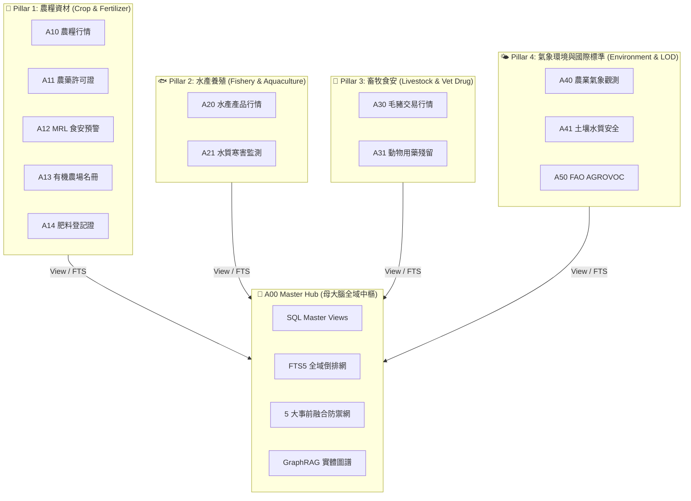
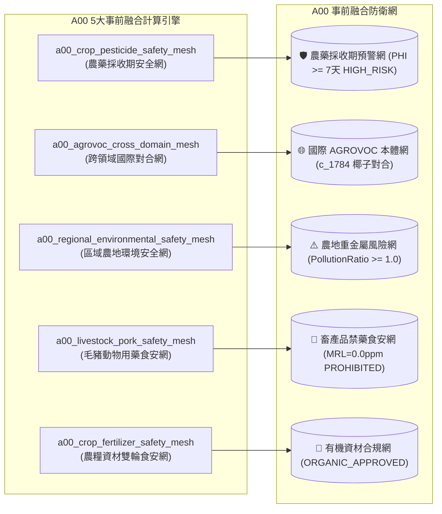

# 🌾 `tw-agro-db`: 台灣農漁畜開放數據全景圖鑑：從產地行情到食安防禦的資料體系

[](https://www.python.org/)
[](LICENSE)
[]()
[](http://aims.fao.org/agrovoc)

> **《台灣農漁畜開放數據全景圖鑑：從產地行情到食安防禦的資料體系》配套開源引擎**
> 
> **`tw-agro-db` (台灣農業開放大數據引擎)** 是一個專為農業數位轉型、食安防禦與 Agentic AI 打造的大一統開源知識庫。它打破了散落於台灣農業部（農糧署、漁業署、畜產會、氣象署、藥毒所、資源司）以及聯合國 FAO 的 12 大開放數據庫藩籬，將數據熔煉為單一可攜帶的 SQLite 知識大腦 (`agro.db`)。

---

## 🏛️ 全景知識架構 (4 大 Pillar & 12 大垂直 DB)



### 📋 12 大垂直 DB 清單與專書百科圖鑑對照表

| DB 代號 | 垂直 DB 模組名稱 | 領域 Pillar 歸屬 | 專書百科圖鑑章節連結 | 核心數據與領域演算法亮點 |
| :--- | :--- | :--- | :--- | :--- |
| **`A00`** | **Master Hub 母大腦中樞** | 全域神經網絡 | [第 2 章 A00 全景架構](book/02_00_architecture_overview.md) | 5 大 Safety Mesh、GraphRAG 346 筆三元組 |
| **`A10`** | **農糧批發交易行情 DB** | Pillar 1 農糧資材 | [3.1 A10 農糧行情圖鑑](book/03_01_a10_tw_crop_db.md) | $CV = \frac{\sigma}{\mu}$ 價格離散模型 (椰子 19.77元) |
| **`A11`** | **農藥許可證與採收期 DB** | Pillar 1 農糧資材 | [3.2 A11 農藥許可證圖鑑](book/03_02_a11_pesticide_db.md) | PHI 採收等待期分級, 滅 Unicode FTS (9,993筆) |
| **`A12`** | **農檢 MRL 殘留抽驗預警 DB** | Pillar 1 農糧資材 | [3.3 A12 MRL 殘留預警圖鑑](book/03_03_a12_pest_mrl_alert_db.md) | $MRLRatio = \frac{conc}{limit}$ 超標模型 (`OVER_LIMIT`) |
| **`A13`** | **有機友善農場認證名冊 DB** | Pillar 1 農糧資材 | [3.4 A13 有機農場名冊圖鑑](book/03_04_a13_organic_cert_db.md) | 有機驗證名冊與資材申報 (硫酸銨 6,739噸) |
| **`A14`** | **農糧資材與肥料登記證 DB** | Pillar 1 農糧資材 | [3.5 A14 肥料登記證圖鑑](book/03_05_a14_organic_fertilizer_db.md) | $NPK\_Total$ 算式與 `ORGANIC_APPROVED` 審定評等 |
| **`A20`** | **水產產品與市場行情 DB** | Pillar 2 水產養殖 | [3.6 A20 水產產品行情圖鑑](book/03_06_a20_fishery_market_db.md) | 管道符 `│` 描述解析器, 80% 臺灣在地標籤 |
| **`A21`** | **水產養殖水質與寒害監測 DB** | Pillar 2 水產養殖 | [3.7 A21 水質寒害監測圖鑑](book/03_07_a21_aquaculture_monitoring_db.md) | 水溫 $<15^\circ\text{C}$ 寒害與溶氧 $<3\text{mg/L}$ 缺氧 Scorer |
| **`A30`** | **毛豬批發交易行情 DB** | Pillar 3 畜牧食安 | [3.8 A30 毛豬交易行情圖鑑](book/03_08_a30_livestock_db.md) | 無槓民國年 `1150819 ➔ 2026-08-19` ISO 轉碼 |
| **`A31`** | **動物用藥殘留管制 DB** | Pillar 3 畜牧食安 | [3.9 A31 動物用藥殘留圖鑑](book/03_09_a31_vet_drug_food_residue_db.md) | 禁藥 $MRL == 0.0\text{ppm}$ 零容忍 `PROHIBITED` 警告 |
| **`A40`** | **農業氣象站歷史觀測 DB** | Pillar 4 氣象環境 | [3.10 A40 農業氣象觀測圖鑑](book/03_10_a40_agro_climate_db.md) | 2,527 點氣象觀測歷史, 微氣候溫濕度序列 |
| **`A41`** | **土壤與水質環境安全 DB** | Pillar 4 氣象環境 | [3.11 A41 土壤水質安全圖鑑](book/03_11_a41_soil_water_pollution_db.md) | 重金屬 $PollutionRatio = \frac{conc}{limit}$ 算式 (北投區) |
| **`A50`** | **FAO AGROVOC 國際詞庫 DB** | Pillar 4 國際標準 | [3.50 A50 FAO 詞庫圖鑑](book/03_50_a50_fao_agrovoc_db.md) | 40,097 概念, 在地椰子對合 FAO `c_1784` |

---

## 👑 A00 Master Hub 母大腦強大功能指引

**A00 Master Hub (`a00_master_hub`)** 做為全庫的全域神經網絡中樞，將散落於 12 個獨立 DB 的領域數據，預先發動背景計算引擎，提供 3 大強硬的全局防衛與 AI 推論能力：



### 1. 🛡️ 5 大事前融合食安與環境防護網 (Pre-computed Safety Meshes)
- **`a00_crop_pesticide_safety_mesh` (農藥採收期安全網)**：跨 A10/A11/A12，事前計算 `HIGH_RISK` 採收等待期（$\ge 7$ 天）與用藥倍數，預防農民違規開罰與食安危機。
- **`a00_livestock_pork_safety_mesh` (毛豬與動物用藥食安網)**：跨 A30/A31，對合肉品部位與 $MRL = 0.0\text{ ppm}$ 國定禁藥 (如氯黴素)，0.01 秒發動 `PROHIBITED` 禁藥即時攔截。
- **`a00_crop_fertilizer_safety_mesh` (農糧資材雙輪食安網)**：跨 A10/A13/A14，自動碰撞 `ORGANIC_COMPLIANT` 審定資材，解決有機農業合規難題。
- **`a00_regional_environmental_safety_mesh` (區域農地環境安全網)**：跨 A41，計算重金屬污染比率 $PollutionRatio = \frac{conc}{limit}$，標註 `HIGH_RISK`（$Ratio \ge 1.0$）區域，預防污染農地誤種食用作物。
- **`a00_agrovoc_cross_domain_mesh` (FAO 國際本體對合網)**：將台灣在地農漁畜名詞與聯合國 FAO 40,097 國際概念對合 (椰子 `c_1784`, 得分 1.0)。

### 2. 🌐 GraphRAG 346 筆 1-Hop 實體圖譜網 (`a00_graph_triples`)
- 提供標準的 `(subject_uri, predicate, object_uri)` SQLite-RDF 拓撲結構（如 `(作物:椰子, has_pesticide, 農藥:滅)`）。為大語言模型 (LLM Agent) 提供 **100% 具備物理數據出處的零幻覺 (Zero-Hallucination) 多跳推論基礎**。

### 3. 🔍 18,725 筆全域 FTS5 全文倒排 (`fts_agro_global`)
- 使用者與 AI Agent 無需知道資料位於哪個子庫，下達單一全域搜尋 `tw-agro-cli search <KEYWORD>`，即可在毫秒級延遲內一鍵穿透農糧、水產、毛豬、氣象、重金屬與 FAO 國際概念。

> 📖 **深入閱讀 A00 架構細節**：請參閱專書 **[第 2 章 2.8 A00 母大腦 5 大防衛網與 GraphRAG](book/02_08_a00_safety_meshes_and_graphrag.md)** 及 **[2.9 4 大真實農業情境知識流轉接力](book/02_09_scenarios_knowledge_navigation.md)**。

---

## 💡 核心價值與亮點

1. **單一 SQLite 大一統引擎 (`agro.db`)**：告別碎片化 API，將 12 大 DB 熔煉為零拷貝、毫秒級響應的開源知識庫。
2. **5 大事前融合食安與環境防護網 (Safety Meshes)**：
   - 🛡️ **農藥安全採收期預警網**：碰撞 9,993 筆藥證與 PHI 等待期 (滅 `HIGH_RISK` 7天)。
   - 🥩 **毛豬禁藥零容忍防禦網**：0.01 秒攔截 $MRL = 0.0\text{ ppm}$ 國定禁藥 (氯黴素 `PROHIBITED`)。
   - 🌿 **有機農場資材合規網**：審定合格有機肥料對合 (`ORGANIC_APPROVED`)。
   - ⚠️ **區域農地重金屬風險網**：計算污染比率 $PollutionRatio \ge 1.0$ (北投高風險區)。
   - 🌐 **FAO AGROVOC 國際對合網**：將在地台規名詞與聯合國 FAO 40,097 國際概念對合 (椰子 `c_1784`)。
3. **GraphRAG 346 筆實體圖譜網 (`a00_graph_triples`)**：為 LLM Agent 提供 100% 物理數據出處的零幻覺推論 Grounding 基礎。
4. **18,725 筆全域 FTS5 全文倒排**：單一指令 `tw-agro-cli search` 支援毫秒級跨域搜尋。

---

## 📚 專書圖鑑章節速查 (Book Chapters)

> 📖 **全本打包下載**：**[FULL_BOOK_TAIWAN_AGRO_DB.md (一鍵閱讀全本 32 章大一統手冊)](book/FULL_BOOK_TAIWAN_AGRO_DB.md)**

全書 Markdown 分章節檔案位於 [`book/`](book/) 目錄中：

- **[第 0 章：全書目錄與導覽](book/00_toc.md)**
- **[第 1 章：專案願景與農業數位轉型使命](book/01_vision_and_mission.md)**
- **[第 2 章：A00 母大腦全景架構與農業知識體系解構](book/02_00_architecture_overview.md)** (含 11 個 1-to-1 標號獨立檔案)
- **[第 3 章：12 大農業知識資產與 DB 百科圖鑑](book/03_00_structure_guide.md)** (含通用 7 大維度與 12 個獨立圖鑑檔案)
- **[第 4 章：4 大領域利害關係人實戰劇本 Playbook](book/04_stakeholder_playbooks.md)** (含 CLI 串接指令與 Python API 指南)
- **[第 5 章：系統工程驗證、單元測試網與 QGIS 軟體定義地圖](book/05_system_engineering_and_sdm.md)**
- **[第 6 章：結語與專案總結](book/06_conclusion.md)**
- **[附錄 A~C](book/07_01_appendix_sqlite_schema_glossary.md)** (含全庫 Schema 導覽、FAO 對照整合表與 CLI 手冊)

---

## 🚀 快速上手 (Quick Start)

### 1. 安裝與環境準備
```bash
git clone https://github.com/wuulong/tw-agro-db.git
cd tw-agro-db

# 推薦 Python 3.12+ 環境
pip install -r requirements.txt  # 或直接執行 CLI
```

### 2. 使用 CLI 命令行查詢
```bash
# 全庫建置 (使用 data/samples/ 微型測試資料)
python src/cli/main.py build-all --db db/agro.db

# 一鍵跨域檢索標的 '椰子'
python src/cli/main.py search "椰子" --db db/agro.db

# 發動全庫 5 大 Safety Mesh 食安與健康診斷
python src/cli/main.py doctor --db db/agro.db
```

### 3. 使用 Just 指令維運
```bash
# 執行 63/63 pytest 全網單元測試
just agro-test-all

# 動態產出帶中文備註之權威 schema.sql
just agro-schema-gen
```

### 4. Python API 調用範例
```python
from tw_agro_db.core.master_hub import MasterHubEngine

# 初始化 A00 母大腦
hub = MasterHubEngine(db_path="db/agro.db")

# 1. 全域 FTS5 檢索
results = hub.search_global("椰子")

# 2. GraphRAG 1-Hop 實體圖譜三元組
triples = hub.get_graph_triples("椰子")
print(triples)
```

---

## 🛠️ 資料庫 Schema 導覽

* 帶中文備註之動態 SQL DDL：[`schema.sql`](schema.sql)
* 備註配置 JSON：[`src/config/schema_comments.json`](src/config/schema_comments.json)
* 測試資料微型樣例：[`data/samples/`](data/samples/)

---

## 📜 許可證 (License)

本專案採用 [MIT License](LICENSE) 開源授權，歡迎學術研究、政府機構與企業自由使用與貢獻！
