# 🌾 `tw-agro-db`: 台灣農漁畜開放數據全景圖鑑與大一統引擎

[](https://www.python.org/)
[](LICENSE)
[]()
[](http://aims.fao.org/agrovoc)

> **《台灣農漁畜開放數據全景圖鑑：從產地行情到食安防禦的資料體系》配套開源引擎**
> 
> **`tw-agro-db` (台灣農業開放大數據引擎)** 是一個專為農業數位轉型、食安防禦與 Agentic AI 打造的大一統開源知識庫。它打破了散落於台灣農業部（農糧署、漁業署、畜產會、氣象署、藥毒所、資源司）以及聯合國 FAO 的 12 大開放數據庫藩籬，將數據熔煉為單一可攜帶的 SQLite 知識大腦 (`agro.db`)。

---

## 🏛️ 全景知識架構 (4 大 Pillar & 12 大垂直 DB)

```mermaid
flowchart TB
    subgraph P1["🌾 Pillar 1: 農糧資材 (Crop & Fertilizer)"]
        A10["A10 農糧行情"]
        A11["A11 農藥許可證"]
        A12["A12 MRL 食安預警"]
        A13["A13 有機農場名冊"]
        A14["A14 肥料登記證"]
    end

    subgraph P2["🐟 Pillar 2: 水產養殖 (Fishery & Aquaculture)"]
        A20["A20 水產產品行情"]
        A21["A21 水質寒害監測"]
    end

    subgraph P3["🐖 Pillar 3: 畜牧食安 (Livestock & Vet Drug)"]
        A30["A30 毛豬交易行情"]
        A31["A31 動物用藥殘留"]
    end

    subgraph P4["🌤️ Pillar 4: 氣象環境與國際標準 (Environment & LOD)"]
        A40["A40 農業氣象觀測"]
        A41["A41 土壤水質安全"]
        A50["A50 FAO AGROVOC"]
    end

    subgraph A00["👑 A00 Master Hub (母大腦全域中樞)"]
        VIEWS["SQL Master Views"]
        FTS["FTS5 全域倒排網"]
        MESH["5 大事前融合防禦網"]
        GRAPH["GraphRAG 實體圖譜"]
    end

    P1 -->|View / FTS| A00
    P2 -->|View / FTS| A00
    P3 -->|View / FTS| A00
    P4 -->|View / FTS| A00
```



---

## 💡 核心價值與亮點

1. **單一 SQLite 大一統引擎 (`agro.db`)**：告別碎片化 API，將 12 大 DB 熔煉為零拷貝、毫秒級響應的開源知識庫。
2. **5 大事前融合食安與環境防護網 (Safety Meshes)**：
   - 🛡️ **農藥安全採收期預警網**：碰撞 9,993 筆藥證與 PHI 等待期 (滅 `HIGH_RISK` 7天)。
   - 🥩 **毛豬禁藥零容忍防禦網**：0.01 秒攔截 $MRL = 0.0\text{ ppm}$ 國定禁藥 (氯黴素 `PROHIBITED`)。
   - 🌿 **有機農場資材合規網**：審定合格有機肥料對合 (`ORGANIC_APPROVED`)。
   - ⚠️ **區域農地重金屬風險網**：計算污染比率 $PollutionRatio \ge 1.0$ (北投高風險區)。
   - 🌐 **FAO AGROVOC 國際對合網**：將在地台規名詞與聯合國 FAO 40,097 國際概念對合 (椰子 `c_1784`)。
3. **GraphRAG 346 筆實體圖譜網 (`a00_graph_triples`)**：為 LLM Agent 提供 100% 物理數據出處的零幻覺推論 Grounding 基礎。
4. **18,725 筆全域 FTS5 全文倒排**：單一指令 `tw-agro-cli search` 支援毫秒級跨域搜尋。

---

## 📚 專書圖鑑章節速查 (Book Chapters)

全書 Markdown 章節位於 [`book/`](book/) 目錄中：

- **[第 0 章：全書目錄與導覽](book/00_toc.md)**
- **[第 1 章：專案願景與農業數位轉型使命](book/01_vision_and_mission.md)**
- **[第 2 章：A00 母大腦全景架構與農業知識體系解構](book/02_00_architecture_overview.md)** (含 11 個 1-to-1 標號獨立檔案)
- **[第 3 章：12 大農業知識資產與 DB 百科圖鑑](book/03_00_structure_guide.md)** (含通用 7 大維度與 12 個獨立圖鑑檔案)
- **[第 4 章：4 大領域利害關係人實戰劇本 Playbook](book/04_stakeholder_playbooks.md)** (含 CLI 串接指令與 Python API 指南)
- **[第 5 章：系統工程驗證、單元測試網與 QGIS 軟體定義地圖](book/05_system_engineering_and_sdm.md)**
- **[第 6 章：結語與專案總結](book/06_conclusion.md)**
- **[附錄 A~C](book/07_01_appendix_sqlite_schema_glossary.md)** (含全庫 Schema 導覽、FAO 對合表與 CLI 手冊)

---

## 🚀 快速上手 (Quick Start)

### 1. 安裝與環境準備
```bash
git clone https://github.com/wuulong/tw-agro-db.git
cd tw-agro-db

# 推薦 Python 3.12+ 環境
pip install -r requirements.txt  # 或直接執行 CLI
```

### 2. 使用 CLI 命令行查詢
```bash
# 全庫建置 (使用 data/samples/ 微型測試資料)
python src/cli/main.py build-all --db db/agro.db

# 一鍵跨域檢索標的 '椰子'
python src/cli/main.py search "椰子" --db db/agro.db

# 發動全庫 5 大 Safety Mesh 食安與健康診斷
python src/cli/main.py doctor --db db/agro.db
```

### 3. 使用 Just 指令維運
```bash
# 執行 63/63 pytest 全網單元測試
just agro-test-all

# 動態產出帶中文備註之權威 schema.sql
just agro-schema-gen
```

### 4. Python API 調用範例
```python
from tw_agro_db.core.master_hub import MasterHubEngine

# 初始化 A00 母大腦
hub = MasterHubEngine(db_path="db/agro.db")

# 1. 全域 FTS5 檢索
results = hub.search_global("椰子")

# 2. GraphRAG 1-Hop 實體圖譜三元組
triples = hub.get_graph_triples("椰子")
print(triples)
```

---

## 🛠️ 資料庫 Schema 導覽

* 帶中文備註之動態 SQL DDL：[`schema.sql`](schema.sql)
* 備註配置 JSON：[`src/config/schema_comments.json`](src/config/schema_comments.json)
* 測試資料微型樣例：[`data/samples/`](data/samples/)

---

## 📜 許可證 (License)

本專案採用 [MIT License](LICENSE) 開源授權，歡迎學術研究、政府機構與企業自由使用與貢獻！
