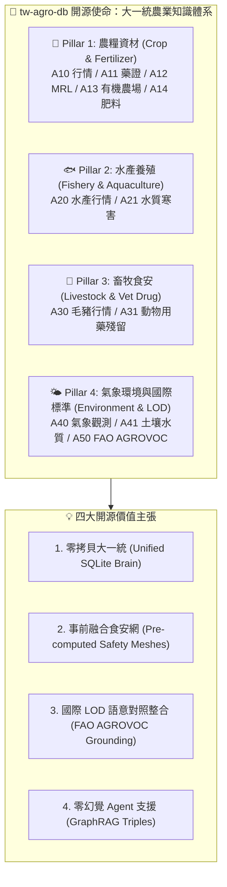

# 📘 第 1 章：專案願景與農業數位轉型使命 (01_vision_and_mission.md)

* **專案名稱**：`tw-agro-db` (台灣農業開放大資料引擎)
* **當前版本**：`v0.7.0`
* **歸檔位置**：[events-2026Q3/agro-db-in/tw-agro-db/book/01_vision_and_mission.md](file:///Users/wuulong/github/bmad-pa/events-2026Q3/agro-db-in/tw-agro-db/book/01_vision_and_mission.md)
* **對照整合審計**：[SYSTEM_ENGINEERING_ALIGNMENT_AUDIT.md](file:///Users/wuulong/github/bmad-pa/events-2026Q3/agro-db-in/sys_eng/05_verification_testing/SYSTEM_ENGINEERING_ALIGNMENT_AUDIT.md)

---

## 🎯 1.1 台灣農漁畜產銷與食安防禦的 5 大現實困境

台灣作為亞熱帶高密度的農業與養殖大國，擁有豐富的農糧、水產與畜牧資料。然而，在現行的開放資料生態與資訊系統中，第一線農民、食安稽查人員、農業專家與 AI 系統架構師，長時間面臨著 **5 大深層的現實困境**：

### 1. 產銷資訊不透明與行情波動盲區
* **現實痛點**：農糧與水產品批發市場拍賣價格受微氣候、季節變遷與區域供需劇烈影響。過往資料散落於各個個別市場與產銷網站，缺乏跨區域與長週期的變異係數 ($CV = \frac{\sigma}{\mu}$) 離散統計模型。
* **導致後果**：農民無法精確評估栽培收益風險，容易陷入「爆產價跌」或「天災搶種」的惡性循環。

### 2. 病蟲害藥安盲區與採收等待期違規風險
* **現實痛點**：全台灣核准之農藥許可證高達近萬筆（如 9,993 筆藥證），且記載了包含特殊 Unicode 字元（如「滅」）等複雜成分。各種作物對應的安全採收等待期 (PHI) 與殘留容許量 (MRL) 查詢門檻極高。
* **導致後果**：農民在病蟲害爆發時缺乏即時合規的藥安指引，極易因不慎在採收前夕誤用長等待期農藥，導致送驗違規遭重罰與蔬果封存銷毀。

### 3. 農地重金屬污染與環境生態風險未知
* **現實痛點**：農地土壤與灌溉水質的重金屬監測資料（如鎘、砷、銅、鉛等）隸屬於環境保護與資源永續範疇，過往未與農糧作物栽培字典直接對接。
* **導致後果**：農業推廣團隊或購地農民無法在事前即時獲知特定區域的重金屬污染比率 ($PollutionRatio = \frac{conc}{limit}$)，可能在高風險管制區誤種食用作物，威脅國土安全與國人健康。

### 4. 畜產品用藥殘留與禁藥攔截死角
* **现实痛點**：全台 23 處毛豬批發拍賣市場每日交易量龐大，但肉品部位（如去骨羊肉、豬肝）與動物用藥殘留標準（如氯黴素等禁藥 $MRL == 0.0\text{ ppm}$）過去缺乏事前實體碰撞機制。
* **導致後果**：稽查團隊只能依靠事後抽驗，無法在拍賣與肉品運銷當下發動即時的禁藥警告與食安防衛。

### 5. 國際農學標準斷層與 AI 幻覺難題
* **現實痛點**：台灣在地特有作物（如椰子、釋迦、毛豬部位）的中文名稱，缺乏與聯合國糧農組織 (FAO) 等國際農學多語主題詞庫 (AGROVOC LOD) 的語意對照。同時，大型語言模型 (LLM) 在回答農業專業疑問時，常因缺乏結構化 Grounding 資料庫而產生嚴重幻覺。
* **導致後果**：台灣農業資料難以接軌國際永續貿易與 LOD 知識圖譜，AI 助手亦無法做為農民可靠的決策顧問。

---

## 🏛️ 1.2 建立大一統農業開放知識體系的開源價值

針對上述 5 大困境，`tw-agro-db` (台灣農業開放大資料引擎) 提出了 **「打破部門資料孤島，建立大一統開源知識體系」** 的開源使命與四大 Pillar 價值主張：

*Fig 1.1: 跨農漁畜與環境 12 大 DB 大一統知識體系與價值主張*

### 💡 四大開源價值主張 (Value Propositions)：

1. **單一 SQLite 大一統引擎 (Unified Knowledge Brain)**：
   - 告別碎片化 API 與混亂格式，將散落於農業部各署司機構（農糧署、漁業署、畜產會、氣象署、農業藥物試驗所、資源永續利用司）及 FAO 的 12 大資料庫，融合成單一可攜帶、零權限門檻的 SQLite 檔案 (`agro.db`)。
2. **事前融合食安與環境防護網 (Pre-computed Safety Meshes)**：
   - 不只做靜態儲存，更在背景預先計算農藥採收期預警、毛豬禁藥攔截、有機資材合規與農地重金屬風險等 5 大安全防護網，提供即時食安防衛。
3. **對照整合聯合國 FAO AGROVOC 國際標準 (LOD Alignment)**：
   - 將全庫去重實體與 FAO AGROVOC 40,097 概念、82,954 多語標籤進行精確對照整合，讓台灣在地農業資料無縫接軌國際。
4. **支援 Agentic AI 零幻覺決策 (GraphRAG Grounding)**：
   - 內建 346 筆 `a00_graph_triples` SQLite-RDF 圖譜與 18,725 筆全域 FTS5 倒排，做為 LLM Agent 進行具名 Tool-Calling 與多跳推論的強硬物理 Grounding 基礎。
