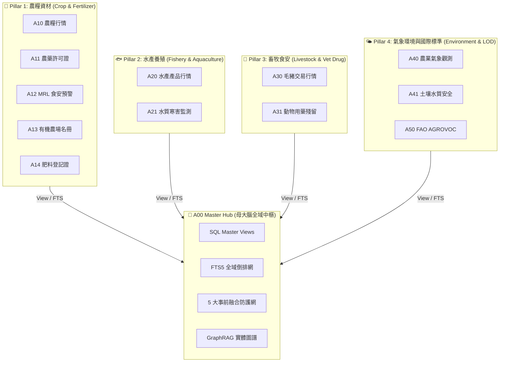
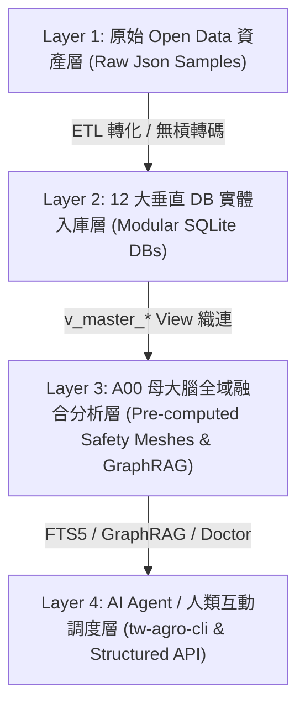

# 📘 2.0 第 2 章：A00 母大腦全景架構與農業知識體系解構 (02_00_architecture_overview.md)

* **專案名稱**：`tw-agro-db` (台灣農業開放大數據引擎)
* **當前版本**：`v0.7.0`
* **歸檔位置**：[events-2026Q3/agro-db-in/tw-agro-db/book/02_00_architecture_overview.md](file:///Users/wuulong/github/bmad-pa/events-2026Q3/agro-db-in/tw-agro-db/book/02_00_architecture_overview.md)
* **對合審計**：[SYSTEM_ENGINEERING_ALIGNMENT_AUDIT.md](file:///Users/wuulong/github/bmad-pa/events-2026Q3/agro-db-in/sys_eng/05_verification_testing/SYSTEM_ENGINEERING_ALIGNMENT_AUDIT.md)

---

## 🎯 2.0 A00 母大腦：解構散落的農業開放數據

散落於台灣農業部各署司機構（農糧署、漁業署、畜產會、氣象署、藥毒所、資源司）以及聯合國 FAO 的 12 大數據庫，過去如同割裂的資料孤島。各單位欄位格式不一、更新頻率不同，且完全缺乏跨資料庫的事前食安與環境碰撞能力。

**A00 母大腦 (`a00_master_hub`)** 的核心價值，即為做為全域指揮官 (Global Master Brain)，提供人類工程師、領域專家與 AI Agent 一個 **「通盤掌握、一鍵穿透」** 的大一統知識體系。本章從「農業實務問題與生態體系」為主體，解構 7 大農業知識維度，並說明 A00 如何調用底下 12 大垂直 DB 的物理數據做為支撐。

---

## 🏛️ 2.0.1 A00 母大腦與 12 大垂直 DB 全景知識網絡拓撲

A00 母大腦將散落的 12 個垂直子模組拆解為 4 大領域 Pillar，透過 SQL View 與全域倒排織連為單一神經網絡：

*Fig 2.0: A00 母大腦與 12 大垂直 DB 全景知識網絡拓撲圖*

---

## 🏗️ 2.0.2 四層大一統技術堆疊與數據管線

`tw-agro-db` 採用四層解耦架構，實現「極速零拷貝、物理強落地」：

*Fig 2.0.1: tw-agro-db 4層技術堆疊與數據管線圖*
