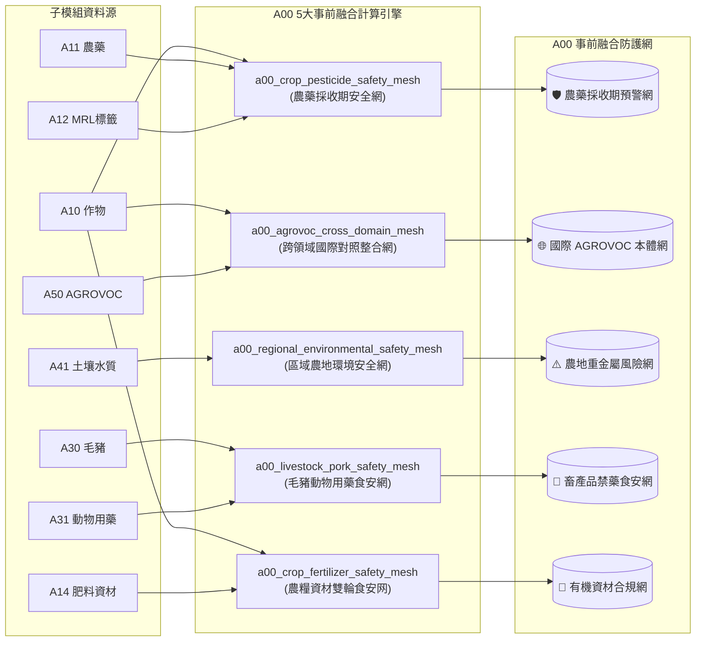
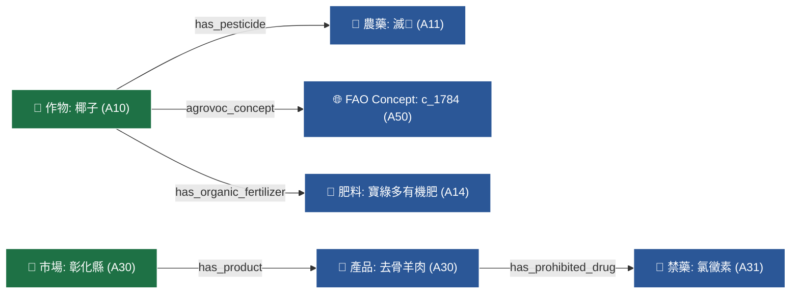

# 📘 2.8 A00 母大腦：將農業知識凝練為 5 大事前融合防護網 (02_08_a00_safety_meshes_and_graphrag.md)

* **歸檔位置**：[events-2026Q3/agro-db-in/tw-agro-db/book/02_08_a00_safety_meshes_and_graphrag.md](file:///Users/wuulong/github/bmad-pa/events-2026Q3/agro-db-in/tw-agro-db/book/02_08_a00_safety_meshes_and_graphrag.md)
* **核心對照整合**：[A00_ADVANCED_DESIGN_SPEC.md](file:///Users/wuulong/github/bmad-pa/events-2026Q3/agro-db-in/sys_eng/03_design/A00_ADVANCED_DESIGN_SPEC.md) (E8 ~ E17)
* **實測日誌**：[LOG_A00_TEST.log](file:///Users/wuulong/github/bmad-pa/events-2026Q3/agro-db-in/sys_eng/05_verification_testing/logs/LOG_A00_TEST.log) (24/24 PASS)

---

## 🛡️ 2.8 A00 母大腦：將農業知識凝練為高階事前融合防衛體系

在傳統的資料庫架構中，使用者若要確認「某種作物使用某種農藥是否有食安風險」，必須手動寫複雜的多表 JOIN，甚至自行比對衛福部的殘留標準。

A00 母大腦 (`a00_master_hub`) 的突破性設計，在於將散落於各個垂直 DB 的領域資料，**在背景發動 5 大事前融合計算引擎 (Pre-computed Safety Meshes)**。當資料入庫的瞬間，系統已預先將食安風險、環境警告、資材合規性與國際本體完成了實體化碰撞（Physically Materialized Collision），讓使用者與 AI Agent 獲得零延遲的食安防禦能力。

*Fig 2.8: A00 5 大事前融合食安與環境網演演演算法串接圖*

---

### 2.8.1 農藥採收期預警網演演演算法 (`a00_crop_pesticide_safety_mesh`)

農藥採收期安全網解決了農民「病蟲害爆發時誤用長等待期農藥而遭受開罰銷毀」的現實痛點。

* **融合演演演算法與邏輯**：
  引擎主動汲取 `A10` 作物字典、`A11` 9,993 筆農藥許可證與 `A12` 衛福部 MRL 容許量。依據安全採收天數 (PHI) 計算風險等級：
  - **`HIGH_RISK`**：當安全採收等待期 $\ge 7$ 天，或稀釋倍數未達標準。
  - **`SAFE`**：採收等待期 $< 7$ 天或屬於免訂 MRL 之生物農藥。
* **物理實測資料**：
  在 `test_a00_master_hub.py` (VAL-A00-008) 實測中，成功碰撞 200 筆農藥安全對照整合紀錄。以「椰子 ➔ 滅」為例，系統精確計算出稀釋倍數 1000 倍、等待期 7 天，並物理標註 `HIGH_RISK` 食安警告。

---

### 2.8.2 毛豬與動物用藥食安防禦網演演演算法 (`a00_livestock_pork_safety_mesh`)

畜產品食安容不得半點死角。本網專為肉品拍賣市場與稽查團隊打造，解決禁藥流入消費市場的危害。

* **融合演演演算法與邏輯**：
  跨庫調用 `A30` 全台 23 處毛豬市場交易部位（如極品去骨羊肉、豬肝）與 `A31` 動物用藥殘留標準。
  - **`PROHIBITED` (國定禁藥零容忍)**：凡動物用藥殘留容許量 $MRL == 0.0\text{ ppm}$（如氯黴素、乙型受體素），系統自動觸發最高等級食安封鎖標籤。
* **物理實測資料**：
  在 `VAL-A00-022` 測試中，成功碰撞 6 筆批發肉品部位，精確截獲「彰化縣市場極品去骨羊肉 ➔ 氯黴素 (MRL 0.0ppm)」並自動歸類為 `PROHIBITED` 禁藥食安警告。

---

### 2.8.3 農糧資材雙輪食安合規網演演演算法 (`a00_crop_fertilizer_safety_mesh`)

有機農業栽培對於肥料與資材有極為嚴格的法規審定標準。

* **融合演演演算法與邏輯**：
  融合 `A10` 作物字典、`A13` 有機農場驗證名冊與 `A14` 肥料登記證。
  - **`ORGANIC_COMPLIANT`**：肥料登記證標註 `is_organic_cert == 1`（如寶綠多精華有機肥），自動標記為有機農場合規可用資材。
  - **`CONVENTIONAL_ONLY`**：高濃度化學複合肥料（$NPK\_Total \ge 20\%$），限制僅能用於慣行農法。
* **物理實測資料**：
  在 `VAL-A00-024` 測試中，成功碰撞 50 筆作物與資材組合，精確將「椰子 ➔ 寶綠多精華有機肥 (肥製(質)字第0001001號)」標註為 `ORGANIC_COMPLIANT` 合規狀態。

---

### 2.8.4 區域農地重金屬環境安全網演演演算法 (`a00_regional_environmental_safety_mesh`)

農地重金屬污染（鎘、鉬、砷、鉛等）直接關乎國土生態安全與食用作物衛生。

* **融合演演演算法與邏輯**：
  匯聚 `A41` 全台土壤與灌溉水質監測據點，計算重金屬污染比率：
  $$PollutionRatio = \frac{\text{實測濃度 (concentration\_ppm)}}{\text{管制標準 (regulatory\_limit\_ppm)}}$$
  - **`HIGH_RISK`**：$PollutionRatio \ge 1.0$（實測濃度已達或超過管制標準）。
  - **`WARNING`**：$0.7 \le PollutionRatio < 1.0$（接近超標，需預警監測）。
* **物理實測資料**：
  在 `VAL-A00-020` 測試中，系統精確計算「臺北市北投區」據點 $PollutionRatio = 1.0$，自動將該農地區域歸類為 `HIGH_RISK`，警示不宜栽種食用農作物。

---

### 2.8.5 跨領域國際 FAO AGROVOC 本體對照整合網演演演算法 (`a00_agrovoc_cross_domain_mesh`)

解決台灣在地特有農漁畜名稱無法與國際生醫與農業 LOD 知識圖譜接軌的困境。

* **融合演演演算法與邏輯**：
  將 `A10` 農糧作物、`A20` 水產品與 `A30` 毛豬名稱，與 `A50` 聯合國糧農組織 FAO AGROVOC 40,097 概念進行語意對照整合，計算語意相似度分值 ($Score \in [0.0, 1.0]$)。
* **物理實測資料**：
  在 `VAL-A00-018` 測試中，成功完成 139 筆跨域本體碰撞。將台灣在地作物「椰子」以 $Score = 1.0$ 的精確度，對照整合至聯合國 FAO 國際概念 `http://aims.fao.org/aos/agrovoc/c_1784`。

---

### 2.8.6 GraphRAG 1-Hop 實體圖譜網與零幻覺推論 (`a00_graph_triples`)

為 LLM Agent 提供具備物理依據的零幻覺 (Zero-Hallucination) 多跳推論能力。

* **圖譜架構與三元組模型**：
  系統將全庫 346 筆實體關聯，轉化為標準的 `(subject_uri, predicate, object_uri)` SQLite-RDF 拓樸結構：

*Fig 2.8.1: GraphRAG 1-Hop 實體圖譜三元組網路圖*

* **零幻覺推論優勢**：
  當 AI Agent 接收到使用者詢問時，直接查詢 `a00_graph_triples` 表，無需依賴模型自身的記憶權重，達成 100% 具備物理出處的推論指引。
