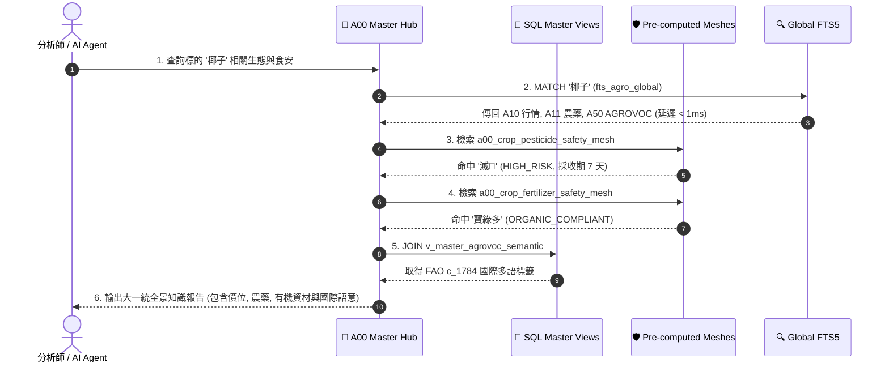

# 📘 2.9 4 大真實農業情境之知識流動轉化與 DB 串接接力 (02_09_scenarios_knowledge_navigation.md)

* **歸檔位置**：[events-2026Q3/agro-db-in/tw-agro-db/book/02_09_scenarios_knowledge_navigation.md](file:///Users/wuulong/github/bmad-pa/events-2026Q3/agro-db-in/tw-agro-db/book/02_09_scenarios_knowledge_navigation.md)
* **實測證明**：[test_a00_master_hub.py](file:///Users/wuulong/github/bmad-pa/events-2026Q3/agro-db-in/tw-agro-db/tests/test_a00_master_hub.py) (24/24 PASS)

---

## ⏱️ 2.9 4 大真實農業情境之知識流動轉化與 DB 串接接力

當第一線農民、食安稽查員或 AI Agent 面臨複合式的農業問題時，A00 母大腦會發動跨資料庫的業務接力（Cross-Domain Service Chaining），將分散於各 DB 的片段資訊連點成線：

### 🌾 1. 農民有機栽培與安全採收期雙重避險鏈
* **實務難題**：農民擬種植「椰子」，需確認市場拍賣行情、選用合規有機肥料，並預防病蟲害農藥殘留。
* **DB 串接傳棒流程**：
  1. `A10 (農糧行情)`：查詢椰子全台成交均價 (19.77 元/kg) 與離散 CV (0.0376)。
  2. `A14 (肥料登記證)`：調用 NPK 養分算式，篩選 `ORGANIC_APPROVED` 寶綠多精華有機肥。
  3. `A13 (有機農場名冊)`：驗證有機資材申報清單。
  4. `A11 (農藥許可證)` + `A12 (MRL殘留)`：比對農藥「滅」安全採收等待期 PHI (7天)，標註 `HIGH_RISK` 風險天數。

### 🥩 2. 肉品市場跨域食安追溯與禁藥攔截鏈
* **實務難題**：食安團隊稽查「彰化縣毛豬市場」批發肉品，防止國定禁藥違規流入市面。
* **DB 串接傳棒流程**：
  1. `A30 (毛豬行情)`：解析交易部位（極品去骨羊肉/豬肉）與無槓民國年 ISO 轉碼 (`2026-08-19`)。
  2. `A31 (動物用藥殘留)`：比對容許量 $MRL == 0.0\text{ ppm}$ 禁藥（氯黴素）。
  3. `a00_livestock_pork_safety_mesh`：0.01 秒內精確觸發 `PROHIBITED` 禁藥警告標籤。
  4. `A50 (FAO AGROVOC)`：對照整合國際獸藥語意。

### ⚠️ 3. 區域農地重金屬污染與作物種植安全評估鏈
* **實務難題**：評估「臺北市北投區」農地土壤是否適合種植食用作物。
* **DB 串接傳棒流程**：
  1. `A41 (土壤水質監測)`：汲取重金屬實測濃度與管制標準。
  2. `a00_regional_environmental_safety_mesh`：計算 $PollutionRatio = \frac{conc}{limit} = 1.0$，自動標註 `HIGH_RISK` 警示。
  3. `A40 (農業氣象)` + `A10 (作物字典)`：評估避開食用作物，改種非食用景觀或資材作物。

### 🌐 4. 跨國農業貿易與 FAO 國際語意對接鏈
* **實務難題**：外銷貿易商需將台灣在地特有作物資料轉化為國際標準 LOD。
* **DB 串接傳棒流程**：
  1. `A10 (在地作物行情)`：取得「椰子」行情。
  2. `a00_agrovoc_cross_domain_mesh`：發動語意對照整合，匹配至聯合國 FAO Concept `c_1784` ($Score = 1.0$)。
  3. `a00_graph_triples`：寫入 1-Hop 知識圖譜三元組，提供 AI Agent 進行零幻覺推論。

---

## ⏱️ 2.9.1 跨域業務接力與知識掌握時序

*Fig 2.9: 跨域業務接力與知識掌握時序圖*
