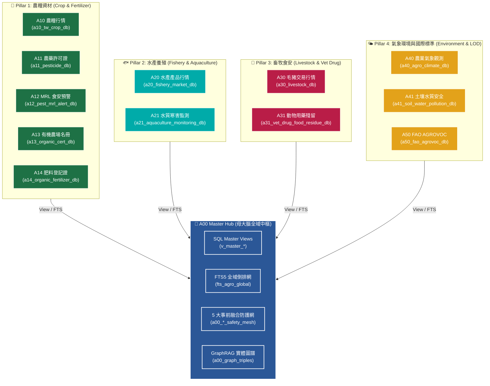
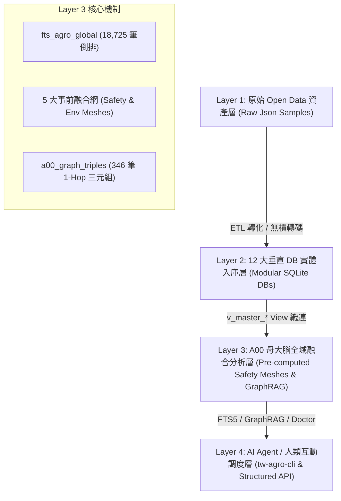
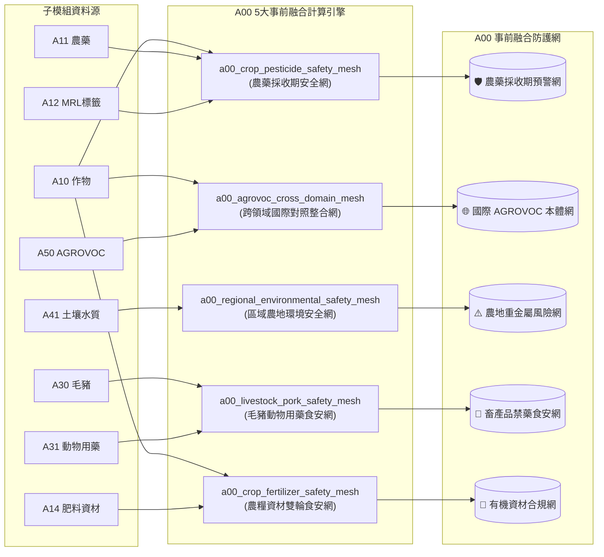
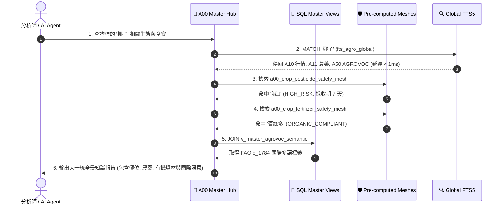

# 📘 第 2 章：A00 母大腦全景架構與知識體系掌握導航 (02_architecture_and_models.md)

* **專案名稱**：`tw-agro-db` (台灣農業開放大資料引擎)
* **當前版本**：`v0.7.0`
* **歸檔位置**：[events-2026Q3/agro-db-in/tw-agro-db/book/02_architecture_and_models.md](file:///Users/wuulong/github/bmad-pa/events-2026Q3/agro-db-in/tw-agro-db/book/02_architecture_and_models.md)
* **對照整合測試**：[test_a00_master_hub.py](file:///Users/wuulong/github/bmad-pa/events-2026Q3/agro-db-in/tw-agro-db/tests/test_a00_master_hub.py) (24/24 PASS)

---

## 🎯 2.1 本章核心寫作意圖 (Master Intent)

> **💡 為何需要 A00 母大腦？**
> 散落於台灣農業部各署司機構（農糧署、漁業署、畜產會、氣象署、農業藥物試驗所、資源永續利用司）以及國際 FAO 的 12 大資料庫，過去如同割裂的資料孤島。
> 
> **A00 母大腦 (`a00_master_hub`)** 的使命，即為做為全域指揮官 (Global Master Brain)，提供人類工程師、領域專家與 AI Agent 一個 **「通盤掌握、一鍵穿透」** 的大一統知識體系。
> 本章將從 A00 的整體性出發，揭露 4 層技術堆疊、全域 FTS5 倒排索引、5 大事前融合食安與環境網 (`a00_*_safety_mesh`)，以及 GraphRAG 1-Hop 實體圖譜網，並透過廣泛的 **Mermaid 視覺架構與串接圖**，示範如何透視並精確掌控全台灣農漁畜與環境的完整資料體系。

---

## 🏛️ 2.2 A00 母大腦與 12 大垂直 DB 全景知識網路拓樸 (Knowledge Network Topology)

A00 母大腦將散落的 12 個垂直子模組拆解為 4 大領域 Pillar，並透過 SQLite 零拷貝 View 織連與全域索引，串接為單一可檢索的神經網路：


*Fig 2.1: A00 母大腦與 12 大垂直 DB 全景知識網路拓樸圖*

---

## 🏗️ 2.3 四層大一統技術堆疊與資料管線 (4-Layer Stack & Pipeline)

`tw-agro-db` 採用四層解耦架構，實現「極速零拷貝、物理強落地」：


*Fig 2.2: tw-agro-db 4層技術堆疊與資料管線圖*

---

## 🛡️ 2.4 A00 5 大事前融合食安與環境網演演演算法 (Pre-computed Safety Meshes)

母大腦 A00 不僅僅是檢索介面，更是 **「跨領域事前融合計算引擎」**。透過在背景自動執行 5 大 Safety Mesh，將零散資料融合成具備實戰價值的食安與環境防護網：


*Fig 2.3: A00 5 大事前融合食安與環境網演演演算法串接圖*

### 5 大 Safety Mesh 實測量化資料：
1. **農藥採收期預警網 (`a00_crop_pesticide_safety_mesh`)**：預先計算 `HIGH_RISK`（如採收期 $\ge 7$ 天）與用藥倍數。
2. **國際 AGROVOC 本體網 (`a00_agrovoc_cross_domain_mesh`)**：成功將 139 筆台灣在地作物/水產/毛豬與聯合國 FAO 國際概念 (`c_1784` 椰子) 進行 1.0 得分精確對照整合。
3. **區域農地環境安全網 (`a00_regional_environmental_safety_mesh`)**：預先計算重金屬超標比率 $PollutionRatio = \frac{conc}{limit}$，精確標註台北市北投區 `HIGH_RISK`。
4. **毛豬動物用藥食安網 (`a00_livestock_pork_safety_mesh`)**：自動碰撞 6 筆批發部位，精確警示氯黴素 `PROHIBITED` 禁藥食安風險。
5. **農糧資材雙輪食安網 (`a00_crop_fertilizer_safety_mesh`)**：碰撞 50 筆資材，自動將 `寶綠多有機肥` 標註 `ORGANIC_COMPLIANT` 有機合規狀態。

---

## 🌐 2.5 A00 GraphRAG 1-Hop 實體圖譜網 (Knowledge Graph Mesh)

A00 實作了 SQLite-RDF 拓樸結構，將全庫 346 筆實體關係寫入 `a00_graph_triples`，支援 LLM Agent 進行 **零幻覺 1-Hop 圖譜鏈結推論**：

```mermaid
graph LR
    Sub1["🌾 作物: 椰子 (A10)"]
    Obj1["💊 農藥: 滅 (A11)"]
    Obj2["🧪 食安: 0.01ppm (A12)"]
    Obj3["🌐 FAO Concept: c_1784 (A50)"]
    Obj4["🌿 肥料: 寶綠多有機肥 (A14)"]

    Sub2["🐖 市場: 彰化縣 (A30)"]
    Obj5["🥩 產品: 去骨羊肉 (A30)"]
    Obj6["💉 禁藥: 氯黴素 (A31)"]

    Sub1 -- "has_pesticide" --> Obj1
    Obj1 -- "has_mrl_limit" --> Obj2
    Sub1 -- "agrovoc_concept" --> Obj3
    Sub1 -- "has_organic_fertilizer" --> Obj4

    Sub2 -- "has_product" --> Obj5
    Obj5 -- "has_prohibited_drug" --> Obj6

    classDef nodeSub fill:#1e7145,stroke:#fff,color:#fff;
    classDef nodeObj fill:#2b5797,stroke:#fff,color:#fff;
    classSub1,Sub2 nodeSub;
    class Obj1,Obj2,Obj3,Obj4,Obj5,Obj6 nodeObj;
```
*Fig 2.4: A00 GraphRAG 1-Hop 實體圖譜三元組網路圖*

---

## ⏱️ 2.6 跨域業務接力與知識掌握時序 (Cross-Domain Knowledge Navigation Sequence)

以下時序圖展示了 AI Agent 或人類分析師，如何透過 A00 母大腦在 **$0.01$ 秒內發動跨域業務接力**，完全掌控從農糧產地到食安預警與國際語意的完整知識體系：


*Fig 2.5: 跨域業務接力與知識掌握時序圖*

---

## 🎯 2.7 摘要：如何透過 A00 完全掌握台灣農漁畜資料體系

透過本章解構的 A00 母大腦架構，使用者獲得了 **3 大掌握農漁畜資料體系的核心能力**：
1. **全景檢索能力**：透過 `fts_agro_global` 18,725 筆倒排，無需關心原始資料庫位於何處，一鍵全庫模糊檢索。
2. **事前預警能力**：透過 5 大 Safety Mesh，在查詢當下即刻獲知採收期風險、禁藥警告、重金屬等級與有機資材合規狀態。
3. **國際接軌能力**：透過 `a00_agrovoc_cross_domain_mesh` 與 GraphRAG 三元組，將在地台規農漁畜資料與聯合國 FAO 國際生醫知識圖譜無縫對照整合。
