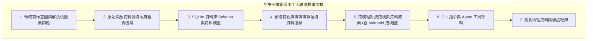

# 📘 3.0 全章子模組撰寫規範與通用 7 大維度架構說明 (03_00_structure_guide.md)

* **專案名稱**：`tw-agro-db` (台灣農業開放大資料引擎)
* **當前版本**：`v0.7.1`
* **歸檔位置**：[events-2026Q3/agro-db-in/tw-agro-db/book/03_00_structure_guide.md](file:///Users/wuulong/github/bmad-pa/events-2026Q3/agro-db-in/tw-agro-db/book/03_00_structure_guide.md)
* **對照整合審計**：[SYSTEM_ENGINEERING_ALIGNMENT_AUDIT.md](file:///Users/wuulong/github/bmad-pa/events-2026Q3/agro-db-in/sys_eng/05_verification_testing/SYSTEM_ENGINEERING_ALIGNMENT_AUDIT.md)

---

## 🎯 3.0.1 第 3 章資料資產百科圖鑑整體定位

第 3 章是全書最核心的 **「12 大農業知識資產與 DB 百科圖鑑 (Submodules Atlas)」**。

為了避免傳統技術文檔「只列 SQL 欄位、缺乏農業領域意涵」的缺憾，本章將 12 個垂直子模組拆分為獨立的專屬檔案（`03_01_a10_tw_crop_db.md` ~ `03_50_a50_fao_agrovoc_db.md`）。每一個子模組檔案均嚴格遵循以下 **「通用 7 大維度標準架構」**，將硬體資料庫提升為具備實務價值與解決能力的領域知識資產：

*Fig 3.0: 子模組通用 7 大維度標準寫作架構圖*

---

## 📐 3.0.2 通用 7 大維度標準寫作規範細節

全章 12 個 DB 子模組在撰寫時，均強制包含以下實質內容：

### 1. 領域寫作意圖與解決的農業問題 (Domain Purpose & Problem Solved)
* 解構該 DB 所蘊含的核心農業、食安、氣象或環境領域知識。
* 說明該 DB 專門為農民、消費者、稽查團隊或 AI Agent 解決了什麼實務難題。

### 2. 原始開放資料源與政府權責機構 (Data Origin & Governance)
* 標明 Open Data 資料集名稱、原始下載管道與更新頻率。
* 明確歸屬農業部權責機構（農糧署、漁業署、畜產會、氣象署、藥毒所、資源司）或聯合國 FAO 國際組織。

### 3. SQLite 資料庫 Schema 與資料模型 (Data Model & Schema)
* 條列實體主表 (Main Table)、全文倒排表 (FTS5 Table) 與 SQL Master View 名稱。
* 給出完整的 SQL `CREATE TABLE` 語法、欄位型態、主鍵與預設值。
* **【必須包含 `attributes_json` Spec】**：詳細解構 `attributes_json` 的擴充 Key-Value 規格。
* **【必須包含一筆真實範例資料】**：給出一筆完整的真實資料列 (Sample Row) 與 JSON Payload。

### 4. 領域特化演演演演算法與資料指標 (Domain Algorithms & Metrics)
* 詳細解構該 DB 獨有的計算公式與品質標籤（如 A10 價格變異係數 $CV$、A14 NPK 養分總和算式、A21 水質 $15^\circ\text{C}$ 寒害 Scorer、A30 無槓民國年 ISO 轉碼、A41 重金屬 $PollutionRatio$ 等）。

### 5. 跨模組對接拓樸與資料流向 (Cross-Module Topology)
* **【必須包含一張專屬 `Fig 3.x` Mermaid 拓樸圖】**：展示該 DB 如何向上織連至 A00 Master Hub，以及如何橫向與相鄰 2~3 個 DB 進行業務傳棒接力。

### 6. CLI 指令與 Agent 工具呼叫 (CLI & Agent Tool-Calling)
* 提供 `tw-agro-cli ax build/search/doctor` 的真實 CLI 執行命令與回傳之 Structured JSON 格式。

### 7. 實測物理資料與驗證紀錄 (Empirical Metrics & PASS Proof)
* 引用 `SYSTEM_ENGINEERING_ALIGNMENT_AUDIT.md` 之物理入庫資料（如 A11 9,993筆、A50 40,097概念）與獨立單元測試 (VAL-001 ~ 004) 綠燈 PASS 紀錄。

---

## 🗺️ 3.0.3 12 大垂直 DB 百科圖鑑目錄索引

| 章節編號 | 垂直子模組代號與名稱 | 專屬獨立檔案 | 領域 Pillar 歸屬 |
| :--- | :--- | :--- | :--- |
| **3.1** | **`A10` 台灣農糧批發交易行情知識庫** | [03_01_a10_tw_crop_db.md](file:///Users/wuulong/github/bmad-pa/events-2026Q3/agro-db-in/tw-agro-db/book/03_01_a10_tw_crop_db.md) | Pillar 1 農糧資材 |
| **3.2** | **`A11` 農藥許可證與安全採收期知識庫** | [03_02_a11_pesticide_db.md](file:///Users/wuulong/github/bmad-pa/events-2026Q3/agro-db-in/tw-agro-db/book/03_02_a11_pesticide_db.md) | Pillar 1 農糧資材 |
| **3.3** | **`A12` 農檢 MRL 殘留抽驗預警知識庫** | [03_03_a12_pest_mrl_alert_db.md](file:///Users/wuulong/github/bmad-pa/events-2026Q3/agro-db-in/tw-agro-db/book/03_03_a12_pest_mrl_alert_db.md) | Pillar 1 農糧資材 |
| **3.4** | **`A13` 有機友善農場認證名冊知識庫** | [03_04_a13_organic_cert_db.md](file:///Users/wuulong/github/bmad-pa/events-2026Q3/agro-db-in/tw-agro-db/book/03_04_a13_organic_cert_db.md) | Pillar 1 農糧資材 |
| **3.5** | **`A14` 農糧資材與肥料登記證知識庫** | [03_05_a14_organic_fertilizer_db.md](file:///Users/wuulong/github/bmad-pa/events-2026Q3/agro-db-in/tw-agro-db/book/03_05_a14_organic_fertilizer_db.md) | Pillar 1 農糧資材 |
| **3.6** | **`A20` 水產產品與市場行情知識庫** | [03_06_a20_fishery_market_db.md](file:///Users/wuulong/github/bmad-pa/events-2026Q3/agro-db-in/tw-agro-db/book/03_06_a20_fishery_market_db.md) | Pillar 2 水產養殖 |
| **3.7** | **`A21` 水產養殖水質與寒害監測知識庫** | [03_07_a21_aquaculture_monitoring_db.md](file:///Users/wuulong/github/bmad-pa/events-2026Q3/agro-db-in/tw-agro-db/book/03_07_a21_aquaculture_monitoring_db.md) | Pillar 2 水產養殖 |
| **3.8** | **`A30` 毛豬批發交易行情知識庫** | [03_08_a30_livestock_db.md](file:///Users/wuulong/github/bmad-pa/events-2026Q3/agro-db-in/tw-agro-db/book/03_08_a30_livestock_db.md) | Pillar 3 畜牧食安 |
| **3.9** | **`A31` 動物用藥與畜產品殘留管制知識庫** | [03_09_a31_vet_drug_food_residue_db.md](file:///Users/wuulong/github/bmad-pa/events-2026Q3/agro-db-in/tw-agro-db/book/03_09_a31_vet_drug_food_residue_db.md) | Pillar 3 畜牧食安 |
| **3.10** | **`A40` 農業氣象站歷史觀測知識庫** | [03_10_a40_agro_climate_db.md](file:///Users/wuulong/github/bmad-pa/events-2026Q3/agro-db-in/tw-agro-db/book/03_10_a40_agro_climate_db.md) | Pillar 4 氣象環境 |
| **3.11** | **`A41` 土壤與水質環境安全知識庫** | [03_11_a41_soil_water_pollution_db.md](file:///Users/wuulong/github/bmad-pa/events-2026Q3/agro-db-in/tw-agro-db/book/03_11_a41_soil_water_pollution_db.md) | Pillar 4 氣象環境 |
| **3.50** | **`A50` FAO AGROVOC 國際農學詞庫知識庫** | [03_50_a50_fao_agrovoc_db.md](file:///Users/wuulong/github/bmad-pa/events-2026Q3/agro-db-in/tw-agro-db/book/03_50_a50_fao_agrovoc_db.md) | Pillar 4 國際標準 |
