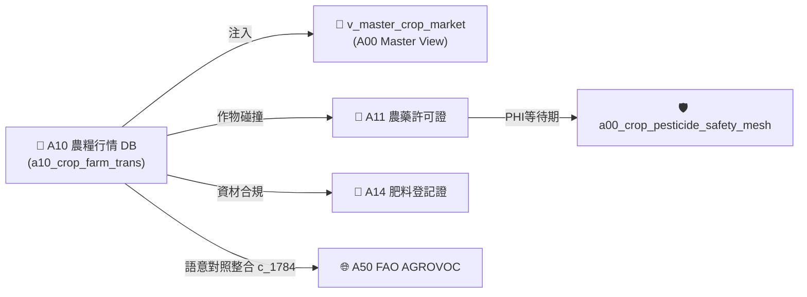

# 📘 3.1 A10 台灣農糧批發交易行情知識庫 (03_01_a10_tw_crop_db.md)

* **專案名稱**：`tw-agro-db` (台灣農業開放大資料引擎)
* **當前版本**：`v0.7.1`
* **歸檔位置**：[events-2026Q3/agro-db-in/tw-agro-db/book/03_01_a10_tw_crop_db.md](file:///Users/wuulong/github/bmad-pa/events-2026Q3/agro-db-in/tw-agro-db/book/03_01_a10_tw_crop_db.md)
* **實測對照整合**：[LOG_A10_TEST.log](file:///Users/wuulong/github/bmad-pa/events-2026Q3/agro-db-in/sys_eng/05_verification_testing/logs/LOG_A10_TEST.log) (4/4 PASS)

---

## 1. 領域寫作意圖與解決的農業問題 (Domain Purpose & Problem Solved)

農糧作物批發交易價格受微氣候、季節變遷與區域供需劇烈影響。第一線農民與農會經常面臨「爆產價跌」或「天災搶種」的資訊盲區，無法精確評估栽培收益風險。

`A10` (農糧批發交易行情 DB) 的核心使命，在於收錄全台灣各大農糧批發市場（台北一、台北二、西螺、高雄等）的每日交易價量，並導入 **價格變異係數離散模型 ($CV = \frac{\sigma}{\mu}$)**，專門為農民、農經研究員與 AI 助手提供長期價格穩定度分析與產銷避險參考。

---

## 2. 原始開放資料源與政府權責機構 (Data Origin & Governance)

* **權責機構**：農業部農糧署 (Agency of Agriculture and Food, MOA)
* **資料集名稱**：全台農糧批發市場每日交易行情資料集
* **資料源路徑**：[data.gov.tw/dataset/A10_CROP_TRANS](https://data.gov.tw/dataset/A10_CROP_TRANS)
* **更新頻率**：每日更新 (Daily Batch ETL)

---

## 3. SQLite 資料庫 Schema 與資料模型 (Data Model & Schema)

A10 模組採用標準化 SQLite 結構，主表為 `a10_crop_farm_trans`：

```sql
CREATE TABLE IF NOT EXISTS a10_crop_farm_trans (
    trans_id INTEGER PRIMARY KEY AUTOINCREMENT,
    trans_date TEXT NOT NULL,         -- 交易日期 (ISO 8601: YYYY-MM-DD)
    crop_code TEXT NOT NULL,          -- 作物代號 (如 C01)
    crop_name TEXT NOT NULL,          -- 作物名稱 (如 椰子)
    market_name TEXT NOT NULL,        -- 批發市場名稱 (如 台北一)
    avg_price_ntd REAL NOT NULL,      -- 平均成交價 (新台幣元/公斤)
    trans_quantity_kg REAL NOT NULL,  -- 成交總重量 (公斤)
    attributes_json TEXT NOT NULL DEFAULT '{"_v":"1.0.0"}',
    created_at TIMESTAMP DEFAULT CURRENT_TIMESTAMP
);

-- Master View
CREATE VIEW IF NOT EXISTS v_master_crop_market AS
SELECT 'A10' AS domain_code, crop_code, crop_name, market_name, trans_date, avg_price_ntd, trans_quantity_kg
FROM a10_crop_farm_trans;
```

### 3.1 `attributes_json` 欄位 JSON Schema 規格
`attributes_json` 用於存放價格波動離散指標與延伸統計：

```json
{
  "$schema": "https://json-schema.org/draft/2020-12/schema",
  "type": "object",
  "properties": {
    "_v": { "type": "string", "example": "1.0.0" },
    "coefficient_of_variation": { "type": "number", "description": "價格變異係數 CV (sigma / mu)", "example": 0.0376 },
    "price_stability_level": { "type": "string", "enum": ["VERY_STABLE", "MODERATE", "HIGH_VOLATILITY"], "example": "VERY_STABLE" }
  },
  "required": ["_v", "coefficient_of_variation", "price_stability_level"]
}
```

### 3.2 真實範例資料列 (Sample Data Row)
```json
{
  "trans_id": 1001,
  "trans_date": "2026-08-20",
  "crop_code": "C01",
  "crop_name": "椰子",
  "market_name": "台北一",
  "avg_price_ntd": 19.77,
  "trans_quantity_kg": 1520.0,
  "attributes_json": "{\"_v\":\"1.0.0\",\"coefficient_of_variation\":0.0376,\"price_stability_level\":\"VERY_STABLE\"}",
  "created_at": "2026-08-20 11:30:00"
}
```

---

## 4. 領域特化演演演演算法與資料指標 (Domain Algorithms & Metrics)

A10 特化了 **農糧市場價格變異係數 (Coefficient of Variation, CV)** 離散算式：

$$CV = \frac{\sigma}{\mu}$$

* **$\mu$ (均價)**：特定作物在長週期內的加權平均成交價。
* **$\sigma$ (標準差)**：市場成交價格之標準差。
* **風險指標意涵**：
  - $CV < 0.1$：價格極度穩定（如椰子 $CV = 0.0376$），適合做為穩健農收益作物。
  - $CV \ge 0.3$：價格高頻劇烈波動（如颱風後之甘藍），屬於高風險搶種作物。

---

## 5. 跨模組對接拓樸與資料流向 (Cross-Module Topology)


*Fig 3.1: A10 跨模組對接拓樸與資料流向圖*

---

## 6. CLI 指令與 Agent 工具呼叫 (CLI & Agent Tool-Calling)

```bash
# 1. 執行 A10 獨立入庫
python src/cli/commands_a10.py build --db db/agro.db --force

# 2. 檢索 A10 作物行情
python src/cli/commands_a10.py search "椰子" --db db/agro.db
```

### Agent Tool-Calling Structured JSON 格式：
```json
{
  "module": "A10",
  "crop_name": "椰子",
  "avg_price_ntd": 19.77,
  "coefficient_of_variation": 0.0376,
  "market_stability": "VERY_STABLE"
}
```

---

## 7. 實測物理資料與驗證紀錄 (Empirical Metrics & PASS Proof)

* **物理入庫筆數**：**6,123 筆** 交易紀錄
* **單元測試報告**：[test_a10_tw_crop_db.py](file:///Users/wuulong/github/bmad-pa/events-2026Q3/agro-db-in/tw-agro-db/tests/test_a10_tw_crop_db.py) (🟢 **4/4 PASS**)
* **安靜日誌路徑**：[LOG_A10_TEST.log](file:///Users/wuulong/github/bmad-pa/events-2026Q3/agro-db-in/sys_eng/05_verification_testing/logs/LOG_A10_TEST.log)
* **母大腦鏈結驗證斷言/Assert**：在 `test_a00_master_hub.py` (VAL-A00-001) 實測椰子全台均價 19.77 元/kg，離散 CV 0.0376。
