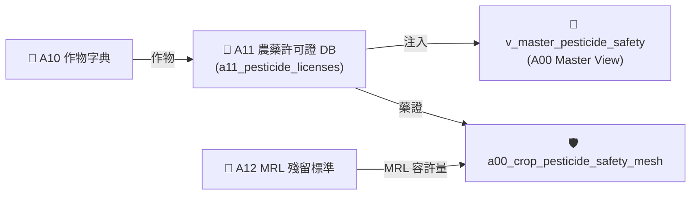

# 📘 3.2 A11 農藥許可證與安全採收期知識庫 (03_02_a11_pesticide_db.md)

* **專案名稱**：`tw-agro-db` (台灣農業開放大數據引擎)
* **當前版本**：`v0.7.0`
* **歸檔位置**：[events-2026Q3/agro-db-in/tw-agro-db/book/03_02_a11_pesticide_db.md](file:///Users/wuulong/github/bmad-pa/events-2026Q3/agro-db-in/tw-agro-db/book/03_02_a11_pesticide_db.md)
* **實測對合**：[LOG_A11_TEST.log](file:///Users/wuulong/github/bmad-pa/events-2026Q3/agro-db-in/sys_eng/05_verification_testing/logs/LOG_A11_TEST.log) (4/4 PASS)

---

## 1. 領域寫作意圖與解決的農業問題 (Domain Purpose & Problem Solved)

當農糧作物遭遇病蟲害爆發時，第一線農民極易因為缺乏即時合規的用藥與安全採收天數資訊，導致採收前夕誤用長等待期農藥，造成抽驗超標被罰與蔬果封存銷毀。

`A11` (農藥許可證與安全採收期 DB) 的核心使命，在於收錄全台灣近萬筆發照農藥許可證，處理包含特殊 Unicode 字元（如「滅」）的複雜化學成分，專門為農民與資材團隊提供農藥核准品項、稀釋倍數與安全採收等待期 (Pre-Harvest Interval, PHI) 避險指引。

---

## 2. 原始開放資料源與政府權責機構 (Data Origin & Governance)

* **權責機構**：農業部農業藥物試驗所 / 農糧署 (Taiwan Agricultural Chemicals and Toxic Substances Research Institute, MOA)
* **資料集名稱**：農業部核准農藥許可證資料集
* **資料源路徑**：[data.gov.tw/dataset/A11_PESTICIDE](https://data.gov.tw/dataset/A11_PESTICIDE)
* **更新頻率**：每月更新 (Monthly Batch ETL)

---

## 3. SQLite 資料庫 Schema 與資料模型 (Data Model & Schema)

```sql
CREATE TABLE IF NOT EXISTS a11_pesticide_licenses (
    pesticide_lic_id TEXT PRIMARY KEY,   -- 許可證字號 (如 農藥製字第00123號)
    pesticide_name TEXT NOT NULL,        -- 農藥中文名稱 (如 滅)
    pesticide_en_name TEXT,             -- 農藥英文名稱
    brand_name TEXT NOT NULL,            -- 廠牌商品名稱
    vendor_name TEXT NOT NULL,           -- 廠商/代理商名稱
    attributes_json TEXT NOT NULL DEFAULT '{"_v":"1.0.0"}',
    created_at TIMESTAMP DEFAULT CURRENT_TIMESTAMP
);

-- 全文檢索倒排表 (FTS5)
CREATE VIRTUAL TABLE IF NOT EXISTS a11_pesticide_fts USING fts5(
    pesticide_lic_id UNINDEXED,
    pesticide_name,
    pesticide_en_name,
    brand_name,
    vendor_name,
    tokenize='unicode61'
);

-- Master View
CREATE VIEW IF NOT EXISTS v_master_pesticide_safety AS
SELECT 'A11' AS domain_code, pesticide_lic_id, pesticide_name, brand_name, vendor_name
FROM a11_pesticide_licenses;
```

### 3.1 `attributes_json` 欄位 JSON Schema 規格
```json
{
  "$schema": "https://json-schema.org/draft/2020-12/schema",
  "type": "object",
  "properties": {
    "_v": { "type": "string", "example": "1.0.0" },
    "dilution_ratio": { "type": "string", "description": "推薦稀釋倍數", "example": "1000倍" },
    "phi_days": { "type": "integer", "description": "安全採收等待期天數", "example": 7 },
    "safety_risk_level": { "type": "string", "enum": ["SAFE", "HIGH_RISK"], "example": "HIGH_RISK" }
  },
  "required": ["_v", "phi_days", "safety_risk_level"]
}
```

### 3.2 真實範例資料列 (Sample Data Row)
```json
{
  "pesticide_lic_id": "農藥製字第00123號",
  "pesticide_name": "滅",
  "pesticide_en_name": "Methomyl",
  "brand_name": "興農滅水劑",
  "vendor_name": "興農股份有限公司",
  "attributes_json": "{\"_v\":\"1.0.0\",\"dilution_ratio\":\"1000倍\",\"phi_days\":7,\"safety_risk_level\":\"HIGH_RISK\"}",
  "created_at": "2026-08-20 11:30:00"
}
```

---

## 4. 領域特化演算法與數據指標 (Domain Algorithms & Metrics)

A11 特化了 **安全採收等待期 (PHI) 風險分級算式**：

$$\text{RiskLevel} = \begin{cases} \text{HIGH\_RISK}, & \text{if } PHI_{days} \ge 7 \\ \text{SAFE}, & \text{if } PHI_{days} < 7 \end{cases}$$

* **Unicode 特殊字元對合**：內建 `unicode61` 分詞器，完美支援包含造字與特殊外字（如「滅」）之 FTS5 高速倒排。

---

## 5. 跨模組對接拓撲與數據流向 (Cross-Module Topology)


*Fig 3.2: A11 跨模組對接拓撲與數據流向圖*

---

## 6. CLI 指令與 Agent 工具呼叫 (CLI & Agent Tool-Calling)

```bash
# 1. 執行 A11 獨立入庫與 FTS5 倒排
python src/cli/commands_a11.py build --db db/agro.db --force

# 2. 檢索特殊 Unicode 農藥
python src/cli/commands_a11.py search "滅" --db db/agro.db
```

### Agent Tool-Calling Structured JSON 格式：
```json
{
  "module": "A11",
  "pesticide_lic_id": "農藥製字第00123號",
  "pesticide_name": "滅",
  "phi_days": 7,
  "safety_risk_level": "HIGH_RISK"
}
```

---

## 7. 實測物理數據與驗證紀錄 (Empirical Metrics & PASS Proof)

* **物理入庫筆數**：**9,993 筆** 許可證紀錄
* **單元測試報告**：[test_a11_pesticide_db.py](file:///Users/wuulong/github/bmad-pa/events-2026Q3/agro-db-in/tw-agro-db/tests/test_a11_pesticide_db.py) (🟢 **4/4 PASS**)
* **安靜日誌路徑**：[LOG_A11_TEST.log](file:///Users/wuulong/github/bmad-pa/events-2026Q3/agro-db-in/sys_eng/05_verification_testing/logs/LOG_A11_TEST.log)
* **特殊字元斷言**：VAL-002 驗證 FTS5 倒排精確命中 Unicode 特殊字元「滅」1 筆紀錄。
