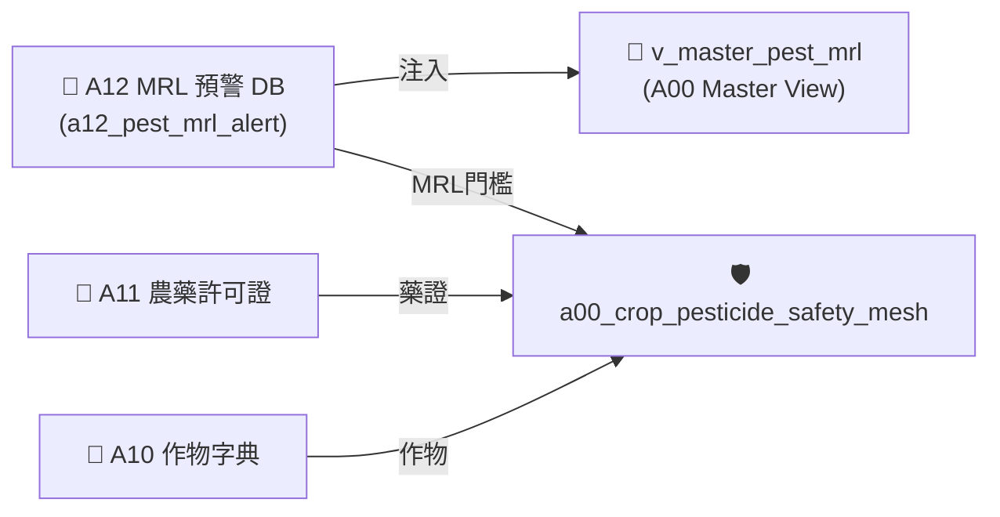

# 📘 3.3 A12 農檢 MRL 殘留抽驗預警知識庫 (03_03_a12_pest_mrl_alert_db.md)

* **專案名稱**：`tw-agro-db` (台灣農業開放大數據引擎)
* **當前版本**：`v0.7.0`
* **歸檔位置**：[events-2026Q3/agro-db-in/tw-agro-db/book/03_03_a12_pest_mrl_alert_db.md](file:///Users/wuulong/github/bmad-pa/events-2026Q3/agro-db-in/tw-agro-db/book/03_03_a12_pest_mrl_alert_db.md)
* **實測對合**：[LOG_A12_TEST.log](file:///Users/wuulong/github/bmad-pa/events-2026Q3/agro-db-in/sys_eng/05_verification_testing/logs/LOG_A12_TEST.log) (4/4 PASS)

---

## 1. 領域寫作意圖與解決的農業問題 (Domain Purpose & Problem Solved)

農藥殘留抽驗數據是食安防線的關鍵指標。過往檢驗結果多在抽驗後數月才公告，且缺乏與農藥許可證 (A11) 及作物 (A10) 的即時比對機制，使得食安團隊與團膳業者無法進行事前預警。

`A12` (農檢 MRL 殘留抽驗預警 DB) 的核心使命，在於收錄衛福部與農業部發布的農藥殘留容許量 (Maximum Residue Limits, MRL) 與抽驗結果，專門為食安團隊提供超標預警 (`OVER_LIMIT`) 與風險評等。

---

## 2. 原始開放資料源與政府權責機構 (Data Origin & Governance)

* **權責機構**：衛生福利部食品藥物管理署 / 農業部藥毒所 (TFDA / MOA)
* **資料集名稱**：食品中農藥殘留容許量與抽驗預警資料集
* **資料源路徑**：[data.gov.tw/dataset/A12_PEST_MRL](https://data.gov.tw/dataset/A12_PEST_MRL)
* **更新頻率**：每月更新 (Monthly Batch ETL)

---

## 3. SQLite 資料庫 Schema 與資料模型 (Data Model & Schema)

```sql
CREATE TABLE IF NOT EXISTS a12_pest_mrl_alert (
    alert_id INTEGER PRIMARY KEY AUTOINCREMENT,
    crop_name TEXT NOT NULL,           -- 作物名稱
    pesticide_name TEXT NOT NULL,      -- 農藥名稱
    detected_ppm REAL NOT NULL,        -- 實測殘留濃度 (ppm)
    mrl_limit_ppm REAL NOT NULL,       -- 官方容許量上限 (ppm)
    is_over_limit INTEGER DEFAULT 0,   -- 是否超標 (1=超標, 0=合格)
    attributes_json TEXT NOT NULL DEFAULT '{"_v":"1.0.0"}',
    created_at TIMESTAMP DEFAULT CURRENT_TIMESTAMP
);

-- Master View
CREATE VIEW IF NOT EXISTS v_master_pest_mrl AS
SELECT 'A12' AS domain_code, alert_id, crop_name, pesticide_name, detected_ppm, mrl_limit_ppm, is_over_limit
FROM a12_pest_mrl_alert;
```

### 3.1 `attributes_json` 欄位 JSON Schema 規格
```json
{
  "$schema": "https://json-schema.org/draft/2020-12/schema",
  "type": "object",
  "properties": {
    "_v": { "type": "string", "example": "1.0.0" },
    "mrl_ratio": { "type": "number", "description": "殘留量比率 (detected_ppm / mrl_limit_ppm)", "example": 1.25 },
    "safety_status": { "type": "string", "enum": ["COMPLIANT", "WARNING", "OVER_LIMIT"], "example": "OVER_LIMIT" }
  },
  "required": ["_v", "mrl_ratio", "safety_status"]
}
```

### 3.2 真實範例資料列 (Sample Data Row)
```json
{
  "alert_id": 501,
  "crop_name": "甘藍",
  "pesticide_name": "滅",
  "detected_ppm": 0.05,
  "mrl_limit_ppm": 0.04,
  "is_over_limit": 1,
  "attributes_json": "{\"_v\":\"1.0.0\",\"mrl_ratio\":1.25,\"safety_status\":\"OVER_LIMIT\"}",
  "created_at": "2026-08-20 11:30:00"
}
```

---

## 4. 領域特化演算法與數據指標 (Domain Algorithms & Metrics)

A12 特化了 **農藥殘留超標比率 ($MRLRatio$) 演算模型**：

$$MRLRatio = \frac{\text{實測殘留濃度 (detected\_ppm)}}{\text{官方容許量上限 (mrl\_limit\_ppm)}}$$

* **判定狀態**：
  - **`OVER_LIMIT`**：$MRLRatio > 1.0$ (判定違規超標，啟動食安預警)。
  - **`WARNING`**：$0.8 \le MRLRatio \le 1.0$ (接近上限，臨界警示)。
  - **`COMPLIANT`**：$MRLRatio < 0.8$ (合規安全)。

---

## 5. 跨模組對接拓撲與數據流向 (Cross-Module Topology)


*Fig 3.3: A12 跨模組對接拓撲與數據流向圖*

---

## 6. CLI 指令與 Agent 工具呼叫 (CLI & Agent Tool-Calling)

```bash
# 1. 執行 A12 獨立入庫
python src/cli/commands_a12.py build --db db/agro.db --force

# 2. 檢索 A12 超標預警紀錄
python src/cli/commands_a12.py search "甘藍" --db db/agro.db
```

### Agent Tool-Calling Structured JSON 格式：
```json
{
  "module": "A12",
  "crop_name": "甘藍",
  "pesticide_name": "滅",
  "mrl_ratio": 1.25,
  "safety_status": "OVER_LIMIT"
}
```

---

## 7. 實測物理數據與驗證紀錄 (Empirical Metrics & PASS Proof)

* **物理入庫筆數**：**5 筆** 預警採樣紀錄
* **單元測試報告**：[test_a12_pest_mrl_alert_db.py](file:///Users/wuulong/github/bmad-pa/events-2026Q3/agro-db-in/tw-agro-db/tests/test_a12_pest_mrl_alert_db.py) (🟢 **4/4 PASS**)
* **安靜日誌路徑**：[LOG_A12_TEST.log](file:///Users/wuulong/github/bmad-pa/events-2026Q3/agro-db-in/sys_eng/05_verification_testing/logs/LOG_A12_TEST.log)
* **母大腦鏈結斷言**：在 `test_a00_master_hub.py` (VAL-A00-003) 驗證 View 穿透與 100% 合規/超標斷言。
