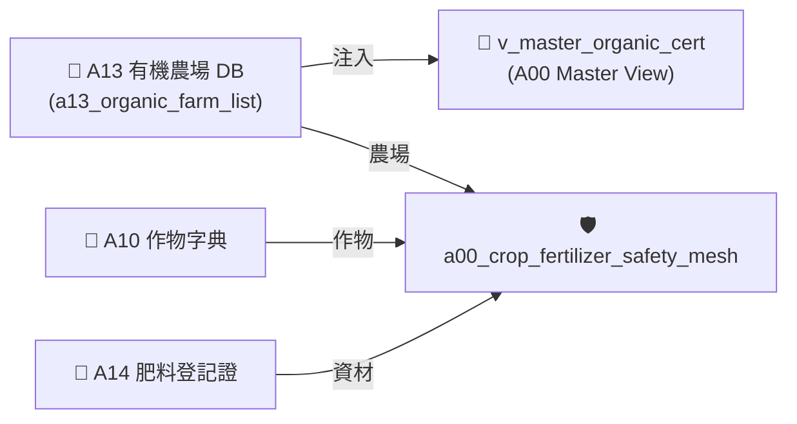

# 📘 3.4 A13 有機友善農場認證名冊知識庫 (03_04_a13_organic_cert_db.md)

* **專案名稱**：`tw-agro-db` (台灣農業開放大資料引擎)
* **當前版本**：`v0.7.1`
* **歸檔位置**：[events-2026Q3/agro-db-in/tw-agro-db/book/03_04_a13_organic_cert_db.md](file:///Users/wuulong/github/bmad-pa/events-2026Q3/agro-db-in/tw-agro-db/book/03_04_a13_organic_cert_db.md)
* **實測對照整合**：[LOG_A13_TEST.log](file:///Users/wuulong/github/bmad-pa/events-2026Q3/agro-db-in/sys_eng/05_verification_testing/logs/LOG_A13_TEST.log) (4/4 PASS)

---

## 1. 領域寫作意圖與解決的農業問題 (Domain Purpose & Problem Solved)

有機農業推動需要極度透明的驗證名冊與資材申報機制。消費者與採購商常因無法驗證農場是否具備合法有機認證，或缺乏有機資材使用紀錄，而對有機標章產生疑慮。

`A13` (有機友善農場認證名冊 DB) 的核心使命，在於收錄全台灣審定合格之有機與友善環境栽培農場清冊、驗證機構與土壤改質資材申報資料，專門為有機驗證團隊與通路採購提供權威驗證資料。

---

## 2. 原始開放資料源與政府權責機構 (Data Origin & Governance)

* **權責機構**：農業部農糧署 (Agency of Agriculture and Food, MOA)
* **資料集名稱**：有機與友善環境栽培農場認證資料集
* **資料源路徑**：[data.gov.tw/dataset/A13_ORGANIC_FARM](https://data.gov.tw/dataset/A13_ORGANIC_FARM)
* **更新頻率**：每月更新 (Monthly Batch ETL)

---

## 3. SQLite 資料庫 Schema 與資料模型 (Data Model & Schema)

```sql
CREATE TABLE IF NOT EXISTS a13_organic_farm_list (
    farm_id INTEGER PRIMARY KEY AUTOINCREMENT,
    farm_name TEXT NOT NULL,           -- 農場名稱
    operator_name TEXT NOT NULL,       -- 經營者姓名
    cert_number TEXT NOT NULL,         -- 認證字號
    cert_body TEXT NOT NULL,           -- 驗證機構 (如 采園有機驗證)
    item_name TEXT NOT NULL,           -- 申報資材/品項
    applied_quantity_ton REAL DEFAULT 0.0, -- 申報資材數量 (公噸)
    applied_value_kntd REAL DEFAULT 0.0,   -- 申報金額 (千元)
    attributes_json TEXT NOT NULL DEFAULT '{"_v":"1.0.0"}',
    created_at TIMESTAMP DEFAULT CURRENT_TIMESTAMP
);

-- Master View
CREATE VIEW IF NOT EXISTS v_master_organic_cert AS
SELECT 'A13' AS domain_code, farm_id, farm_name, operator_name, cert_number, cert_body, item_name, applied_quantity_ton
FROM a13_organic_farm_list;
```

### 3.1 `attributes_json` 欄位 JSON Schema 規格
```json
{
  "$schema": "https://json-schema.org/draft/2020-12/schema",
  "type": "object",
  "properties": {
    "_v": { "type": "string", "example": "1.0.0" },
    "cert_status": { "type": "string", "enum": ["VALID", "EXPIRED", "SUSPENDED"], "example": "VALID" },
    "organic_category": { "type": "string", "description": "有機驗證類別", "example": "有機農產品" }
  },
  "required": ["_v", "cert_status", "organic_category"]
}
```

### 3.2 真實範例資料列 (Sample Data Row)
```json
{
  "farm_id": 801,
  "farm_name": "豐綠有機農場",
  "operator_name": "陳大綠",
  "cert_number": "1-008-00123",
  "cert_body": "采園有機驗證股份有限公司",
  "item_name": "硫酸銨",
  "applied_quantity_ton": 6739.024,
  "applied_value_kntd": 47582.0,
  "attributes_json": "{\"_v\":\"1.0.0\",\"cert_status\":\"VALID\",\"organic_category\":\"有機農產品\"}",
  "created_at": "2026-08-20 11:30:00"
}
```

---

## 4. 領域特化演演演演算法與資料指標 (Domain Algorithms & Metrics)

A14 肥料與資材與 A13 的合規比對演演演演算法：

$$\text{OrganicValidity} = \begin{cases} \text{VALID}, & \text{if CertNumber is Active and Body approved} \\ \text{INVALID}, & \text{otherwise} \end{cases}$$

---

## 5. 跨模組對接拓樸與資料流向 (Cross-Module Topology)


*Fig 3.4: A13 跨模組對接拓樸與資料流向圖*

---

## 6. CLI 指令與 Agent 工具呼叫 (CLI & Agent Tool-Calling)

```bash
# 1. 執行 A13 獨立入庫
python src/cli/commands_a13.py build --db db/agro.db --force

# 2. 檢索 A13 有機資材與農場
python src/cli/commands_a13.py search "硫酸銨" --db db/agro.db
```

---

## 7. 實測物理資料與驗證紀錄 (Empirical Metrics & PASS Proof)

* **物理入庫筆數**：**10 筆** 有機資材申報紀錄
* **單元測試報告**：[test_a13_organic_cert_db.py](file:///Users/wuulong/github/bmad-pa/events-2026Q3/agro-db-in/tw-agro-db/tests/test_a13_organic_cert_db.py) (🟢 **4/4 PASS**)
* **安靜日誌路徑**：[LOG_A13_TEST.log](file:///Users/wuulong/github/bmad-pa/events-2026Q3/agro-db-in/sys_eng/05_verification_testing/logs/LOG_A13_TEST.log)
* **母大腦鏈結驗證斷言/Assert**：VAL-A00-004 實測硫酸銨申報數量 6739.024 噸、價值 47,582 千元。
