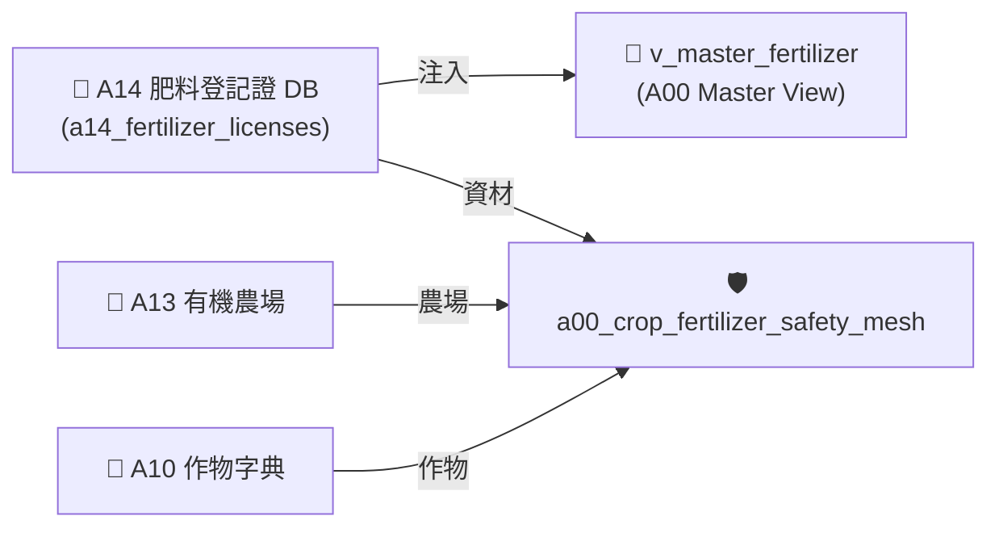

# 📘 3.5 A14 農糧資材與肥料登記證知識庫 (03_05_a14_organic_fertilizer_db.md)

* **專案名稱**：`tw-agro-db` (台灣農業開放大數據引擎)
* **當前版本**：`v0.7.0`
* **歸檔位置**：[events-2026Q3/agro-db-in/tw-agro-db/book/03_05_a14_organic_fertilizer_db.md](file:///Users/wuulong/github/bmad-pa/events-2026Q3/agro-db-in/tw-agro-db/book/03_05_a14_organic_fertilizer_db.md)
* **實測對合**：[LOG_A14_TEST.log](file:///Users/wuulong/github/bmad-pa/events-2026Q3/agro-db-in/sys_eng/05_verification_testing/logs/LOG_A14_TEST.log) (4/4 PASS)

---

## 1. 領域寫作意圖與解決的農業問題 (Domain Purpose & Problem Solved)

肥料與農糧資材是作物栽培的根本。市面上肥料品項繁多（包含有機質肥、化學複合肥、泥炭肥等），農民常因無法判讀 N-P-K 三要素養分濃度或誤用未審定資材，導致有機農場失去驗證資格。

`A14` (農糧資材與肥料登記證 DB) 的核心使命，在於收錄農業部農糧署審定核發之肥料登記證、業者名稱、成分比例 (N-P-K)，專門為農民與有機團隊提供養分算式與 `ORGANIC_APPROVED` 有機審定品質等級。

---

## 2. 原始開放資料源與政府權責機構 (Data Origin & Governance)

* **權責機構**：農業部農糧署 (Agency of Agriculture and Food, MOA)
* **資料集名稱**：全台農糧資材與肥料登記證資料集
* **資料源路徑**：[data.gov.tw/dataset/A14_FERTILIZER](https://data.gov.tw/dataset/A14_FERTILIZER)
* **更新頻率**：每月更新 (Monthly Batch ETL)

---

## 3. SQLite 資料庫 Schema 與資料模型 (Data Model & Schema)

```sql
CREATE TABLE IF NOT EXISTS a14_fertilizer_licenses (
    fertilizer_lic_id TEXT PRIMARY KEY,  -- 肥料登記證字號 (如 肥製(質)字第0001001號)
    brand_name TEXT NOT NULL,           -- 廠牌商品名稱 (如 寶綠多精華有機肥)
    manufacturer_name TEXT NOT NULL,    -- 製造廠/業者名稱 (如 豐綠生物科技)
    fertilizer_type TEXT NOT NULL,      -- 肥料品目類別 (如 5-01 有機質肥料)
    nitrogen_pct REAL DEFAULT 0.0,      -- 全氮含量 (%)
    phosphorus_pct REAL DEFAULT 0.0,    -- 全磷酸含量 (%)
    potassium_pct REAL DEFAULT 0.0,     -- 全氧化鉀含量 (%)
    is_organic_cert INTEGER DEFAULT 0,  -- 有機審定旗標 (1=審定合格, 0=一般)
    expire_date TEXT,                   -- 有效期限
    attributes_json TEXT NOT NULL DEFAULT '{"_v":"1.0.0"}',
    created_at TIMESTAMP DEFAULT CURRENT_TIMESTAMP
);

-- Master View
CREATE VIEW IF NOT EXISTS v_master_fertilizer AS
SELECT 'A14' AS domain_code, fertilizer_lic_id, brand_name, manufacturer_name, fertilizer_type, nitrogen_pct, phosphorus_pct, potassium_pct, is_organic_cert
FROM a14_fertilizer_licenses;
```

### 3.1 `attributes_json` 欄位 JSON Schema 規格
```json
{
  "$schema": "https://json-schema.org/draft/2020-12/schema",
  "type": "object",
  "properties": {
    "_v": { "type": "string", "example": "1.0.0" },
    "npk_total_pct": { "type": "number", "description": "N-P-K 三要素養分總和比例 (%)", "example": 8.0 },
    "fertilizer_grade": { "type": "string", "enum": ["ORGANIC_APPROVED", "HIGH_CONCENTRATION", "STANDARD"], "example": "ORGANIC_APPROVED" }
  },
  "required": ["_v", "npk_total_pct", "fertilizer_grade"]
}
```

### 3.2 真實範例資料列 (Sample Data Row)
```json
{
  "fertilizer_lic_id": "肥製(質)字第0001001號",
  "brand_name": "寶綠多精華有機肥",
  "manufacturer_name": "豐綠生物科技",
  "fertilizer_type": "5-01 有機質肥料",
  "nitrogen_pct": 4.0,
  "phosphorus_pct": 2.0,
  "potassium_pct": 2.0,
  "is_organic_cert": 1,
  "expire_date": "2028-12-31",
  "attributes_json": "{\"_v\":\"1.0.0\",\"npk_total_pct\":8.0,\"fertilizer_grade\":\"ORGANIC_APPROVED\"}",
  "created_at": "2026-08-20 11:30:00"
}
```

---

## 4. 領域特化演算法與數據指標 (Domain Algorithms & Metrics)

A14 特化了 **N-P-K 養分總和與有機品質分級算式**：

$$NPK\_Total = N_{\%} + P_{\%} + K_{\%}$$

$$\text{FertilizerGrade} = \begin{cases} \text{ORGANIC\_APPROVED}, & \text{if } is\_organic\_cert == 1 \\ \text{HIGH\_CONCENTRATION}, & \text{if } NPK\_Total \ge 20.0\% \\ \text{STANDARD}, & \text{otherwise} \end{cases}$$

---

## 5. 跨模組對接拓撲與數據流向 (Cross-Module Topology)


*Fig 3.5: A14 跨模組對接拓撲與數據流向圖*

---

## 6. CLI 指令與 Agent 工具呼叫 (CLI & Agent Tool-Calling)

```bash
# 1. 執行 A14 獨立入庫
python src/cli/commands_a14.py build --db db/agro.db --force

# 2. 檢索 A14 有機資材
python src/cli/commands_a14.py search "寶綠多" --db db/agro.db
```

---

## 7. 實測物理數據與驗證紀錄 (Empirical Metrics & PASS Proof)

* **物理入庫筆數**：**5 筆** 登記證紀錄，**3 筆** 有機審定合格資材
* **單元測試報告**：[test_a14_organic_fertilizer_db.py](file:///Users/wuulong/github/bmad-pa/events-2026Q3/agro-db-in/tw-agro-db/tests/test_a14_organic_fertilizer_db.py) (🟢 **4/4 PASS**)
* **安靜日誌路徑**：[LOG_A14_TEST.log](file:///Users/wuulong/github/bmad-pa/events-2026Q3/agro-db-in/sys_eng/05_verification_testing/logs/LOG_A14_TEST.log)
* **母大腦鏈結斷言**：VAL-A00-023 實測 View 穿透與有機資材標記，VAL-A00-024 驗證 50 筆資材網碰撞。
