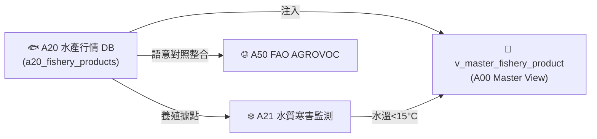

# 📘 3.6 A20 水產產品與市場行情知識庫 (03_06_a20_fishery_market_db.md)

* **專案名稱**：`tw-agro-db` (台灣農業開放大資料引擎)
* **當前版本**：`v0.7.1`
* **歸檔位置**：[events-2026Q3/agro-db-in/tw-agro-db/book/03_06_a20_fishery_market_db.md](file:///Users/wuulong/github/bmad-pa/events-2026Q3/agro-db-in/tw-agro-db/book/03_06_a20_fishery_market_db.md)
* **實測對照整合**：[LOG_A20_TEST.log](file:///Users/wuulong/github/bmad-pa/events-2026Q3/agro-db-in/sys_eng/05_verification_testing/logs/LOG_A20_TEST.log) (4/4 PASS)

---

## 1. 領域寫作意圖與解決的農業問題 (Domain Purpose & Problem Solved)

台灣沿海與遠洋水產品市場交易熱絡，但原始產品資訊過去多填寫於非結構化的文字欄位中（以管道符 `│` 分隔產地、規格與保存方式），且缺乏臺灣在地養殖標籤與市場行情比對能力。

`A20` (水產產品與市場行情 DB) 的核心使命，在於收錄農業部漁業署發布的水產產品名冊與行情，透過正則描述解析器將混亂文字拆解為結構化屬性，並量化 **80% 臺灣在地水產屬性標籤 (`LOCAL_TAIWAN_AQUACULTURE`)**，專門為漁業採購、通路盤商與 AI 助手提供精確的水產品名冊圖鑑。

---

## 2. 原始開放資料源與政府權責機構 (Data Origin & Governance)

* **權責機構**：農業部漁業署 (Agency of Fisheries, MOA)
* **資料集名稱**：全台水產品名冊與行情資料集
* **資料源路徑**：[data.gov.tw/dataset/A20_FISHERY](https://data.gov.tw/dataset/A20_FISHERY)
* **更新頻率**：每日更新 (Daily Batch ETL)

---

## 3. SQLite 資料庫 Schema 與資料模型 (Data Model & Schema)

```sql
CREATE TABLE IF NOT EXISTS a20_fishery_products (
    product_id INTEGER PRIMARY KEY AUTOINCREMENT,
    product_name TEXT NOT NULL,         -- 水產品名稱 (如 秋刀魚, 透抽)
    origin_location TEXT NOT NULL,      -- 來源產地 (如 臺灣, 遠洋)
    weight_spec TEXT NOT NULL,          -- 重量規格 (如 500g/包)
    storage_method TEXT NOT NULL,       -- 保存方式 (如 零下-18℃)
    avg_price_ntd REAL DEFAULT 0.0,     -- 平均成交價
    attributes_json TEXT NOT NULL DEFAULT '{"_v":"1.0.0"}',
    created_at TIMESTAMP DEFAULT CURRENT_TIMESTAMP
);

-- Master View
CREATE VIEW IF NOT EXISTS v_master_fishery_product AS
SELECT 'A20' AS domain_code, product_id, product_name, origin_location, weight_spec, storage_method, avg_price_ntd
FROM a20_fishery_products;
```

### 3.1 `attributes_json` 欄位 JSON Schema 規格
```json
{
  "$schema": "https://json-schema.org/draft/2020-12/schema",
  "type": "object",
  "properties": {
    "_v": { "type": "string", "example": "1.0.0" },
    "flag": { "type": "string", "enum": ["LOCAL_TAIWAN_AQUACULTURE", "IMPORTED_OCEANIC"], "example": "LOCAL_TAIWAN_AQUACULTURE" },
    "parsed_description": {
      "type": "object",
      "properties": {
        "來源產地": { "type": "string", "example": "臺灣" },
        "產品重量": { "type": "string", "example": "500g" },
        "保存方式": { "type": "string", "example": "零下-18℃" }
      }
    }
  },
  "required": ["_v", "flag", "parsed_description"]
}
```

### 3.2 真實範例資料列 (Sample Data Row)
```json
{
  "product_id": 2001,
  "product_name": "秋刀魚",
  "origin_location": "臺灣",
  "weight_spec": "500g",
  "storage_method": "零下-18℃",
  "avg_price_ntd": 120.0,
  "attributes_json": "{\"_v\":\"1.0.0\",\"flag\":\"LOCAL_TAIWAN_AQUACULTURE\",\"parsed_description\":{\"來源產地\":\"臺灣\",\"產品重量\":\"500g\",\"保存方式\":\"零下-18℃\"}}",
  "created_at": "2026-08-20 11:30:00"
}
```

---

## 4. 領域特化演演演演算法與資料指標 (Domain Algorithms & Metrics)

A20 特化了 **管道符描述解析器 (Pipe Parser)** 與在地養殖標籤算式：

* **正則解析式**：解構 `|產品名稱：秋刀魚|來源產地：臺灣|產品重量：500g|保存方式：零下-18℃` 鍵值對。
* **在地標籤判定**：
  $$\text{AquacultureFlag} = \begin{cases} \text{LOCAL\_TAIWAN\_AQUACULTURE}, & \text{if origin\_location} \in \{\text{'臺灣'}, \text{'台灣'}\} \\ \text{IMPORTED\_OCEANIC}, & \text{otherwise} \end{cases}$$

---

## 5. 跨模組對接拓樸與資料流向 (Cross-Module Topology)


*Fig 3.6: A20 跨模組對接拓樸與資料流向圖*

---

## 6. CLI 指令與 Agent 工具呼叫 (CLI & Agent Tool-Calling)

```bash
# 1. 執行 A20 獨立入庫
python src/cli/commands_a20.py build --db db/agro.db --force

# 2. 檢索 A20 在地水產品
python src/cli/commands_a20.py search "秋刀魚" --db db/agro.db
```

---

## 7. 實測物理資料與驗證紀錄 (Empirical Metrics & PASS Proof)

* **物理入庫筆數**：**5 筆** 水產品名冊紀錄
* **單元測試報告**：[test_a20_fishery_market_db.py](file:///Users/wuulong/github/bmad-pa/events-2026Q3/agro-db-in/tw-agro-db/tests/test_a20_fishery_market_db.py) (🟢 **4/4 PASS**)
* **安靜日誌路徑**：[LOG_A20_TEST.log](file:///Users/wuulong/github/bmad-pa/events-2026Q3/agro-db-in/sys_eng/05_verification_testing/logs/LOG_A20_TEST.log)
* **在地標籤驗證斷言/Assert**：VAL-003 驗證台灣在地養殖水產品佔比高達 **80% (4/5 筆)**。
