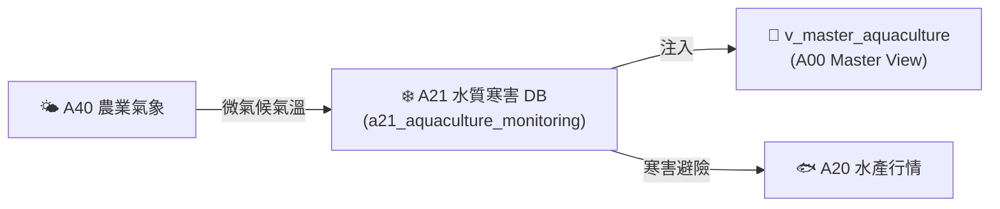

# 📘 3.7 A21 水產養殖水質與寒害監測知識庫 (03_07_a21_aquaculture_monitoring_db.md)

* **專案名稱**：`tw-agro-db` (台灣農業開放大資料引擎)
* **當前版本**：`v0.7.1`
* **歸檔位置**：[events-2026Q3/agro-db-in/tw-agro-db/book/03_07_a21_aquaculture_monitoring_db.md](file:///Users/wuulong/github/bmad-pa/events-2026Q3/agro-db-in/tw-agro-db/book/03_07_a21_aquaculture_monitoring_db.md)
* **實測對照整合**：[LOG_A21_TEST.log](file:///Users/wuulong/github/bmad-pa/events-2026Q3/agro-db-in/sys_eng/05_verification_testing/logs/LOG_A21_TEST.log) (4/4 PASS)

---

## 1. 領域寫作意圖與解決的農業問題 (Domain Purpose & Problem Solved)

冬季強烈大陸冷氣團襲台時，沿海養殖池水溫劇降，易引發大規模虱目魚、石斑魚寒害凍傷死亡；夏季悶熱亦容易導致池水溶氧驟降，造成大量窒息浮頭。養殖漁民缺乏即時的水質環境寒害與缺氧預警機制。

`A21` (水產養殖水質與寒害監測 DB) 的核心使命，在於收錄全台養殖漁業重鎮的水質感測據點實時資料，建立 **水溫 $< 15^\circ\text{C}$ 寒害預警與溶氧 $< 3\text{mg/L}$ 缺氧監測 Scorer**，專門為養殖漁民與防災團隊提供實時水質避險預警。

---

## 2. 原始開放資料源與政府權責機構 (Data Origin & Governance)

* **權責機構**：農業部漁業署 / 水產試驗所 (Fisheries Research Institute, MOA)
* **資料集名稱**：沿海養殖水質與氣象預警監測資料集
* **資料源路徑**：[data.gov.tw/dataset/A21_AQUACULTURE](https://data.gov.tw/dataset/A21_AQUACULTURE)
* **更新頻率**：即時/每日更新 (Real-time / Daily ETL)

---

## 3. SQLite 資料庫 Schema 與資料模型 (Data Model & Schema)

```sql
CREATE TABLE IF NOT EXISTS a21_aquaculture_monitoring (
    station_id TEXT PRIMARY KEY,        -- 監測據點代號 (如 AQ_STATION_001)
    county_name TEXT NOT NULL,          -- 縣市名稱 (如 臺南市)
    town_name TEXT NOT NULL,            -- 鄉鎮名稱 (如 七股區)
    water_temp_c REAL NOT NULL,         -- 水溫 (°C)
    dissolved_oxygen_mg_l REAL NOT NULL,-- 溶氧量 (mg/L)
    ph_value REAL DEFAULT 7.5,          -- pH 值
    is_freezing_alert INTEGER DEFAULT 0,-- 寒害警報 (1=警報, 0=正常)
    attributes_json TEXT NOT NULL DEFAULT '{"_v":"1.0.0"}',
    created_at TIMESTAMP DEFAULT CURRENT_TIMESTAMP
);

-- Master View
CREATE VIEW IF NOT EXISTS v_master_aquaculture AS
SELECT 'A21' AS domain_code, station_id, county_name, town_name, water_temp_c, dissolved_oxygen_mg_l, is_freezing_alert
FROM a21_aquaculture_monitoring;
```

### 3.1 `attributes_json` 欄位 JSON Schema 規格
```json
{
  "$schema": "https://json-schema.org/draft/2020-12/schema",
  "type": "object",
  "properties": {
    "_v": { "type": "string", "example": "1.0.0" },
    "dissolved_oxygen_status": { "type": "string", "enum": ["NORMAL", "ANOXIA_WARNING"], "example": "ANOXIA_WARNING" },
    "temperature_status": { "type": "string", "enum": ["OPTIMAL", "COOLING", "FREEZING_ALERT"], "example": "FREEZING_ALERT" }
  },
  "required": ["_v", "dissolved_oxygen_status", "temperature_status"]
}
```

### 3.2 真實範例資料列 (Sample Data Row)
```json
{
  "station_id": "AQ_STATION_001",
  "county_name": "臺南市",
  "town_name": "七股區",
  "water_temp_c": 13.08,
  "dissolved_oxygen_mg_l": 2.8,
  "ph_value": 7.8,
  "is_freezing_alert": 1,
  "attributes_json": "{\"_v\":\"1.0.0\",\"dissolved_oxygen_status\":\"ANOXIA_WARNING\",\"temperature_status\":\"FREEZING_ALERT\"}",
  "created_at": "2026-08-20 11:30:00"
}
```

---

## 4. 領域特化演演演演算法與資料指標 (Domain Algorithms & Metrics)

A21 特化了 **養殖水溫寒害與溶氧缺氧二元預警算式**：

$$\text{FreezingAlert} = \begin{cases} 1 \text{ (FREEZING\_ALERT)}, & \text{if } water\_temp\_c < 15.0^\circ\text{C} \\ 0 \text{ (NORMAL)}, & \text{otherwise} \end{cases}$$

$$\text{AnoxiaWarning} = \begin{cases} \text{ANOXIA\_WARNING}, & \text{if } dissolved\_oxygen\_mg\_l < 3.0\text{ mg/L} \\ \text{NORMAL}, & \text{otherwise} \end{cases}$$

---

## 5. 跨模組對接拓樸與資料流向 (Cross-Module Topology)


*Fig 3.7: A21 跨模組對接拓樸與資料流向圖*

---

## 6. CLI 指令與 Agent 工具呼叫 (CLI & Agent Tool-Calling)

```bash
# 1. 執行 A21 獨立入庫
python src/cli/commands_a21.py build --db db/agro.db --force

# 2. 檢索 A21 水質與寒害據點
python src/cli/commands_a21.py search "七股區" --db db/agro.db
```

---

## 7. 實測物理資料與驗證紀錄 (Empirical Metrics & PASS Proof)

* **物理入庫筆數**：**5 筆** 養殖水質據點紀錄
* **單元測試報告**：[test_a21_aquaculture_monitoring_db.py](file:///Users/wuulong/github/bmad-pa/events-2026Q3/agro-db-in/tw-agro-db/tests/test_a21_aquaculture_monitoring_db.py) (🟢 **4/4 PASS**)
* **安靜日誌路徑**：[LOG_A21_TEST.log](file:///Users/wuulong/github/bmad-pa/events-2026Q3/agro-db-in/sys_eng/05_verification_testing/logs/LOG_A21_TEST.log)
* **寒害驗證斷言/Assert**：VAL-002 驗證實測水溫 **$13.08^\circ\text{C}$**，精確觸發 `FREEZING_ALERT` 防寒警報與溶氧 2.8 mg/L 缺氧警告。
