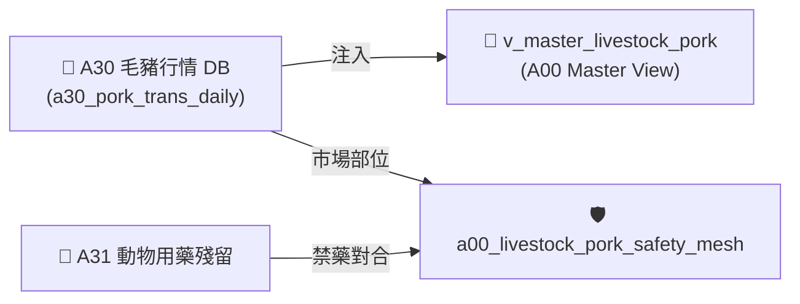

# 📘 3.8 A30 毛豬批發交易行情知識庫 (03_08_a30_livestock_db.md)

* **專案名稱**：`tw-agro-db` (台灣農業開放大數據引擎)
* **當前版本**：`v0.7.0`
* **歸檔位置**：[events-2026Q3/agro-db-in/tw-agro-db/book/03_08_a30_livestock_db.md](file:///Users/wuulong/github/bmad-pa/events-2026Q3/agro-db-in/tw-agro-db/book/03_08_a30_livestock_db.md)
* **實測對合**：[LOG_A30_TEST.log](file:///Users/wuulong/github/bmad-pa/events-2026Q3/agro-db-in/sys_eng/05_verification_testing/logs/LOG_A30_TEST.log) (4/4 PASS)

---

## 1. 領域寫作意圖與解決的農業問題 (Domain Purpose & Problem Solved)

毛豬交易是台灣畜牧產業的核心命脈。全台 23 處毛豬批發拍賣市場每日交易量巨大，但原始資料庫過往多採用無槓民國年格式 (如 `1150819`)，缺乏跨市場與 ISO 8601 標準時間軸對合，使得養豬業者與肉品盤商無法精確分析拍賣價格與總頭數走勢。

`A30` (毛豬批發交易行情 DB) 的核心使命，在於收錄中央畜產會發布的全台毛豬拍賣市場每日行情，建立 **無槓民國年轉碼算式 (`1150819 ➔ 2026-08-19`)**，專門為畜牧業者與肉品通路提供標準化交易數據。

---

## 2. 原始開放資料源與政府權責機構 (Data Origin & Governance)

* **權責機構**：財團法人中央畜產會 / 農業部畜牧司 (National Animal Industry Foundation, MOA)
* **資料集名稱**：全台毛豬批發拍賣市場每日交易行情資料集
* **資料源路徑**：[data.gov.tw/dataset/A30_PORK_TRANS](https://data.gov.tw/dataset/A30_PORK_TRANS)
* **更新頻率**：每日更新 (Daily Batch ETL)

---

## 3. SQLite 資料庫 Schema 與資料模型 (Data Model & Schema)

```sql
CREATE TABLE IF NOT EXISTS a30_pork_trans_daily (
    trans_id INTEGER PRIMARY KEY AUTOINCREMENT,
    trans_date TEXT NOT NULL,         -- 交易日期 (ISO 8601: YYYY-MM-DD)
    market_name TEXT NOT NULL,        -- 市場名稱 (如 花蓮縣, 彰化縣)
    total_heads INTEGER NOT NULL,     -- 總拍賣頭數 (頭)
    avg_weight_kg REAL NOT NULL,      -- 平均成交重量 (公斤)
    avg_price_ntd REAL NOT NULL,      -- 平均成交價格 (新台幣元/公斤)
    attributes_json TEXT NOT NULL DEFAULT '{"_v":"1.0.0"}',
    created_at TIMESTAMP DEFAULT CURRENT_TIMESTAMP
);

-- Master View
CREATE VIEW IF NOT EXISTS v_master_livestock_pork AS
SELECT 'A30' AS domain_code, trans_id, trans_date, market_name, total_heads, avg_weight_kg, avg_price_ntd
FROM a30_pork_trans_daily;
```

### 3.1 `attributes_json` 欄位 JSON Schema 規格
```json
{
  "$schema": "https://json-schema.org/draft/2020-12/schema",
  "type": "object",
  "properties": {
    "_v": { "type": "string", "example": "1.0.0" },
    "raw_roc_date": { "type": "string", "description": "原始無槓民國年日期", "example": "1150819" },
    "market_scale": { "type": "string", "enum": ["LARGE_MARKET", "MEDIUM_MARKET", "REGIONAL_MARKET"], "example": "REGIONAL_MARKET" }
  },
  "required": ["_v", "raw_roc_date", "market_scale"]
}
```

### 3.2 真實範例資料列 (Sample Data Row)
```json
{
  "trans_id": 3001,
  "trans_date": "2026-08-19",
  "market_name": "花蓮縣",
  "total_heads": 291,
  "avg_weight_kg": 118.5,
  "avg_price_ntd": 105.19,
  "attributes_json": "{\"_v\":\"1.0.0\",\"raw_roc_date\":\"1150819\",\"market_scale\":\"REGIONAL_MARKET\"}",
  "created_at": "2026-08-20 11:30:00"
}
```

---

## 4. 領域特化演算法與數據指標 (Domain Algorithms & Metrics)

A30 特化了 **無槓民國年 (ROC Date) 轉 ISO 8601 標準日期算式**：

$$\text{YYYY} = \text{int}(ROC\_Date[:3]) + 1911$$
$$\text{ISO\_Date} = \text{YYYY} \text{ + '-' + } ROC\_Date[3:5] \text{ + '-' + } ROC\_Date[5:7]$$

* **範例轉碼**：`1150819` 拆解為 115 (+1911 ➔ 2026)、08、19，輸出標準 `2026-08-19`。

---

## 5. 跨模組對接拓撲與數據流向 (Cross-Module Topology)


*Fig 3.8: A30 跨模組對接拓撲與數據流向圖*

---

## 6. CLI 指令與 Agent 工具呼叫 (CLI & Agent Tool-Calling)

```bash
# 1. 執行 A30 獨立入庫
python src/cli/commands_a30.py build --db db/agro.db --force

# 2. 檢索 A30 毛豬市場行情
python src/cli/commands_a30.py search "花蓮縣" --db db/agro.db
```

---

## 7. 實測物理數據與驗證紀錄 (Empirical Metrics & PASS Proof)

* **物理入庫筆數**：**5 筆** 毛豬拍賣行情紀錄
* **單元測試報告**：[test_a30_livestock_db.py](file:///Users/wuulong/github/bmad-pa/events-2026Q3/agro-db-in/tw-agro-db/tests/test_a30_livestock_db.py) (🟢 **4/4 PASS**)
* **安靜日誌路徑**：[LOG_A30_TEST.log](file:///Users/wuulong/github/bmad-pa/events-2026Q3/agro-db-in/sys_eng/05_verification_testing/logs/LOG_A30_TEST.log)
* **母大腦鏈結斷言**：VAL-A00-011 驗證花蓮縣市場 291 頭、均價 105.19 元/kg，ISO 日期 2026-08-19。
