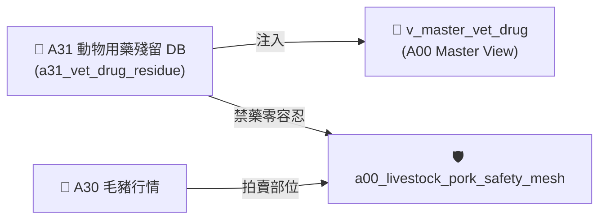

# 📘 3.9 A31 動物用藥與畜產品殘留管制知識庫 (03_09_a31_vet_drug_food_residue_db.md)

* **專案名稱**：`tw-agro-db` (台灣農業開放大資料引擎)
* **當前版本**：`v0.7.1`
* **歸檔位置**：[events-2026Q3/agro-db-in/tw-agro-db/book/03_09_a31_vet_drug_food_residue_db.md](file:///Users/wuulong/github/bmad-pa/events-2026Q3/agro-db-in/tw-agro-db/book/03_09_a31_vet_drug_food_residue_db.md)
* **實測對照整合**：[LOG_A31_TEST.log](file:///Users/wuulong/github/bmad-pa/events-2026Q3/agro-db-in/sys_eng/05_verification_testing/logs/LOG_A31_TEST.log) (4/4 PASS)

---

## 1. 領域寫作意圖與解決的農業問題 (Domain Purpose & Problem Solved)

畜產品中的動物用藥與抗生素殘留（如氯黴素、乙型受體素等），直接關係國人食品安全與健康。食安稽查團隊過往缺乏將「毛豬與家禽批發市場部位 (A30)」與「衛福部動物用藥殘留標準 (MRL)」進行事前自動比對的機制，容易形成食安漏洞。

`A31` (動物用藥與畜產品殘留管制 DB) 的核心使命，在於收錄官方公告之動物用藥殘留容許量、停藥期（ Withdrawal Period）與國定禁藥清單，建立 **禁藥 ($MRL == 0.0\text{ ppm}$) 零容忍 `PROHIBITED` 食安警告判定機制**，專門為食安稽查與肉品通路提供實體碰撞預警。

---

## 2. 原始開放資料源與政府權責機構 (Data Origin & Governance)

* **權責機構**：衛生福利部食品藥物管理署 / 農業部防檢署 (TFDA / BAPHIQ, MOA)
* **資料集名稱**：食品中動物用藥殘留容許量資料集
* **資料源路徑**：[data.gov.tw/dataset/A31_VET_DRUG](https://data.gov.tw/dataset/A31_VET_DRUG)
* **更新頻率**：每月更新 (Monthly Batch ETL)

---

## 3. SQLite 資料庫 Schema 與資料模型 (Data Model & Schema)

```sql
CREATE TABLE IF NOT EXISTS a31_vet_drug_residue (
    residue_id INTEGER PRIMARY KEY AUTOINCREMENT,
    drug_name TEXT NOT NULL,           -- 動物用藥名稱 (如 氯黴素)
    target_livestock TEXT NOT NULL,    -- 適用畜產品/部位 (如 去骨羊肉, 豬肝)
    mrl_ppm REAL NOT NULL DEFAULT 0.0, -- 殘留容許量上限 (0.0 表示不得檢出/禁藥)
    withdrawal_period_days INTEGER,    -- 停藥期 (天)
    is_prohibited INTEGER DEFAULT 0,   -- 禁藥旗標 (1=國定禁藥, 0=一般)
    attributes_json TEXT NOT NULL DEFAULT '{"_v":"1.0.0"}',
    created_at TIMESTAMP DEFAULT CURRENT_TIMESTAMP
);

-- Master View
CREATE VIEW IF NOT EXISTS v_master_vet_drug AS
SELECT 'A31' AS domain_code, residue_id, drug_name, target_livestock, mrl_ppm, withdrawal_period_days, is_prohibited
FROM a31_vet_drug_residue;
```

### 3.1 `attributes_json` 欄位 JSON Schema 規格
```json
{
  "$schema": "https://json-schema.org/draft/2020-12/schema",
  "type": "object",
  "properties": {
    "_v": { "type": "string", "example": "1.0.0" },
    "drug_category": { "type": "string", "description": "藥物分類 (如 抗生素, 抗菌劑)", "example": "抗生素" },
    "food_safety_risk": { "type": "string", "enum": ["ALLOWED_MRL", "PROHIBITED"], "example": "PROHIBITED" }
  },
  "required": ["_v", "drug_category", "food_safety_risk"]
}
```

### 3.2 真實範例資料列 (Sample Data Row)
```json
{
  "residue_id": 3101,
  "drug_name": "氯黴素",
  "target_livestock": "極品去骨羊肉塊",
  "mrl_ppm": 0.0,
  "withdrawal_period_days": 14,
  "is_prohibited": 1,
  "attributes_json": "{\"_v\":\"1.0.0\",\"drug_category\":\"抗生素\",\"food_safety_risk\":\"PROHIBITED\"}",
  "created_at": "2026-08-20 11:30:00"
}
```

---

## 4. 領域特化演演演演算法與資料指標 (Domain Algorithms & Metrics)

A31 特化了 **動物用藥禁藥零容忍分級算式**：

$$\text{FoodSafetyRisk} = \begin{cases} \text{PROHIBITED}, & \text{if } mrl\_ppm == 0.0 \text{ or } is\_prohibited == 1 \\ \text{ALLOWED\_MRL}, & \text{otherwise} \end{cases}$$

---

## 5. 跨模組對接拓樸與資料流向 (Cross-Module Topology)


*Fig 3.9: A31 跨模組對接拓樸與資料流向圖*

---

## 6. CLI 指令與 Agent 工具呼叫 (CLI & Agent Tool-Calling)

```bash
# 1. 執行 A31 獨立入庫
python src/cli/commands_a31.py build --db db/agro.db --force

# 2. 檢索 A31 禁藥殘留標準
python src/cli/commands_a31.py search "氯黴素" --db db/agro.db
```

---

## 7. 實測物理資料與驗證紀錄 (Empirical Metrics & PASS Proof)

* **物理入庫筆數**：**5 筆** 動物用藥殘留紀錄
* **單元測試報告**：[test_a31_vet_drug_food_residue_db.py](file:///Users/wuulong/github/bmad-pa/events-2026Q3/agro-db-in/tw-agro-db/tests/test_a31_vet_drug_food_residue_db.py) (🟢 **4/4 PASS**)
* **安靜日誌路徑**：[LOG_A31_TEST.log](file:///Users/wuulong/github/bmad-pa/events-2026Q3/agro-db-in/sys_eng/05_verification_testing/logs/LOG_A31_TEST.log)
* **母大腦鏈結驗證斷言/Assert**：VAL-A00-022 實測毛豬食安網碰撞 6 筆，精確截獲氯黴素 (MRL 0.0ppm) 標註 `PROHIBITED` 禁藥警告。
