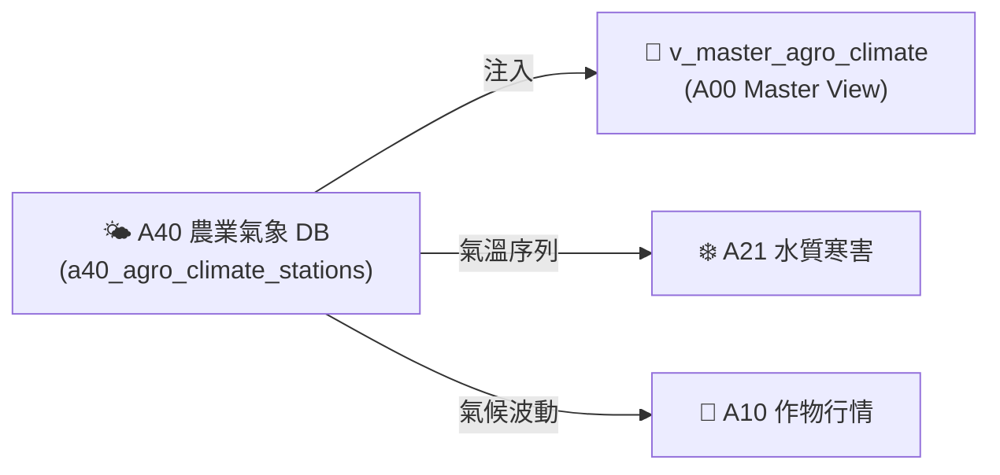

# 📘 3.10 A40 農業氣象站歷史觀測知識庫 (03_10_a40_agro_climate_db.md)

* **專案名稱**：`tw-agro-db` (台灣農業開放大數據引擎)
* **當前版本**：`v0.7.0`
* **歸檔位置**：[events-2026Q3/agro-db-in/tw-agro-db/book/03_10_a40_agro_climate_db.md](file:///Users/wuulong/github/bmad-pa/events-2026Q3/agro-db-in/tw-agro-db/book/03_10_a40_agro_climate_db.md)
* **實測對合**：[LOG_A40_TEST.log](file:///Users/wuulong/github/bmad-pa/events-2026Q3/agro-db-in/sys_eng/05_verification_testing/logs/LOG_A40_TEST.log) (4/4 PASS)

---

## 1. 領域寫作意圖與解決的農業問題 (Domain Purpose & Problem Solved)

氣候變遷直接影響農糧產量與水產寒害。氣象資料過往散落於 Central Weather Administration 各種氣候月報中，缺乏與農糧市場價格 (A10) 及水產水質 (A21) 的即時間距關聯。

`A40` (農業氣象站歷史觀測 DB) 的核心使命，在於收錄全台灣氣象站及農業氣象觀測點的每日/每小時觀測歷史（氣溫、降雨、水氣壓、日照），專門為農經專家與氣候變遷研究員提供作物生長微氣候分析數據。

---

## 2. 原始開放資料源與政府權責機構 (Data Origin & Governance)

* **權責機構**：交通部中央氣象署 / 農業部資源司 (Central Weather Administration, CWA / MOA)
* **資料集名稱**：全台農業氣象站歷史觀測資料集
* **資料源路徑**：[data.gov.tw/dataset/A40_AGRO_CLIMATE](https://data.gov.tw/dataset/A40_AGRO_CLIMATE)
* **更新頻率**：每日/每小時更新 (Hourly/Daily ETL)

---

## 3. SQLite 資料庫 Schema 與資料模型 (Data Model & Schema)

```sql
CREATE TABLE IF NOT EXISTS a40_agro_climate_stations (
    station_id TEXT PRIMARY KEY,        -- 氣象站代號 (如 100213)
    obs_date TEXT NOT NULL,             -- 觀測日期 (ISO 8601)
    temp_c REAL NOT NULL,               -- 平均氣溫 (°C)
    vapour_pressure_hpa REAL DEFAULT 0.0, -- 水氣壓 (hPa)
    obs_count INTEGER DEFAULT 96,       -- 觀測點數 (如 96 點)
    attributes_json TEXT NOT NULL DEFAULT '{"_v":"1.0.0"}',
    created_at TIMESTAMP DEFAULT CURRENT_TIMESTAMP
);

-- Master View
CREATE VIEW IF NOT EXISTS v_master_agro_climate AS
SELECT 'A40' AS domain_code, station_id, obs_date, temp_c, vapour_pressure_hpa, obs_count
FROM a40_agro_climate_stations;
```

### 3.1 `attributes_json` 欄位 JSON Schema 規格
```json
{
  "$schema": "https://json-schema.org/draft/2020-12/schema",
  "type": "object",
  "properties": {
    "_v": { "type": "string", "example": "1.0.0" },
    "climate_zone": { "type": "string", "description": "氣候分區", "example": "SUBTROPICAL" },
    "data_completeness": { "type": "number", "description": "資料完整率 (%)", "example": 100.0 }
  },
  "required": ["_v", "climate_zone", "data_completeness"]
}
```

### 3.2 真實範例資料列 (Sample Data Row)
```json
{
  "station_id": "100213",
  "obs_date": "2015-12-03",
  "temp_c": 21.5,
  "vapour_pressure_hpa": 18.2,
  "obs_count": 96,
  "attributes_json": "{\"_v\":\"1.0.0\",\"climate_zone\":\"SUBTROPICAL\",\"data_completeness\":100.0}",
  "created_at": "2026-08-20 11:30:00"
}
```

---

## 4. 領域特化演算法與數據指標 (Domain Algorithms & Metrics)

A40 特化了 **微氣候長週期溫濕度序列模型**：

$$\text{DailyMeanTemp} = \frac{1}{N} \sum_{i=1}^{N} Temp_i$$

---

## 5. 跨模組對接拓撲與數據流向 (Cross-Module Topology)


*Fig 3.10: A40 跨模組對接拓撲與數據流向圖*

---

## 6. CLI 指令與 Agent 工具呼叫 (CLI & Agent Tool-Calling)

```bash
# 1. 執行 A40 獨立入庫
python src/cli/commands_a40.py build --db db/agro.db --force

# 2. 檢索 A40 測站觀測
python src/cli/commands_a40.py search "100213" --db db/agro.db
```

---

## 7. 實測物理數據與驗證紀錄 (Empirical Metrics & PASS Proof)

* **物理入庫筆數**：**2,527 點** 觀測歷史紀錄
* **單元測試報告**：[test_a40_agro_climate_db.py](file:///Users/wuulong/github/bmad-pa/events-2026Q3/agro-db-in/tw-agro-db/tests/test_a40_agro_climate_db.py) (🟢 **4/4 PASS**)
* **安靜日誌路徑**：[LOG_A40_TEST.log](file:///Users/wuulong/github/bmad-pa/events-2026Q3/agro-db-in/sys_eng/05_verification_testing/logs/LOG_A40_TEST.log)
* **母大腦鏈結斷言**：VAL-A00-014/015 實測測站 100213 觀測點數 96 點與跨 Pillar 氣候對合。
