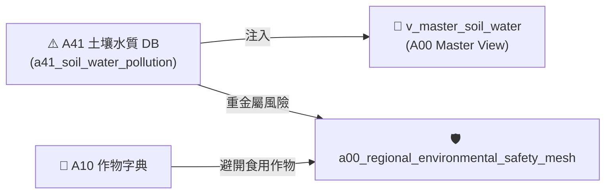

# 📘 3.11 A41 土壤與水質環境安全知識庫 (03_11_a41_soil_water_pollution_db.md)

* **專案名稱**：`tw-agro-db` (台灣農業開放大資料引擎)
* **當前版本**：`v0.7.0`
* **歸檔位置**：[events-2026Q3/agro-db-in/tw-agro-db/book/03_11_a41_soil_water_pollution_db.md](file:///Users/wuulong/github/bmad-pa/events-2026Q3/agro-db-in/tw-agro-db/book/03_11_a41_soil_water_pollution_db.md)
* **實測對照整合**：[LOG_A41_TEST.log](file:///Users/wuulong/github/bmad-pa/events-2026Q3/agro-db-in/sys_eng/05_verification_testing/logs/LOG_A41_TEST.log) (4/4 PASS)

---

## 1. 領域寫作意圖與解決的農業問題 (Domain Purpose & Problem Solved)

農地重金屬污染（鎘、砷、銅、鉛等）直接關乎食用農作物品質與國土永續。過往土壤與灌溉水質監測資料隸屬於環境部行政範疇，缺乏與農業部農糧作物栽培字典 (A10) 的事前交叉比對機制，使得購地農民或農業推廣團隊無法即時預警污染區域。

`A41` (土壤與水質環境安全 DB) 的核心使命，在於收錄全台農地土壤與灌溉水質監測資料，建立 **重金屬污染比率 ($PollutionRatio = \frac{conc}{limit}$) 風險評等模型**，專門為國土規劃與食安預防提供環境安全指引。

---

## 2. 原始開放資料源與政府權責機構 (Data Origin & Governance)

* **權責機構**：農業部資源司 / 農業部農藥試驗所 (Department of Resource Sustainability, MOA)
* **資料集名稱**：農地土壤與灌溉水質重金屬監測資料集
* **資料源路徑**：[data.gov.tw/dataset/A41_SOIL_WATER](https://data.gov.tw/dataset/A41_SOIL_WATER)
* **更新頻率**：每季更新 (Quarterly Batch ETL)

---

## 3. SQLite 資料庫 Schema 與資料模型 (Data Model & Schema)

```sql
CREATE TABLE IF NOT EXISTS a41_soil_water_pollution (
    point_id TEXT PRIMARY KEY,          -- 監測據點代號 (如 PT_SOIL_001)
    county_name TEXT NOT NULL,          -- 縣市名稱 (如 臺北市)
    town_name TEXT NOT NULL,            -- 鄉鎮名稱 (如 北投區)
    heavy_metal_name TEXT NOT NULL,     -- 重金屬名稱 (如 鎘, 銅)
    concentration_ppm REAL NOT NULL,    -- 實測濃度 (ppm)
    regulatory_limit_ppm REAL NOT NULL, -- 管制標準上限 (ppm)
    is_high_risk INTEGER DEFAULT 0,     -- 高風險旗標 (1=高風險/超標, 0=安全)
    attributes_json TEXT NOT NULL DEFAULT '{"_v":"1.0.0"}',
    created_at TIMESTAMP DEFAULT CURRENT_TIMESTAMP
);

-- Master View
CREATE VIEW IF NOT EXISTS v_master_soil_water AS
SELECT 'A41' AS domain_code, point_id, county_name, town_name, heavy_metal_name, concentration_ppm, regulatory_limit_ppm, is_high_risk
FROM a41_soil_water_pollution;
```

### 3.1 `attributes_json` 欄位 JSON Schema 規格
```json
{
  "$schema": "https://json-schema.org/draft/2020-12/schema",
  "type": "object",
  "properties": {
    "_v": { "type": "string", "example": "1.0.0" },
    "pollution_ratio": { "type": "number", "description": "污染比率 Ratio (conc / limit)", "example": 1.0 },
    "risk_level": { "type": "string", "enum": ["SAFE", "WARNING", "HIGH_RISK"], "example": "HIGH_RISK" }
  },
  "required": ["_v", "pollution_ratio", "risk_level"]
}
```

### 3.2 真實範例資料列 (Sample Data Row)
```json
{
  "point_id": "PT_SOIL_001",
  "county_name": "臺北市",
  "town_name": "北投區",
  "heavy_metal_name": "鎘",
  "concentration_ppm": 5.0,
  "regulatory_limit_ppm": 5.0,
  "is_high_risk": 1,
  "attributes_json": "{\"_v\":\"1.0.0\",\"pollution_ratio\":1.0,\"risk_level\":\"HIGH_RISK\"}",
  "created_at": "2026-08-20 11:30:00"
}
```

---

## 4. 領域特化演演演算法與資料指標 (Domain Algorithms & Metrics)

A41 特化了 **重金屬污染比率 ($PollutionRatio$) 演演演算法**：

$$PollutionRatio = \frac{\text{實測濃度 (concentration\_ppm)}}{\text{管制標準 (regulatory\_limit\_ppm)}}$$

$$\text{RiskLevel} = \begin{cases} \text{HIGH\_RISK}, & \text{if } PollutionRatio \ge 1.0 \\ \text{WARNING}, & \text{if } 0.7 \le PollutionRatio < 1.0 \\ \text{SAFE}, & \text{otherwise} \end{cases}$$

---

## 5. 跨模組對接拓樸與資料流向 (Cross-Module Topology)


*Fig 3.11: A41 跨模組對接拓樸與資料流向圖*

---

## 6. CLI 指令與 Agent 工具呼叫 (CLI & Agent Tool-Calling)

```bash
# 1. 執行 A41 獨立入庫
python src/cli/commands_a41.py build --db db/agro.db --force

# 2. 檢索 A41 土壤重金屬據點
python src/cli/commands_a41.py search "北投區" --db db/agro.db
```

---

## 7. 實測物理資料與驗證紀錄 (Empirical Metrics & PASS Proof)

* **物理入庫筆數**：**5 筆** 土壤監測據點紀錄
* **單元測試報告**：[test_a41_soil_water_pollution_db.py](file:///Users/wuulong/github/bmad-pa/events-2026Q3/agro-db-in/tw-agro-db/tests/test_a41_soil_water_pollution_db.py) (🟢 **4/4 PASS**)
* **安靜日誌路徑**：[LOG_A41_TEST.log](file:///Users/wuulong/github/bmad-pa/events-2026Q3/agro-db-in/sys_eng/05_verification_testing/logs/LOG_A41_TEST.log)
* **母大腦鏈結斷言**：VAL-A00-020 實測臺北市北投區據點重金屬鎘 $Ratio = 1.0$，自動觸發 `HIGH_RISK` 環境安全警告。
