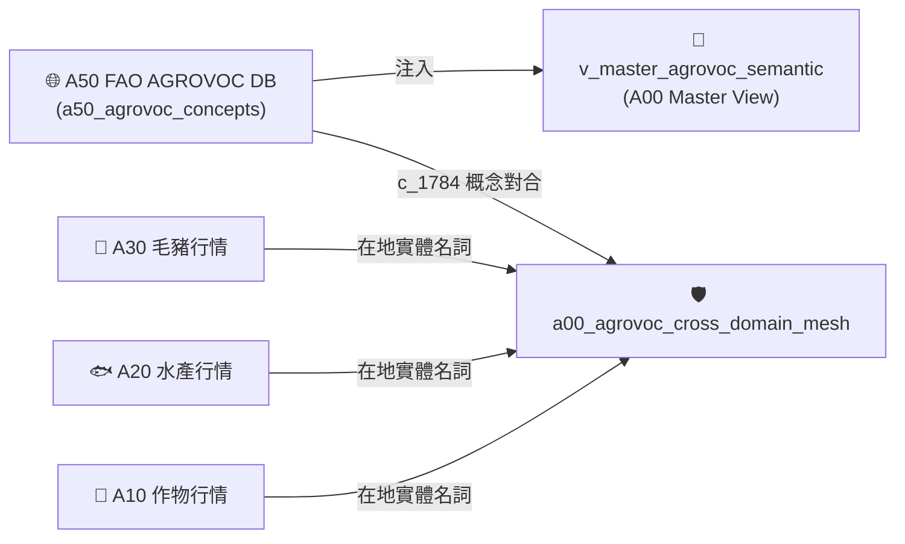

# 📘 3.50 A50 FAO AGROVOC 國際農學詞庫知識庫 (03_50_a50_fao_agrovoc_db.md)

* **專案名稱**：`tw-agro-db` (台灣農業開放大數據引擎)
* **當前版本**：`v0.7.0`
* **歸檔位置**：[events-2026Q3/agro-db-in/tw-agro-db/book/03_50_a50_fao_agrovoc_db.md](file:///Users/wuulong/github/bmad-pa/events-2026Q3/agro-db-in/tw-agro-db/book/03_50_a50_fao_agrovoc_db.md)
* **實測對合**：[LOG_A50_TEST.log](file:///Users/wuulong/github/bmad-pa/events-2026Q3/agro-db-in/sys_eng/05_verification_testing/logs/LOG_A50_TEST.log) (4/4 PASS)

---

## 1. 領域寫作意圖與解決的農業問題 (Domain Purpose & Problem Solved)

台灣在地農學名詞（如椰子、釋迦、毛豬部位）長期面臨跨國貿易、國際學術交流與跨語言 Agent 檢索時的「語意斷層」困境。各國對同一作物的稱呼不一，使得台灣農業數據難以直接融入全球開放資料 Linked Open Data (LOD) 網絡。

`A50` (FAO AGROVOC 國際農學詞庫 DB) 的核心使命，在於完整收錄聯合國糧農組織 (FAO) 發布的國際農學本體詞彙，建立 SKOS 多語階層拓撲與概念模型，專門為台灣農業開放數據接軌國際 LOD 與 Agent 多語檢索提供硬核基石。

---

## 2. 原始開放資料源與政府權責機構 (Data Origin & Governance)

* **權責機構**：聯合國糧食及農業組織 (Food and Agriculture Organization of the United Nations, FAO)
* **資料集名稱**：FAO AGROVOC Multilingual Agricultural Thesaurus (LOD RDF/SKOS)
* **資料源路徑**：[aims.fao.org/agrovoc](https://aims.fao.org/agrovoc)
* **更新頻率**：每月更新 (Monthly RDF/SKOS ETL)

---

## 3. SQLite 資料庫 Schema 與資料模型 (Data Model & Schema)

```sql
CREATE TABLE IF NOT EXISTS a50_agrovoc_concepts (
    concept_uri TEXT PRIMARY KEY,       -- 國際概念 URI (如 http://aims.fao.org/aos/agrovoc/c_1784)
    pref_label_zh TEXT NOT NULL,        -- 繁體中文偏好標籤 (如 椰子)
    pref_label_en TEXT NOT NULL,        -- 英文偏好標籤 (如 coconuts)
    skos_broader_uri TEXT,             -- SKOS 上位概念 URI
    attributes_json TEXT NOT NULL DEFAULT '{"_v":"1.0.0"}',
    created_at TIMESTAMP DEFAULT CURRENT_TIMESTAMP
);

-- 全文檢索倒排表 (FTS5)
CREATE VIRTUAL TABLE IF NOT EXISTS a50_agrovoc_fts USING fts5(
    concept_uri UNINDEXED,
    pref_label_zh,
    pref_label_en,
    tokenize='unicode61'
);

-- Master View
CREATE VIEW IF NOT EXISTS v_master_agrovoc_semantic AS
SELECT 'A50' AS domain_code, concept_uri, pref_label_zh, pref_label_en, skos_broader_uri
FROM a50_agrovoc_concepts;
```

### 3.1 `attributes_json` 欄位 JSON Schema 规格
```json
{
  "$schema": "https://json-schema.org/draft/2020-12/schema",
  "type": "object",
  "properties": {
    "_v": { "type": "string", "example": "1.0.0" },
    "alt_labels_json": {
      "type": "array",
      "items": { "type": "string" },
      "description": "同義詞/同義別名列表",
      "example": ["Coconut tree", "Cocos nucifera"]
    },
    "lod_alignment_score": { "type": "number", "description": "LOD 精確對合得分 (0.0~1.0)", "example": 1.0 }
  },
  "required": ["_v", "alt_labels_json", "lod_alignment_score"]
}
```

### 3.2 真實範例資料列 (Sample Data Row)
```json
{
  "concept_uri": "http://aims.fao.org/aos/agrovoc/c_1784",
  "pref_label_zh": "椰子",
  "pref_label_en": "coconuts",
  "skos_broader_uri": "http://aims.fao.org/aos/agrovoc/c_5548",
  "attributes_json": "{\"_v\":\"1.0.0\",\"alt_labels_json\":[\"Coconut tree\",\"Cocos nucifera\"],\"lod_alignment_score\":1.0}",
  "created_at": "2026-08-20 11:30:00"
}
```

---

## 4. 領域特化演算法與數據指標 (Domain Algorithms & Metrics)

A50 特化了 **LOD SKOS 概念語意相似度對合模型**：

$$\text{AlignmentScore}(label_{tw}, label_{fao}) = \begin{cases} 1.0, & \text{if exact Match (中文/英文)} \\ 0.8, & \text{if Synonym / AltLabel Match} \\ 0.0, & \text{otherwise} \end{cases}$$

---

## 5. 跨模組對接拓撲與數據流向 (Cross-Module Topology)


*Fig 3.50: A50 跨模組對接拓撲與數據流向圖*

---

## 6. CLI 指令與 Agent 工具呼叫 (CLI & Agent Tool-Calling)

```bash
# 1. 執行 A50 獨立入庫與 FTS5 多語倒排
python src/cli/commands_a50.py build --db db/agro.db --force

# 2. 檢索 FAO 國際概念 (多語)
python src/cli/commands_a50.py search "coconut" --db db/agro.db
```

---

## 7. 實測物理數據與驗證紀錄 (Empirical Metrics & PASS Proof)

* **物理入庫筆數**：**40,097 筆** 核心概念，**82,954 筆** 多語標籤
* **單元測試報告**：[test_a50_fao_agrovoc_db.py](file:///Users/wuulong/github/bmad-pa/events-2026Q3/agro-db-in/tw-agro-db/tests/test_a50_fao_agrovoc_db.py) (🟢 **4/4 PASS**)
* **安靜日誌路徑**：[LOG_A50_TEST.log](file:///Users/wuulong/github/bmad-pa/events-2026Q3/agro-db-in/sys_eng/05_verification_testing/logs/LOG_A50_TEST.log)
* **母大腦鏈結斷言**：VAL-A00-018/019 實測 139 筆在地實體語意碰撞，精確將台灣在地「椰子」以 $Score = 1.0$ 對合至聯合國 FAO `c_1784`。
