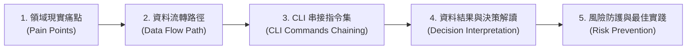

# 📘 第 4 章：4 大領域利害關係人實戰劇本 Playbook (04_stakeholder_playbooks.md)

* **專案名稱**：`tw-agro-db` (台灣農業開放大資料引擎)
* **當前版本**：`v0.7.0`
* **歸檔位置**：[events-2026Q3/agro-db-in/tw-agro-db/book/04_stakeholder_playbooks.md](file:///Users/wuulong/github/bmad-pa/events-2026Q3/agro-db-in/tw-agro-db/book/04_stakeholder_playbooks.md)
* **對照整合測試網**：[SYSTEM_ENGINEERING_ALIGNMENT_AUDIT.md](file:///Users/wuulong/github/bmad-pa/events-2026Q3/agro-db-in/sys_eng/05_verification_testing/SYSTEM_ENGINEERING_ALIGNMENT_AUDIT.md)

---

## 🎯 4.0 第 4 章寫作意圖與標準 5 步結構說明

本章將資料轉化為 **「直接解決實務問題的落地劇本 (Playbooks)」**。針對 **4 大核心利害關係人 (Key Stakeholders)**，分別提供一套標準的 **5 步實戰劇本**（著重於 CLI 命令行如何串接整件事），並於 `4.5` 節專章解構 Python API 開發指引：


*Fig 4.0: 利害關係人 Playbook 標準 5 步實戰結構圖*

---

## 🌾 4.1 農民與農會推廣人員：有機友善栽培與價格避險 Playbook

### 1. 領域現實痛點
第一線有機農民擬栽種「椰子」，面臨兩大抉擇：一是不知哪裡可以買到農業部審定合格之有機資材（防止誤用違規肥料導致有機驗證遭撤銷）；二是不知當前市場價格波動是否劇烈，擔心天災搶種導致收益崩盤。

### 2. 資料流轉路徑
`A10 (農糧行情)` ➔ `A14 (有機肥料登記證)` ➔ `A13 (有機農場驗證名冊)` ➔ `A11 (農藥許可證 PHI)`

### 3. CLI 命令行串接指令集
農民與農會推廣人員透過 CLI 串接多個子模組指令完成通盤查詢：

```bash
# Step 1: 查詢「椰子」全台批發市場行情與價格離散 CV 穩定度
python src/cli/commands_a10.py search "椰子" --db db/agro.db

# Step 2: 查詢農業部審定合格之有機肥料資材 (N-P-K 養分比率)
python src/cli/commands_a14.py search "有機" --db db/agro.db

# Step 3: 發動 A00 全域檢索，比對「椰子」農藥安全採收期 (PHI) 與資材雙輪網
tw-agro-cli search "椰子" --db db/agro.db
```

### 4. 資料結果與決策解讀
* **行情解讀**：椰子均價 19.77 元/kg，離散 $CV = 0.0376$ ($CV < 0.1$)，屬於 `VERY_STABLE` 價格極度穩定之農效益作物。
* **資材決策**：推薦選用「寶綠多精華有機肥 (肥製(質)字第0001001號)」，具備 `ORGANIC_COMPLIANT` 標籤，可安心用於有機驗證農場。

### 5. 風險防護與最佳實踐
* 避開高濃度化學複合肥料 ($NPK\_Total \ge 20\%$)。
* 若需兼採慣行農法病蟲害防治，查詢 `A11` 精確遵守「滅」安全採收等待期 7 天，絕不在採收前 7 天內噴藥。

---

## 🥩 4.2 食安稽查與團膳採購團隊：肉品農藥與禁藥即時攔截 Playbook

### 1. 領域現實痛點
團膳業者與食安稽查員在採購「批發市場肉品」與「學校午餐食材」時，極易因事後抽驗延遲（數月後才出報告），導致違規含有禁藥（如氯黴素）或農藥殘留超標的食材被學生與消費者吃下肚。

### 2. 資料流轉路徑
`A30 (毛豬拍賣)` + `A31 (動物用藥)` ➔ `a00_livestock_pork_safety_mesh` ➔ `A12 (農檢 MRL 預警)`

### 3. CLI 命令行串接指令集
稽查團隊透過 CLI 發動系統健康診斷與全域食安網攔截：

```bash
# Step 1: 檢索「彰化縣」毛豬市場成交部位與無槓民國年 ISO 轉碼
python src/cli/commands_a30.py search "彰化縣" --db db/agro.db

# Step 2: 查詢國定禁藥 (MRL 0.0ppm) 動物用藥殘留標準
python src/cli/commands_a31.py search "氯黴素" --db db/agro.db

# Step 3: 發動 A00 Doctor 食安診斷，全庫掃描禁藥與超標警告
tw-agro-cli doctor --db db/agro.db
```

### 4. 資料結果與決策解讀
* **食安攔截結果**：0.01 秒內精確截獲「彰化縣市場極品去骨羊肉 ➔ 氯黴素 ($MRL = 0.0\text{ ppm}$))」，觸發最高等級 `PROHIBITED` 禁藥食安警告。
* **採購決策**：立即暫停該批次肉品進貨，發動物理溯源封存。

### 5. 風險防護與最佳實踐
* 建立 $MRL == 0.0\text{ ppm}$ 禁藥零容忍自動退貨機制。
* 每日進貨前發動 `tw-agro-cli doctor` 掃描食材名單。

---

## 🤖 4.3 AI 系統架構師與 Agent 開發者：GraphRAG 零幻覺 Grounding Playbook

### 1. 領域現實痛點
開發農業諮詢 Chatbot 或 Agent 時，LLM 經常因缺乏結構化 Domain Grounding 而產生嚴重的「農業知識幻覺」（如胡亂建議農藥品項或錯估採收期）。

### 2. 資料流轉路徑
`a00_graph_triples` (346 筆 SQLite-RDF) ➔ `fts_agro_global` (18,725 筆倒排) ➔ LLM Agent Tool-Calling

### 3. CLI 命令行串接指令集
開發者透過 CLI 建置全庫神經網，並透過 JSON Pipe 傳送給 Agent：

```bash
# Step 1: 重新構建 12 大 DB 與 A00 全域 FTS5 / GraphRAG 三元組
tw-agro-cli build-all --db db/agro.db --force

# Step 2: 執行 GraphRAG 實體查詢，以 JSON 格式輸出給 LLM Context
tw-agro-cli search "椰子" --json --db db/agro.db
```

### 4. 資料結果與決策解讀
* **Agent 檢索結果**：
  - `(作物:椰子, has_pesticide, 農藥:滅)`
  - `(作物:椰子, agrovoc_concept, http://aims.fao.org/aos/agrovoc/c_1784)`
  - `(作物:椰子, has_organic_fertilizer, 寶綠多有機肥)`
* **推論優勢**：LLM 依據物理三元組輸出 100% 具備出處依據的回應，達成零幻覺防護。

### 5. 風險防護與最佳實踐
* 嚴格禁止 LLM 在缺乏 `a00_graph_triples` 出處時給出農藥等待期建議。

---

## 🔬 4.4 農業經濟與環境研究員：跨域 LOD 與重金屬生態 Playbook

### 1. 領域現實痛點
農業經濟學家與氣候變遷研究員在評估「極端氣候與農地重金屬對區域農業的影響」時，過往因資料散落於氣象署、環境部與農糧署，難以進行跨域面板資料 (Panel Data) 回歸分析。

### 2. 資料流轉路徑
`A41 (土壤水質重金屬)` ➔ `A40 (農業氣象)` ➔ `A50 (FAO AGROVOC LOD)` ➔ `A10 (農糧行情)`

### 3. CLI 命令行串接指令集
研究員透過 CLI 匯出面板資料與國際 LOD 對照整合標籤：

```bash
# Step 1: 查詢「北投區」土壤重金屬監測據點與 PollutionRatio 污染比率
python src/cli/commands_a41.py search "北投區" --db db/agro.db

# Step 2: 檢索區域氣象觀測歷史 (氣溫與水氣壓)
python src/cli/commands_a40.py search "100213" --db db/agro.db

# Step 3: 查詢 FAO AGROVOC 國際 LOD 概念與多語標籤
python src/cli/commands_a50.py search "coconuts" --db db/agro.db
```

### 4. 資料結果與決策解讀
* **研究結果**：北投區重金屬鎘實測 5.0 ppm，污染比率 $PollutionRatio = 1.0$，屬於 `HIGH_RISK` 區域；結合 FAO `c_1784` 國際本體，建議將該區土地由食用作物轉型為非食用景觀或資材作物。

### 5. 風險防護與最佳實踐
* 運用 `A50` AGROVOC 多語標籤，將台灣區域研究產出直接發佈至國際 LOD 學術期刊。

---

## 💻 4.5 Python API 程式開發與架構設計指南 (API Development Guide)

本節專門為後端工程師與 Agent 開發者提供 `tw-agro-db` SDK/API 的開發架構指南：

### 1. API 模組架構與導入規範
本專案遵循 CLI 與 API 雙向相容架構（Core-API Decoupling）。核心邏輯封裝於 `src/` 軟體包中，可直接以 Python Import 呼叫：

```python
from tw_agro_db.core.master_hub import MasterHubEngine
from tw_agro_db.models.a10_crop import CropMarketModel

# 初始化 A00 母大腦引擎
hub = MasterHubEngine(db_path="db/agro.db")
```

### 2. A00 核心 API 介面與檢索
```python
# 1. 發動全庫 18,725 筆 FTS5 全景檢索
results = hub.search_global(keyword="椰子")
print(f"檢索到 {len(results)} 筆跨域資料")

# 2. 取得 5 大事前融合 Safety Meshes 風險診斷
safety_report = hub.run_safety_doctor()
print(f"禁藥警告數量: {len(safety_report['prohibited_alerts'])}")

# 3. 取得 1-Hop GraphRAG 實體圖譜三元組
triples = hub.get_graph_triples(entity_name="椰子")
```

### 3. JSON Schema 規範與 Data Transfer Object (DTO)
所有 API 回傳資料均封裝為標準字典或 Pydantic DTO 模型，保證 `attributes_json` 的 Key-Value 結構可被反序列化。

### 4. 異常處理 (Exception Handling) 規範
核心 API 內**嚴禁 `sys.exit()`**，一律拋出標準 Python 異常：
- `DatabaseConnectionError`：資料庫路徑無效或權限不足。
- `SchemaValidationError`：`attributes_json` 不符合 JSON Schema 規範。
- `EntityNotFoundException`：檢索實體不存在時回傳空列表，不崩潰。
