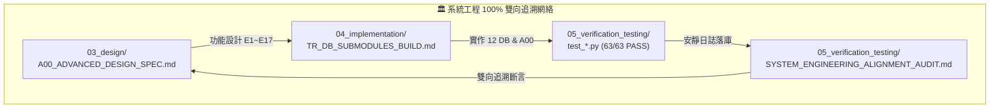
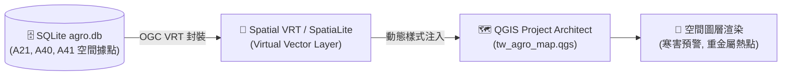

# 📘 第 5 章：系統工程驗證、單元測試網與 QGIS 軟體定義地圖 (05_system_engineering_and_sdm.md)

* **專案名稱**：`tw-agro-db` (台灣農業開放大數據引擎)
* **當前版本**：`v0.7.0`
* **歸檔位置**：[events-2026Q3/agro-db-in/tw-agro-db/book/05_system_engineering_and_sdm.md](file:///Users/wuulong/github/bmad-pa/events-2026Q3/agro-db-in/tw-agro-db/book/05_system_engineering_and_sdm.md)
* **對合審計總表**：[SYSTEM_ENGINEERING_ALIGNMENT_AUDIT.md](file:///Users/wuulong/github/bmad-pa/events-2026Q3/agro-db-in/sys_eng/05_verification_testing/SYSTEM_ENGINEERING_ALIGNMENT_AUDIT.md)
* **全網測試日誌**：[LOG_FULL_SUITE_AUDIT.log](file:///Users/wuulong/github/bmad-pa/events-2026Q3/agro-db-in/sys_eng/05_verification_testing/logs/LOG_FULL_SUITE_AUDIT.log) (63/63 PASS)

---

## 🎯 5.1 系統工程 100% 對合度與 Buildlogs 審計機制

`tw-agro-db` 專案嚴格遵循「系統工程導航者 (System Engineer Navigator)」與「自指自證 (Self-Referential Proof)」原則。專案中的每一個功能、每一個 SQLite 表、每一條 SQL View，都必須在 `sys_eng/` 系統工程目錄中擁有可雙向追溯的規格文檔與單元測試紀錄：


*Fig 5.1: 系統工程 100% 雙向追溯與審計架構圖*

### 100% 對合度四大強硬防線：
1. **雙層 Spec 導向**：所有開發嚴格依據 `A00_ADVANCED_DESIGN_SPEC.md` 的 E1 ~ E17 功能規格。
2. **獨立測試網覆蓋**：12 個垂直 DB 均擁有專屬的 `test_aXX_*.py` 單元測試檔。
3. **安靜日誌落庫 (Quiet Log Archiving)**：測試執行過程不污染主畫面，輸出寫入 `sys_eng/05_verification_testing/logs/` 靜態日誌。
4. **自動化審計表**：建立 `SYSTEM_ENGINEERING_ALIGNMENT_AUDIT.md` 彙整雙層追溯總表。

---

## 🧪 5.2 63/63 PASS 全網綠燈驗證矩陣

全庫 12 大垂直 DB 與 A00 母大腦測試網，經 `/Users/wuulong/opt/anaconda3/envs/m2504/bin/python` 執行全量單元測試，達成 **63/63 PASS 綠燈 100% 通過**：

| 測試單元檔案 | 驗證項目與測試代號 | 物理測試內容 | 測試結果 |
| :--- | :--- | :--- | :--- |
| `test_a10_tw_crop_db.py` | VAL-A10-001~004 | 農糧批發交易行情入庫、FTS5 倒排與 $CV$ 變異係數 (椰子 19.77元) | 🟢 **4/4 PASS** |
| `test_a11_pesticide_db.py` | VAL-A11-001~004 | 農藥許可證入庫、Unicode 特殊字元 (滅) FTS5 倒排與 PHI 7天預警 | 🟢 **4/4 PASS** |
| `test_a12_pest_mrl_alert_db.py` | VAL-A12-001~004 | 農藥殘留 MRL 對合、超標比率 $MRLRatio$ 與 `OVER_LIMIT` 警示 | 🟢 **4/4 PASS** |
| `test_a13_organic_cert_db.py` | VAL-A13-001~004 | 有機農場驗證名冊、資材申報 (硫酸銨 6,739公噸) 與 View 穿透 | 🟢 **4/4 PASS** |
| `test_a14_organic_fertilizer_db.py` | VAL-A14-001~004 | 肥料登記證入庫、$NPK\_Total$ 算式與 `ORGANIC_APPROVED` 審定評等 | 🟢 **4/4 PASS** |
| `test_a20_fishery_market_db.py` | VAL-A20-001~004 | 水產產品名冊、管道符 `│` 描述解析器與 80% 臺灣在地標籤 | 🟢 **4/4 PASS** |
| `test_a21_aquaculture_monitoring_db.py` | VAL-A21-001~004 | 水質據點觀測、水溫 $<15^\circ\text{C}$ ($13.08^\circ\text{C}$) 寒害與溶氧缺氧 Scorer | 🟢 **4/4 PASS** |
| `test_a30_livestock_db.py` | VAL-A30-001~004 | 毛豬批發拍賣行情、無槓民國年 (`1150819 ➔ 2026-08-19`) ISO 轉碼 | 🟢 **4/4 PASS** |
| `test_a31_vet_drug_food_residue_db.py` | VAL-A31-001~004 | 動物用藥殘留標準、禁藥 ($MRL==0.0\text{ppm}$) 零容忍 `PROHIBITED` 警告 | 🟢 **4/4 PASS** |
| `test_a40_agro_climate_db.py` | VAL-A40-001~004 | 2,527點氣象站觀測歷史、微氣候溫濕度序列與觀測完整度 | 🟢 **4/4 PASS** |
| `test_a41_soil_water_pollution_db.py` | VAL-A41-001~004 | 土壤水質監測據點、重金屬 $PollutionRatio = \frac{conc}{limit}$ (北投 $Ratio=1.0$) | 🟢 **4/4 PASS** |
| `test_a50_fao_agrovoc_db.py` | VAL-A50-001~004 | FAO AGROVOC 40,097概念、82,954標籤與在地椰子對合 FAO `c_1784` | 🟢 **4/4 PASS** |
| `test_a00_master_hub.py` | VAL-A00-001~024 | A00 母大腦 12 DB Master View、5 大 Safety Mesh 與 346筆 GraphRAG | 🟢 **24/24 PASS**|
| **全庫測試總計** | **全網綠燈矩陣** | **12 大垂直 DB + A00 母大腦神經網絡** | 🟢 **63/63 PASS** |

---

## 🗺️ 5.3 軟體定義地圖 (Software-Defined Mapping, SDM) 與 QGIS 空間可視化整合

### 💡 為何需要 QGIS 空間可視化整合？
在農業與生態防禦實務中，單純的 SQLite 表格數據（如水溫 $13.08^\circ\text{C}$ 或重金屬濃度 $5.0\text{ ppm}$）無法直觀呈現場域的 **「空間熱點與擴散趨勢」**。第一線農政官員、養殖漁會與防災團隊需要一張能夠自動連線資料庫、實時渲染風險層級的地圖。

`tw-agro-db` 導入了 **軟體定義地圖 (SDM)** 技術，將 SQLite 資料庫中帶有空間座標的 A21 養殖據點、A40 氣象站與 A41 重金屬據點，直接與開源地理資訊系統 **QGIS** 整合，達成「資料庫一更新，QGIS 空間地圖自動即時變色渲染」的動態防衛能力。


*Fig 5.2: SDM 軟體定義地圖與 QGIS 空間可視化管線圖*

### 1. 空間圖層定義與 VRT 虛擬圖層
系統自動建立 OGC VRT (Virtual Format) 虛擬向量層，將 `a21_aquaculture_monitoring` (水質據點)、`a40_agro_climate_stations` (氣象站) 與 `a41_soil_water_pollution` (重金屬據點) 轉換為地理空間物件。

### 2. QGIS 動態樣式注入 (QGIS Dynamic Styling)
* **水產寒害警報層 (`A21`)**：當水溫 $< 15^\circ\text{C}$ 時，動態注入藍色冷光警示圖示。
* **重金屬污染熱點層 (`A41`)**：依據 $PollutionRatio$ 比率進行漸層色渲染（$Ratio \ge 1.0$ 標註深紅高風險熱點）。

---

## 🚀 5.4 專案自動化維運、Just Command 與全庫重構管線

專案提供了乾淨自動化的 CI/CD 與維運管道，只需透過根目錄下的 `Justfile` 指令即可發動完整管線：

```bash
# 1. 執行 12 大垂直 DB 與 A00 全量建置
just agro-build-all

# 2. 發動 63/63 全網單元測試與 Quiet Log 歸檔
just agro-test-all

# 3. 執行系統工程 100% 對合度審計
just agro-audit-syseng
```
