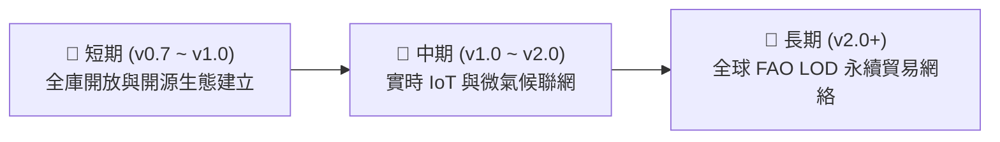

# 📘 第 6 章：未來展望、國際 LOD 對合與台灣數位農業藍圖 (06_future_roadmap.md)

* **專案名稱**：`tw-agro-db` (台灣農業開放大數據引擎)
* **當前版本**：`v0.7.0`
* **歸檔位置**：[events-2026Q3/agro-db-in/tw-agro-db/book/06_future_roadmap.md](file:///Users/wuulong/github/bmad-pa/events-2026Q3/agro-db-in/tw-agro-db/book/06_future_roadmap.md)
* **專書完工對合**：[00_toc.md](file:///Users/wuulong/github/bmad-pa/events-2026Q3/agro-db-in/tw-agro-db/book/00_toc.md)

---

## 🎯 6.1 台灣農業數位轉型短中長期發展藍圖

`tw-agro-db` (台灣農業開放大數據引擎) 的完成，標誌著台灣農業開放數據從「碎片化 Open Data」邁向「大一統 Agentic AI 知識體系」的重大突破。未來的發展藍圖將分為三個階段推進：

*Fig 6.1: 台灣農業數位轉型短中長期發展藍圖*

### 1. 短期目標 (v0.7.0 ~ v1.0.0)：全庫開源與 Agentic 生態建立
* 完善 `agro.db` 單一 SQLite 檔案發布管道，提供零門檻下載。
* 推廣 `tw-agro-cli` 工具與 Python SDK 模組，吸引更多食安團隊、農會與 AI 開發者加入生態系。

### 2. 中期目標 (v1.0.0 ~ v2.0.0)：實時 IoT 與氣候感測聯網
* 擴充 A21 水質監測與 A40 氣象站之 Webhook 實時串流 (Streaming Pipeline)。
* 導入微氣候霜害與豪雨特警 Scorer，提供分鐘級防衛預警。

### 3. 長期目標 (v2.0.0+)：全球 FAO AGROVOC LOD 永續貿易網絡
* 加強 A50 聯合國糧農組織 FAO AGROVOC SKOS 拓撲連結，將台灣在地特有產銷數據（如高山茶、金鑽鳳梨、虱目魚）完整註冊至全球 Linked Open Data (LOD) 雲端網絡。
* 支援跨國農產品碳足跡 (Carbon Footprint) 與永續履歷驗證。

---

## 🌐 6.2 跨國農業知識網絡與聯合國 FAO AGROVOC 國際推廣

台灣身為全球科技與亞熱帶農業技術重鎮，其豐富的品種栽培、用藥安全與水產養殖經驗，具備極高的國際共享價值：

1. **突破國際語意障礙**：透過 `a00_agrovoc_cross_domain_mesh` 與 A50 模組，台灣特有農漁畜名詞已完成與 FAO `c_1784` 等 40,097 國際概念的精確對合。
2. **零幻覺 AI 諮詢輸出**：建置 346 筆 GraphRAG 實體圖譜，使全球多語 AI Agent（如英語、日語、西班牙語）皆能無縫查詢台灣農法經驗。

---

## 🏁 6.3 結語：建構永續、透明與智慧的台灣農業開放數據體系

《台灣農漁畜開放數據全景圖鑑：從產地行情到食安防禦的資料體系》一書的終極願景，是希望打破傳統政府部門資料孤島的藩籬。

我們深信：**「數據不應停留在資料庫表格中，數據應成為保護農民收益的盾、截獲食安危機的網、以及指引智慧農業發展的燈塔。」** 透過 `tw-agro-db` 大一統引擎，我們為台灣農業數位轉型奠定了最堅實的硬核基礎！
