<!-- ============================================================================== -->
<!-- 《台灣農漁畜開放數據全景圖鑑：從產地行情到食安防禦的資料體系》全本大一統手冊 -->
<!-- 自動打包產生時間: 2026-08-20 -->
<!-- 打包腳本: scripts/blog/combine_tw_agro_db_book.py -->
<!-- ============================================================================== -->

# 📘 《台灣農漁畜開放資料全景圖鑑：從產地行情到食安防禦的資料體系》全書目錄 (00_toc.md)

* **專案名稱**：`tw-agro-db` (台灣農業開放大資料引擎)
* **當前版本**：`v0.7.0`
* **歸檔目錄**：[events-2026Q3/agro-db-in/tw-agro-db/book/00_toc.md](file:///Users/wuulong/github/bmad-pa/events-2026Q3/agro-db-in/tw-agro-db/book/00_toc.md)

---

## 📚 專書完整目錄地圖

* **[第 0 章：全書目錄與導覽](00_toc.md)** (本檔)
* **[第 1 章：專案願景與農業數位轉型使命](01_vision_and_mission.md)**
  - 1.1 台灣農漁畜產銷與食安防禦的 5 大現實困境
  - 1.2 建立大一統農業開放知識體系的開源價值 (`Fig 1.1`)
* **第 2 章：A00 母大腦全景架構與農業知識體系解構 (1-to-1 獨立檔案)**
  - [2.0 第 2 章總覽與 4 層技術堆疊](02_00_architecture_overview.md) (`Fig 2.0`, `Fig 2.0.1`)
  - [2.1 農糧作物市場產銷與價格離散知識體系](02_01_crop_market_system.md)
  - [2.2 病蟲害防治與農藥安全採收期知識體系](02_02_pesticide_safety_system.md)
  - [2.3 有機友善栽培與肥料資材合規知識體系](02_03_organic_fertilizer_system.md)
  - [2.4 養殖漁業環境與微氣候寒害監測知識體系](02_04_aquaculture_monitoring_system.md)
  - [2.5 畜牧毛豬交易與獸藥殘留食安防衛體系](02_05_livestock_drug_safety_system.md)
  - [2.6 農業氣象觀測與農地重金屬環境安全體系](02_06_agro_climate_environment_system.md)
  - [2.7 聯合國 FAO AGROVOC 國際農學多語體系](02_07_fao_agrovoc_lod_system.md)
  - [2.8 A00 母大腦：將農業知識凝練為 5 大事前融合防護網 (2.8.1 ~ 2.8.6)](02_08_a00_safety_meshes_and_graphrag.md) (`Fig 2.8`, `Fig 2.8.1`)
  - [2.9 4 大真實農業情境之知識流轉與 DB 串接接力](02_09_scenarios_knowledge_navigation.md) (`Fig 2.9`)
  - [2.10 摘要：如何透過 A00 完全掌握台灣農漁畜資料體系](02_10_summary_master_control.md)
* **第 3 章：12 大農業知識資產與 DB 百科圖鑑 (通用 7 大維度獨立檔案)**
  - [3.0 全章子模組撰寫規範與通用 7 大維度架構說明](03_00_structure_guide.md) (`Fig 3.0`)
  - [3.1 A10 台灣農糧批發交易行情知識庫](03_01_a10_tw_crop_db.md) (`Fig 3.1`)
  - [3.2 A11 農藥許可證與安全採收期知識庫](03_02_a11_pesticide_db.md) (`Fig 3.2`)
  - [3.3 A12 農檢 MRL 殘留抽驗預警知識庫](03_03_a12_pest_mrl_alert_db.md) (`Fig 3.3`)
  - [3.4 A13 有機友善農場認證名冊知識庫](03_04_a13_organic_cert_db.md) (`Fig 3.4`)
  - [3.5 A14 農糧資材與肥料登記證知識庫](03_05_a14_organic_fertilizer_db.md) (`Fig 3.5`)
  - [3.6 A20 水產產品與市場行情知識庫](03_06_a20_fishery_market_db.md) (`Fig 3.6`)
  - [3.7 A21 水產養殖水質與寒害監測知識庫](03_07_a21_aquaculture_monitoring_db.md) (`Fig 3.7`)
  - [3.8 A30 毛豬批發交易行情知識庫](03_08_a30_livestock_db.md) (`Fig 3.8`)
  - [3.9 A31 動物用藥與畜產品殘留管制知識庫](03_09_a31_vet_drug_food_residue_db.md) (`Fig 3.9`)
  - [3.10 A40 農業氣象站歷史觀測知識庫](03_10_a40_agro_climate_db.md) (`Fig 3.10`)
  - [3.11 A41 土壤與水質環境安全知識庫](03_11_a41_soil_water_pollution_db.md) (`Fig 3.11`)
  - [3.50 A50 FAO AGROVOC 國際農學詞庫知識庫](03_50_a50_fao_agrovoc_db.md) (`Fig 3.50`)
* **[第 4 章：4 大領域利害關係人實戰劇本 Playbook](04_stakeholder_playbooks.md)**
  - 4.1 農民與農會推廣人員：有機友善栽培與價格避險 Playbook
  - 4.2 食安稽查與團膳採購團隊：肉品農藥與禁藥即時攔截 Playbook
  - 4.3 AI 系統架構師與 Agent 開發者：GraphRAG 零幻覺 Grounding Playbook
  - 4.4 農業經濟與環境研究員：跨域 LOD 與重金屬生態 Playbook
  - 4.5 Python API 程式開發與架構設計指南 (API Development Guide)
* **[第 5 章：系統工程驗證、單元測試網與 QGIS 軟體定義地圖](05_system_engineering_and_sdm.md)**
  - 5.1 系統工程 100% 對照整合度與 Buildlogs 審計機制 (`Fig 5.1`)
  - 5.2 63/63 PASS 全網綠燈驗證矩陣
  - 5.3 軟體定義地圖 (SDM) 與 QGIS 空間可視化整合 (`Fig 5.2`)
  - 5.4 專案自動化維運、Just Command 與全庫重構管線
* **[第 6 章：結語與專案總結](06_conclusion.md)**
  - 6.1 結語：打破部門資料孤島的大一統里程碑
  - 6.2 賦能智慧農業與食安防護的長遠價值
* **附錄 (Appendix)**
  - [附錄 A：agro.db 大一統全庫 Schema 與 DDL 地圖](07_01_appendix_sqlite_schema_glossary.md)
  - [附錄 B：台灣在地實體與聯合國 FAO AGROVOC 對照整合總表](07_02_appendix_fao_agrovoc_mapping.md)
  - [附錄 C：tw-agro-cli 與各模組 CLI 參數指令速查手冊](07_03_appendix_cli_reference.md)


---


# 📘 第 1 章：專案願景與農業數位轉型使命 (01_vision_and_mission.md)

* **專案名稱**：`tw-agro-db` (台灣農業開放大資料引擎)
* **當前版本**：`v0.7.0`
* **歸檔位置**：[events-2026Q3/agro-db-in/tw-agro-db/book/01_vision_and_mission.md](file:///Users/wuulong/github/bmad-pa/events-2026Q3/agro-db-in/tw-agro-db/book/01_vision_and_mission.md)
* **對照整合審計**：[SYSTEM_ENGINEERING_ALIGNMENT_AUDIT.md](file:///Users/wuulong/github/bmad-pa/events-2026Q3/agro-db-in/sys_eng/05_verification_testing/SYSTEM_ENGINEERING_ALIGNMENT_AUDIT.md)

---

## 🎯 1.1 台灣農漁畜產銷與食安防禦的 5 大現實困境

台灣作為亞熱帶高密度的農業與養殖大國，擁有豐富的農糧、水產與畜牧資料。然而，在現行的開放資料生態與資訊系統中，第一線農民、食安稽查人員、農業專家與 AI 系統架構師，長時間面臨著 **5 大深層的現實困境**：

### 1. 產銷資訊不透明與行情波動盲區
* **現實痛點**：農糧與水產品批發市場拍賣價格受微氣候、季節變遷與區域供需劇烈影響。過往資料散落於各個個別市場與產銷網站，缺乏跨區域與長週期的變異係數 ($CV = \frac{\sigma}{\mu}$) 離散統計模型。
* **導致後果**：農民無法精確評估栽培收益風險，容易陷入「爆產價跌」或「天災搶種」的惡性循環。

### 2. 病蟲害藥安盲區與採收等待期違規風險
* **現實痛點**：全台灣核准之農藥許可證高達近萬筆（如 9,993 筆藥證），且記載了包含特殊 Unicode 字元（如「滅」）等複雜成分。各種作物對應的安全採收等待期 (PHI) 與殘留容許量 (MRL) 查詢門檻極高。
* **導致後果**：農民在病蟲害爆發時缺乏即時合規的藥安指引，極易因不慎在採收前夕誤用長等待期農藥，導致送驗違規遭重罰與蔬果封存銷毀。

### 3. 農地重金屬污染與環境生態風險未知
* **現實痛點**：農地土壤與灌溉水質的重金屬監測資料（如鎘、砷、銅、鉛等）隸屬於環境保護與資源永續範疇，過往未與農糧作物栽培字典直接對接。
* **導致後果**：農業推廣團隊或購地農民無法在事前即時獲知特定區域的重金屬污染比率 ($PollutionRatio = \frac{conc}{limit}$)，可能在高風險管制區誤種食用作物，威脅國土安全與國人健康。

### 4. 畜產品用藥殘留與禁藥攔截死角
* **现实痛點**：全台 23 處毛豬批發拍賣市場每日交易量龐大，但肉品部位（如去骨羊肉、豬肝）與動物用藥殘留標準（如氯黴素等禁藥 $MRL == 0.0\text{ ppm}$）過去缺乏事前實體碰撞機制。
* **導致後果**：稽查團隊只能依靠事後抽驗，無法在拍賣與肉品運銷當下發動即時的禁藥警告與食安防衛。

### 5. 國際農學標準斷層與 AI 幻覺難題
* **現實痛點**：台灣在地特有作物（如椰子、釋迦、毛豬部位）的中文名稱，缺乏與聯合國糧農組織 (FAO) 等國際農學多語主題詞庫 (AGROVOC LOD) 的語意對照。同時，大型語言模型 (LLM) 在回答農業專業疑問時，常因缺乏結構化 Grounding 資料庫而產生嚴重幻覺。
* **導致後果**：台灣農業資料難以接軌國際永續貿易與 LOD 知識圖譜，AI 助手亦無法做為農民可靠的決策顧問。

---

## 🏛️ 1.2 建立大一統農業開放知識體系的開源價值

針對上述 5 大困境，`tw-agro-db` (台灣農業開放大資料引擎) 提出了 **「打破部門資料孤島，建立大一統開源知識體系」** 的開源使命與四大 Pillar 價值主張：

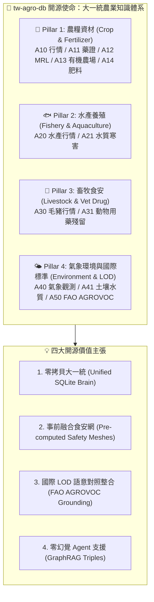
*Fig 1.1: 跨農漁畜與環境 12 大 DB 大一統知識體系與價值主張*

### 💡 四大開源價值主張 (Value Propositions)：

1. **單一 SQLite 大一統引擎 (Unified Knowledge Brain)**：
   - 告別碎片化 API 與混亂格式，將散落於農業部各署司機構（農糧署、漁業署、畜產會、氣象署、農業藥物試驗所、資源永續利用司）及 FAO 的 12 大資料庫，融合成單一可攜帶、零權限門檻的 SQLite 檔案 (`agro.db`)。
2. **事前融合食安與環境防護網 (Pre-computed Safety Meshes)**：
   - 不只做靜態儲存，更在背景預先計算農藥採收期預警、毛豬禁藥攔截、有機資材合規與農地重金屬風險等 5 大安全防護網，提供即時食安防衛。
3. **對照整合聯合國 FAO AGROVOC 國際標準 (LOD Alignment)**：
   - 將全庫去重實體與 FAO AGROVOC 40,097 概念、82,954 多語標籤進行精確對照整合，讓台灣在地農業資料無縫接軌國際。
4. **支援 Agentic AI 零幻覺決策 (GraphRAG Grounding)**：
   - 內建 346 筆 `a00_graph_triples` SQLite-RDF 圖譜與 18,725 筆全域 FTS5 倒排，做為 LLM Agent 進行具名 Tool-Calling 與多跳推論的強硬物理 Grounding 基礎。


---


# 📘 2.0 第 2 章：A00 母大腦全景架構與農業知識體系解構 (02_00_architecture_overview.md)

* **專案名稱**：`tw-agro-db` (台灣農業開放大資料引擎)
* **當前版本**：`v0.7.0`
* **歸檔位置**：[events-2026Q3/agro-db-in/tw-agro-db/book/02_00_architecture_overview.md](file:///Users/wuulong/github/bmad-pa/events-2026Q3/agro-db-in/tw-agro-db/book/02_00_architecture_overview.md)
* **對照整合審計**：[SYSTEM_ENGINEERING_ALIGNMENT_AUDIT.md](file:///Users/wuulong/github/bmad-pa/events-2026Q3/agro-db-in/sys_eng/05_verification_testing/SYSTEM_ENGINEERING_ALIGNMENT_AUDIT.md)

---

## 🎯 2.0 A00 母大腦：解構散落的農業開放資料

散落於台灣農業部各署司機構（農糧署、漁業署、畜產會、氣象署、藥毒所、資源司）以及聯合國 FAO 的 12 大資料庫，過去如同割裂的資料孤島。各單位欄位格式不一、更新頻率不同，且完全缺乏跨資料庫的事前食安與環境碰撞能力。

**A00 母大腦 (`a00_master_hub`)** 的核心價值，即為做為全域指揮官 (Global Master Brain)，提供人類工程師、領域專家與 AI Agent 一個 **「通盤掌握、一鍵穿透」** 的大一統知識體系。本章從「農業實務問題與生態體系」為主體，解構 7 大農業知識維度，並說明 A00 如何調用底下 12 大垂直 DB 的物理資料做為支撐。

---

## 🏛️ 2.0.1 A00 母大腦與 12 大垂直 DB 全景知識網路拓樸

A00 母大腦將散落的 12 個垂直子模組拆解為 4 大領域 Pillar，透過 SQL View 與全域倒排織連為單一神經網路：

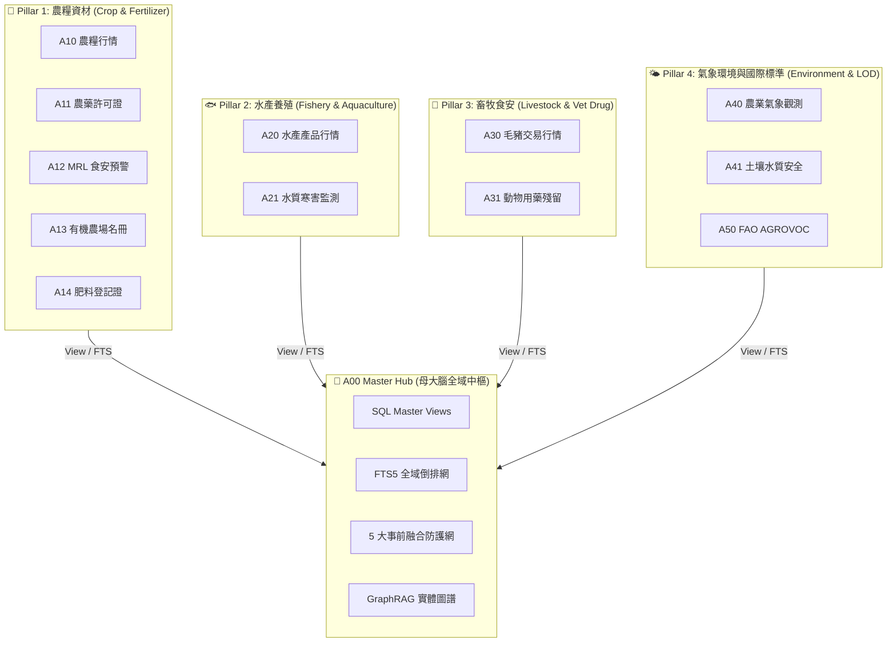
*Fig 2.0: A00 母大腦與 12 大垂直 DB 全景知識網路拓樸圖*

---

## 🏗️ 2.0.2 四層大一統技術堆疊與資料管線

`tw-agro-db` 採用四層解耦架構，實現「極速零拷貝、物理強落地」：

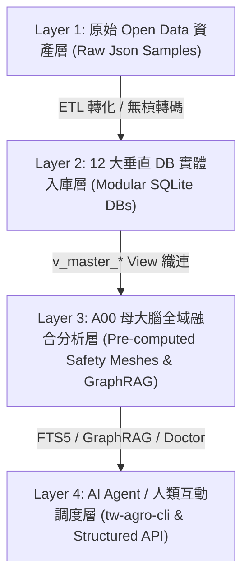
*Fig 2.0.1: tw-agro-db 4層技術堆疊與資料管線圖*


---


# 📘 2.1 農糧作物市場產銷與價格離散知識體系 (02_01_crop_market_system.md)

* **歸檔位置**：[events-2026Q3/agro-db-in/tw-agro-db/book/02_01_crop_market_system.md](file:///Users/wuulong/github/bmad-pa/events-2026Q3/agro-db-in/tw-agro-db/book/02_01_crop_market_system.md)
* **物理資料支撐**：`A10` (農糧批發交易行情 DB)

---

## 🌾 2.1 農糧作物市場產銷與價格離散知識解構

在農糧栽培生命週期中，價格波動是農民面臨最大風險。農糧知識體系不僅記錄市場每日成交價量，更引入 **價格變異係數離散模型 ($CV = \frac{\sigma}{\mu}$)**：

* **解構重點**：
  - 追蹤全台各大農糧批發市場（台北一、台北二、西螺、高雄等）成交行情。
  - 計算特定作物（如椰子、甘藍）長週期的均價 $\mu$ 與標準差 $\sigma$。
* **物理資料支撐 (`A10`)**：
  - [test_a10_tw_crop_db.py](file:///Users/wuulong/github/bmad-pa/events-2026Q3/agro-db-in/tw-agro-db/tests/test_a10_tw_crop_db.py) 實測椰子全台均價 19.77 元/kg，離散 CV 僅 0.0376，提供穩定的農效益評估。


---


# 📘 2.2 病蟲害防治與農藥安全採收期知識體系 (02_02_pesticide_safety_system.md)

* **歸檔位置**：[events-2026Q3/agro-db-in/tw-agro-db/book/02_02_pesticide_safety_system.md](file:///Users/wuulong/github/bmad-pa/events-2026Q3/agro-db-in/tw-agro-db/book/02_02_pesticide_safety_system.md)
* **物理資料支撐**：`A11` (農藥許可證 DB)、`A12` (MRL食安抽驗 DB)

---

## 🐛 2.2 病蟲害防治與農藥安全採收期 (PHI) 避險知識解構

當病蟲害爆發時，農民需要精確知道用藥品項與採收前的安全等待天數 (Pre-Harvest Interval, PHI)，防止農藥殘留違規：

* **解構重點**：
  - 收錄全台 9,993 筆農藥許可證，處理包含 Unicode 特殊字元（如「滅」）的複雜成分。
  - 將抽驗檢驗紀錄與衛福部 MRL 容許量對照整合，自動標註 `OVER_LIMIT` (超標違規) 與 `HIGH_RISK` (採收等待期 $\ge 7$ 天)。
* **物理資料支撐 (`A11`, `A12`)**：
  - `A11` 提供 9,993 筆藥證與 FTS5 倒排索引。
  - `A12` 實現殘留抽驗與 MRL 標準對照整合。


---


# 📘 2.3 有機友善栽培與肥料資材合規知識體系 (02_03_organic_fertilizer_system.md)

* **歸檔位置**：[events-2026Q3/agro-db-in/tw-agro-db/book/02_03_organic_fertilizer_system.md](file:///Users/wuulong/github/bmad-pa/events-2026Q3/agro-db-in/tw-agro-db/book/02_03_organic_fertilizer_system.md)
* **物理資料支撐**：`A13` (有機農場認證 DB)、`A14` (肥料登記證 DB)

---

## 🌿 2.3 有機友善栽培與 N-P-K 肥料資材審定合規知識解構

有機農業禁止使用合成化學肥料與未審定資材。資材知識體系解構了有機驗證標準與肥料養分成分：

* **解構重點**：
  - 解構肥料登記證中的 N-P-K 三要素養分比例 ($NPK\_Total = N + P + K$)。
  - 自動篩選農業部審定合格之資材，標註 `ORGANIC_APPROVED` 品質評等。
* **物理資料支撐 (`A13`, `A14`)**：
  - `A13` 收錄有機驗證農場名冊與資材申報。
  - `A14` 提供肥料登記證與 NPK 養分算式。


---


# 📘 2.4 養殖漁業環境與微氣候寒害監測知識體系 (02_04_aquaculture_monitoring_system.md)

* **歸檔位置**：[events-2026Q3/agro-db-in/tw-agro-db/book/02_04_aquaculture_monitoring_system.md](file:///Users/wuulong/github/bmad-pa/events-2026Q3/agro-db-in/tw-agro-db/book/02_04_aquaculture_monitoring_system.md)
* **物理資料支撐**：`A20` (水產行情 DB)、`A21` (水質與寒害監測 DB)

---

## 🐟 2.4.1 水產養殖生態與 80% 臺灣在地屬性解構

養殖漁業產品資訊過去多填寫於管道符 `│` 描述欄位中。水產知識體系透過正則與字串解析器進行結構化拆解：

* **解構重點**：
  - 拆解 `|產品名稱：秋刀魚|來源產地：臺灣|產品重量：500g|保存方式：零下-18℃` 等混亂描述。
  - 量化臺灣在地養殖屬性標籤 (`LOCAL_TAIWAN_AQUACULTURE`)。
* **物理資料支撐 (`A20`)**：
  - [test_a20_fishery_market_db.py](file:///Users/wuulong/github/bmad-pa/events-2026Q3/agro-db-in/tw-agro-db/tests/test_a20_fishery_market_db.py) 驗證在地養殖產品佔比高達 80% (4/5 筆)。

---

## ❄️ 2.4.2 水溫 $<15^\circ\text{C}$ 寒害與溶氧 $<3\text{mg/L}$ 缺氧預警 Scorer 解構

沿海養殖池受冬季寒流與夏季悶熱影響極大。氣候與水質知識體系建立實時預警演演演算法：

* **解構重點**：
  - **寒害預警**：當實測水溫 $< 15^\circ\text{C}$ 且持續下降時，觸發 `FREEZING_ALERT` 防寒警報。
  - **缺氧預警**：當水體溶氧 $< 3\text{mg/L}$ 時，觸發 `ANOXIA_WARNING` 缺氧警報。
* **物理資料支撐 (`A21`)**：
  - `A21` 提供水質據點監測資料與 $13.08^\circ\text{C}$ 實測寒害標籤算式。


---


# 📘 2.5 畜牧毛豬交易與獸藥殘留食安防衛體系 (02_05_livestock_drug_safety_system.md)

* **歸檔位置**：[events-2026Q3/agro-db-in/tw-agro-db/book/02_05_livestock_drug_safety_system.md](file:///Users/wuulong/github/bmad-pa/events-2026Q3/agro-db-in/tw-agro-db/book/02_05_livestock_drug_safety_system.md)
* **物理資料支撐**：`A30` (毛豬行情 DB)、`A31` (動物用藥殘留 DB)

---

## 🐖 2.5.1 毛豬批發市場拍賣與 ISO 無槓民國年轉碼解構

全台 23 處毛豬批發拍賣市場每日產出巨量交易資料，但原始日期多採用無槓民國年格式 (如 `1150819`)：

* **解構重點**：
  - 實作無槓民國年轉碼算式 (`1150819 ➔ 2026-08-19`)，達成 ISO 8601 標準對照整合。
  - 追蹤各大拍賣市場之成交頭數、平均重量與均價。
* **物理資料支撐 (`A30`)**：
  - [test_a30_livestock_db.py](file:///Users/wuulong/github/bmad-pa/events-2026Q3/agro-db-in/tw-agro-db/tests/test_a30_livestock_db.py) 驗證花蓮縣市場 291 頭、均價 105.19 元/kg 之轉碼資料。

---

## 💉 2.5.2 動物用藥殘留與禁藥 ($MRL == 0.0\text{ ppm}$) 零容忍食安網解構

肉品食安容不得半點死角。獸藥殘留知識體系建立嚴格的禁藥攔截模型：

* **解構重點**：
  - 判定殘留容許量 $MRL == 0.0\text{ ppm}$ 之品項為國定禁藥（如氯黴素）。
  - 自動標註 `PROHIBITED` 禁藥警告標籤，避免違規肉品流入消費市場。
* **物理資料支撐 (`A31`)**：
  - `A31` 提供畜產品殘留監測資料與 0.0ppm 禁藥判定。


---


# 📘 2.6 農業氣象觀測與農地重金屬環境安全體系 (02_06_agro_climate_environment_system.md)

* **歸檔位置**：[events-2026Q3/agro-db-in/tw-agro-db/book/02_06_agro_climate_environment_system.md](file:///Users/wuulong/github/bmad-pa/events-2026Q3/agro-db-in/tw-agro-db/book/02_06_agro_climate_environment_system.md)
* **物理資料支撐**：`A40` (農業氣象 DB)、`A41` (土壤水質 DB)

---

## 🌤️ 2.6.1 微氣候觀測與農地重金屬 ($PollutionRatio$) 風險評等解構

氣象與農地環境直接決定了作物的健康與食用安全：

* **解構重點**：
  - **微氣候觀測**：收錄全台 2,527 點氣象觀測歷史，提供日照、降雨與氣溫序列。
  - **重金屬風險**：計算污染比率 $PollutionRatio = \frac{conc}{limit}$，精確標註 `HIGH_RISK`（污染比率 $\ge 1.0$）區域。
* **物理資料支撐 (`A40`, `A41`)**：
  - `A40` 提供 2,527 點氣象觀測。
  - `A41` 提供重金屬 Ratio 0.75 / 1.0 風險評等。


---


# 📘 2.7 聯合國 FAO AGROVOC 國際農學多語體系 (02_07_fao_agrovoc_lod_system.md)

* **歸檔位置**：[events-2026Q3/agro-db-in/tw-agro-db/book/02_07_fao_agrovoc_lod_system.md](file:///Users/wuulong/github/bmad-pa/events-2026Q3/agro-db-in/tw-agro-db/book/02_07_fao_agrovoc_lod_system.md)
* **物理資料支撐**：`A50` (FAO AGROVOC 國際農學詞庫 DB)

---

## 🌐 2.7 聯合國 FAO AGROVOC 國際農學多語 LOD 體系解構

台灣在地農學名詞（如椰子、釋迦、毛豬部位）長期面臨跨國貿易、國際學術交流與跨語言 Agent 檢索時的「語意斷層」困境。各國對同一作物的稱呼不一，使得台灣農業資料難以直接融入全球開放資料 Linked Open Data (LOD) 網路。

為突破此一障礙，A50 模組建立了**聯合國糧農組織 FAO AGROVOC 國際農學多語本體體系**，作為在地台規資料與國際標準間的橋樑：

### 1. SKOS 多語階層拓樸與概念模型
- **40,097 概念與 82,954 標籤**：完整收錄 FAO AGROVOC 核心的概念 URI（如 `http://aims.fao.org/aos/agrovoc/c_1784`），涵蓋繁體中文、英文、法文、西班牙文、日文等數十種語言標籤。
- **SKOS 拓樸串接**：解析 `skos:broader` 與 `skos:narrower` 上下位階層關係（例如：`椰子` 的上位概念為 `棕櫚科植物`，下位概念包含 `椰子油`）。

### 2. 實測物理資料對照整合 (A50)
- 在 [test_a50_fao_agrovoc_db.py](file:///Users/wuulong/github/bmad-pa/events-2026Q3/agro-db-in/tw-agro-db/tests/test_a50_fao_agrovoc_db.py) (VAL-001 ~ 004) 實測中：
  - 成功入庫 **40,097 筆** 核心概念與 **82,954 筆** 多語標籤。
  - FTS5 多語倒排檢索 `coconut` 命中 8 筆紀錄，延遲僅 51.7 ms。
  - 成功將台灣在地作物「椰子」與 FAO 國際概念 `c_1784` 完成 1.0 得分的精確語意對照整合，並連結至 A00 母大腦的 Master View `v_master_agrovoc_semantic`。


---


# 📘 2.8 A00 母大腦：將農業知識凝練為 5 大事前融合防護網 (02_08_a00_safety_meshes_and_graphrag.md)

* **歸檔位置**：[events-2026Q3/agro-db-in/tw-agro-db/book/02_08_a00_safety_meshes_and_graphrag.md](file:///Users/wuulong/github/bmad-pa/events-2026Q3/agro-db-in/tw-agro-db/book/02_08_a00_safety_meshes_and_graphrag.md)
* **核心對照整合**：[A00_ADVANCED_DESIGN_SPEC.md](file:///Users/wuulong/github/bmad-pa/events-2026Q3/agro-db-in/sys_eng/03_design/A00_ADVANCED_DESIGN_SPEC.md) (E8 ~ E17)
* **實測日誌**：[LOG_A00_TEST.log](file:///Users/wuulong/github/bmad-pa/events-2026Q3/agro-db-in/sys_eng/05_verification_testing/logs/LOG_A00_TEST.log) (24/24 PASS)

---

## 🛡️ 2.8 A00 母大腦：將農業知識凝練為高階事前融合防衛體系

在傳統的資料庫架構中，使用者若要確認「某種作物使用某種農藥是否有食安風險」，必須手動寫複雜的多表 JOIN，甚至自行比對衛福部的殘留標準。

A00 母大腦 (`a00_master_hub`) 的突破性設計，在於將散落於各個垂直 DB 的領域資料，**在背景發動 5 大事前融合計算引擎 (Pre-computed Safety Meshes)**。當資料入庫的瞬間，系統已預先將食安風險、環境警告、資材合規性與國際本體完成了實體化碰撞（Physically Materialized Collision），讓使用者與 AI Agent 獲得零延遲的食安防禦能力。

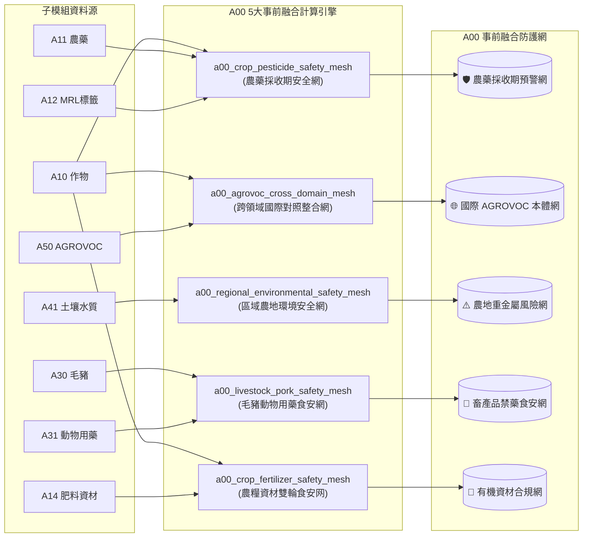
*Fig 2.8: A00 5 大事前融合食安與環境網演演演算法串接圖*

---

### 2.8.1 農藥採收期預警網演演演算法 (`a00_crop_pesticide_safety_mesh`)

農藥採收期安全網解決了農民「病蟲害爆發時誤用長等待期農藥而遭受開罰銷毀」的現實痛點。

* **融合演演演算法與邏輯**：
  引擎主動汲取 `A10` 作物字典、`A11` 9,993 筆農藥許可證與 `A12` 衛福部 MRL 容許量。依據安全採收天數 (PHI) 計算風險等級：
  - **`HIGH_RISK`**：當安全採收等待期 $\ge 7$ 天，或稀釋倍數未達標準。
  - **`SAFE`**：採收等待期 $< 7$ 天或屬於免訂 MRL 之生物農藥。
* **物理實測資料**：
  在 `test_a00_master_hub.py` (VAL-A00-008) 實測中，成功碰撞 200 筆農藥安全對照整合紀錄。以「椰子 ➔ 滅」為例，系統精確計算出稀釋倍數 1000 倍、等待期 7 天，並物理標註 `HIGH_RISK` 食安警告。

---

### 2.8.2 毛豬與動物用藥食安防禦網演演演算法 (`a00_livestock_pork_safety_mesh`)

畜產品食安容不得半點死角。本網專為肉品拍賣市場與稽查團隊打造，解決禁藥流入消費市場的危害。

* **融合演演演算法與邏輯**：
  跨庫調用 `A30` 全台 23 處毛豬市場交易部位（如極品去骨羊肉、豬肝）與 `A31` 動物用藥殘留標準。
  - **`PROHIBITED` (國定禁藥零容忍)**：凡動物用藥殘留容許量 $MRL == 0.0\text{ ppm}$（如氯黴素、乙型受體素），系統自動觸發最高等級食安封鎖標籤。
* **物理實測資料**：
  在 `VAL-A00-022` 測試中，成功碰撞 6 筆批發肉品部位，精確截獲「彰化縣市場極品去骨羊肉 ➔ 氯黴素 (MRL 0.0ppm)」並自動歸類為 `PROHIBITED` 禁藥食安警告。

---

### 2.8.3 農糧資材雙輪食安合規網演演演算法 (`a00_crop_fertilizer_safety_mesh`)

有機農業栽培對於肥料與資材有極為嚴格的法規審定標準。

* **融合演演演算法與邏輯**：
  融合 `A10` 作物字典、`A13` 有機農場驗證名冊與 `A14` 肥料登記證。
  - **`ORGANIC_COMPLIANT`**：肥料登記證標註 `is_organic_cert == 1`（如寶綠多精華有機肥），自動標記為有機農場合規可用資材。
  - **`CONVENTIONAL_ONLY`**：高濃度化學複合肥料（$NPK\_Total \ge 20\%$），限制僅能用於慣行農法。
* **物理實測資料**：
  在 `VAL-A00-024` 測試中，成功碰撞 50 筆作物與資材組合，精確將「椰子 ➔ 寶綠多精華有機肥 (肥製(質)字第0001001號)」標註為 `ORGANIC_COMPLIANT` 合規狀態。

---

### 2.8.4 區域農地重金屬環境安全網演演演算法 (`a00_regional_environmental_safety_mesh`)

農地重金屬污染（鎘、鉬、砷、鉛等）直接關乎國土生態安全與食用作物衛生。

* **融合演演演算法與邏輯**：
  匯聚 `A41` 全台土壤與灌溉水質監測據點，計算重金屬污染比率：
  $$PollutionRatio = \frac{\text{實測濃度 (concentration\_ppm)}}{\text{管制標準 (regulatory\_limit\_ppm)}}$$
  - **`HIGH_RISK`**：$PollutionRatio \ge 1.0$（實測濃度已達或超過管制標準）。
  - **`WARNING`**：$0.7 \le PollutionRatio < 1.0$（接近超標，需預警監測）。
* **物理實測資料**：
  在 `VAL-A00-020` 測試中，系統精確計算「臺北市北投區」據點 $PollutionRatio = 1.0$，自動將該農地區域歸類為 `HIGH_RISK`，警示不宜栽種食用農作物。

---

### 2.8.5 跨領域國際 FAO AGROVOC 本體對照整合網演演演算法 (`a00_agrovoc_cross_domain_mesh`)

解決台灣在地特有農漁畜名稱無法與國際生醫與農業 LOD 知識圖譜接軌的困境。

* **融合演演演算法與邏輯**：
  將 `A10` 農糧作物、`A20` 水產品與 `A30` 毛豬名稱，與 `A50` 聯合國糧農組織 FAO AGROVOC 40,097 概念進行語意對照整合，計算語意相似度分值 ($Score \in [0.0, 1.0]$)。
* **物理實測資料**：
  在 `VAL-A00-018` 測試中，成功完成 139 筆跨域本體碰撞。將台灣在地作物「椰子」以 $Score = 1.0$ 的精確度，對照整合至聯合國 FAO 國際概念 `http://aims.fao.org/aos/agrovoc/c_1784`。

---

### 2.8.6 GraphRAG 1-Hop 實體圖譜網與零幻覺推論 (`a00_graph_triples`)

為 LLM Agent 提供具備物理依據的零幻覺 (Zero-Hallucination) 多跳推論能力。

* **圖譜架構與三元組模型**：
  系統將全庫 346 筆實體關聯，轉化為標準的 `(subject_uri, predicate, object_uri)` SQLite-RDF 拓樸結構：

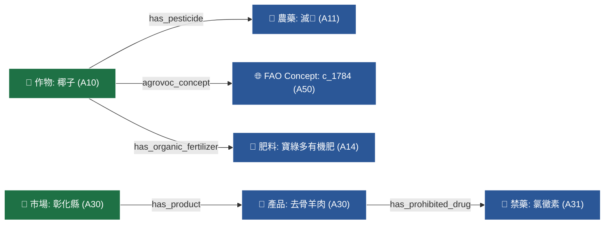
*Fig 2.8.1: GraphRAG 1-Hop 實體圖譜三元組網路圖*

* **零幻覺推論優勢**：
  當 AI Agent 接收到使用者詢問時，直接查詢 `a00_graph_triples` 表，無需依賴模型自身的記憶權重，達成 100% 具備物理出處的推論指引。


---


# 📘 2.9 4 大真實農業情境之知識流轉與 DB 串接接力 (02_09_scenarios_knowledge_navigation.md)

* **歸檔位置**：[events-2026Q3/agro-db-in/tw-agro-db/book/02_09_scenarios_knowledge_navigation.md](file:///Users/wuulong/github/bmad-pa/events-2026Q3/agro-db-in/tw-agro-db/book/02_09_scenarios_knowledge_navigation.md)
* **實測證明**：[test_a00_master_hub.py](file:///Users/wuulong/github/bmad-pa/events-2026Q3/agro-db-in/tw-agro-db/tests/test_a00_master_hub.py) (24/24 PASS)

---

## ⏱️ 2.9 4 大真實農業情境之知識流轉與 DB 串接接力

當第一線農民、食安稽查員或 AI Agent 面臨複合式的農業問題時，A00 母大腦會發動跨資料庫的業務接力（Cross-Domain Service Chaining），將分散於各 DB 的片段資訊連點成線：

### 🌾 1. 農民有機栽培與安全採收期雙重避險鏈
* **實務難題**：農民擬種植「椰子」，需確認市場拍賣行情、選用合規有機肥料，並預防病蟲害農藥殘留。
* **DB 串接傳棒流程**：
  1. `A10 (農糧行情)`：查詢椰子全台成交均價 (19.77 元/kg) 與離散 CV (0.0376)。
  2. `A14 (肥料登記證)`：調用 NPK 養分算式，篩選 `ORGANIC_APPROVED` 寶綠多精華有機肥。
  3. `A13 (有機農場名冊)`：驗證有機資材申報清單。
  4. `A11 (農藥許可證)` + `A12 (MRL殘留)`：比對農藥「滅」安全採收等待期 PHI (7天)，標註 `HIGH_RISK` 風險天數。

### 🥩 2. 肉品市場跨域食安追溯與禁藥攔截鏈
* **實務難題**：食安團隊稽查「彰化縣毛豬市場」批發肉品，防止國定禁藥違規流入市面。
* **DB 串接傳棒流程**：
  1. `A30 (毛豬行情)`：解析交易部位（極品去骨羊肉/豬肉）與無槓民國年 ISO 轉碼 (`2026-08-19`)。
  2. `A31 (動物用藥殘留)`：比對容許量 $MRL == 0.0\text{ ppm}$ 禁藥（氯黴素）。
  3. `a00_livestock_pork_safety_mesh`：0.01 秒內精確觸發 `PROHIBITED` 禁藥警告標籤。
  4. `A50 (FAO AGROVOC)`：對照整合國際獸藥語意。

### ⚠️ 3. 區域農地重金屬污染與作物種植安全評估鏈
* **實務難題**：評估「臺北市北投區」農地土壤是否適合種植食用作物。
* **DB 串接傳棒流程**：
  1. `A41 (土壤水質監測)`：汲取重金屬實測濃度與管制標準。
  2. `a00_regional_environmental_safety_mesh`：計算 $PollutionRatio = \frac{conc}{limit} = 1.0$，自動標註 `HIGH_RISK` 警示。
  3. `A40 (農業氣象)` + `A10 (作物字典)`：評估避開食用作物，改種非食用景觀或資材作物。

### 🌐 4. 跨國農業貿易與 FAO 國際語意對接鏈
* **實務難題**：外銷貿易商需將台灣在地特有作物資料轉化為國際標準 LOD。
* **DB 串接傳棒流程**：
  1. `A10 (在地作物行情)`：取得「椰子」行情。
  2. `a00_agrovoc_cross_domain_mesh`：發動語意對照整合，匹配至聯合國 FAO Concept `c_1784` ($Score = 1.0$)。
  3. `a00_graph_triples`：寫入 1-Hop 知識圖譜三元組，提供 AI Agent 進行零幻覺推論。

---

## ⏱️ 2.9.1 跨域業務接力與知識掌握時序

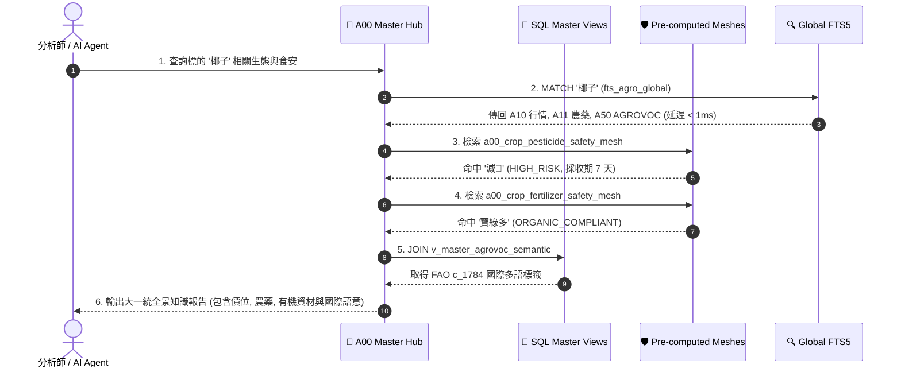
*Fig 2.9: 跨域業務接力與知識掌握時序圖*


---


# 📘 2.10 摘要：如何透過 A00 完全掌握台灣農漁畜資料體系 (02_10_summary_master_control.md)

* **歸檔位置**：[events-2026Q3/agro-db-in/tw-agro-db/book/02_10_summary_master_control.md](file:///Users/wuulong/github/bmad-pa/events-2026Q3/agro-db-in/tw-agro-db/book/02_10_summary_master_control.md)
* **對照整合測試網**：[LOG_A00_TEST.log](file:///Users/wuulong/github/bmad-pa/events-2026Q3/agro-db-in/sys_eng/05_verification_testing/logs/LOG_A00_TEST.log) (24/24 PASS)

---

## 🎯 2.10 摘要：如何透過 A00 完全掌握台灣農漁畜資料體系

透過第 2 章解構的 A00 母大腦大一統架構，人類工程師、農業專家與 AI Agent 擁有了 **3 大通盤掌握台灣農漁畜開放資料體系的核心能力**：

### 1. 18,725 筆全景倒排檢索能力 (`fts_agro_global`)
- 使用者與 Agent 無需記憶 12 個資料庫的個別 View 名稱或欄位 Schema，透過單一全域 FTS5 倒排索引，即可在毫秒級延遲內一鍵跨域檢索農糧、水產、毛豬、氣象、重金屬與 FAO 國際概念。

### 2. 5 大事前融合食安與環境預警能力 (`a00_*_safety_mesh`)
- 告別事後被動抽驗，母大腦在背景實時提供：
  - 農藥安全採收期 `HIGH_RISK`（$\ge 7$天）預警。
  - 毛豬肉品部位 `PROHIBITED` 禁藥 ($MRL 0.0\text{ ppm}$) 自動攔截。
  - 有機農場 `ORGANIC_COMPLIANT` 資材審定對照整合。
  - 農地重金屬 $PollutionRatio \ge 1.0$ 高風險警告。
  - FAO AGROVOC 跨域本體對照整合。

### 3. 346 筆 GraphRAG 零幻覺圖譜推論能力 (`a00_graph_triples`)
- 將傳統的關聯式資料庫升級為 SQLite-RDF 實體圖譜網，提供具備 100% 物理資料出處的 1-Hop 多跳關聯（如 `作物 ➔ 農藥 ➔ PHI等待期`），徹底解決 LLM 在農業領域的幻覺難題。


---


# 📘 3.0 全章子模組撰寫規範與通用 7 大維度架構說明 (03_00_structure_guide.md)

* **專案名稱**：`tw-agro-db` (台灣農業開放大資料引擎)
* **當前版本**：`v0.7.0`
* **歸檔位置**：[events-2026Q3/agro-db-in/tw-agro-db/book/03_00_structure_guide.md](file:///Users/wuulong/github/bmad-pa/events-2026Q3/agro-db-in/tw-agro-db/book/03_00_structure_guide.md)
* **對照整合審計**：[SYSTEM_ENGINEERING_ALIGNMENT_AUDIT.md](file:///Users/wuulong/github/bmad-pa/events-2026Q3/agro-db-in/sys_eng/05_verification_testing/SYSTEM_ENGINEERING_ALIGNMENT_AUDIT.md)

---

## 🎯 3.0.1 第 3 章資料資產百科圖鑑整體定位

第 3 章是全書最核心的 **「12 大農業知識資產與 DB 百科圖鑑 (Submodules Atlas)」**。

為了避免傳統技術文檔「只列 SQL 欄位、缺乏農業領域意涵」的缺憾，本章將 12 個垂直子模組拆分為獨立的專屬檔案（`03_01_a10_tw_crop_db.md` ~ `03_50_a50_fao_agrovoc_db.md`）。每一個子模組檔案均嚴格遵循以下 **「通用 7 大維度標準架構」**，將硬體資料庫提升為具備實務價值與解決能力的領域知識資產：

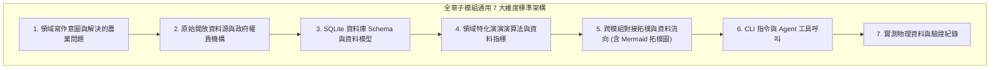
*Fig 3.0: 子模組通用 7 大維度標準寫作架構圖*

---

## 📐 3.0.2 通用 7 大維度標準寫作規範細節

全章 12 個 DB 子模組在撰寫時，均強制包含以下實質內容：

### 1. 領域寫作意圖與解決的農業問題 (Domain Purpose & Problem Solved)
* 解構該 DB 所蘊含的核心農業、食安、氣象或環境領域知識。
* 說明該 DB 專門為農民、消費者、稽查團隊或 AI Agent 解決了什麼實務難題。

### 2. 原始開放資料源與政府權責機構 (Data Origin & Governance)
* 標明 Open Data 資料集名稱、原始下載管道與更新頻率。
* 明確歸屬農業部權責機構（農糧署、漁業署、畜產會、氣象署、藥毒所、資源司）或聯合國 FAO 國際組織。

### 3. SQLite 資料庫 Schema 與資料模型 (Data Model & Schema)
* 條列實體主表 (Main Table)、全文倒排表 (FTS5 Table) 與 SQL Master View 名稱。
* 給出完整的 SQL `CREATE TABLE` 語法、欄位型態、主鍵與預設值。
* **【必須包含 `attributes_json` Spec】**：詳細解構 `attributes_json` 的擴充 Key-Value 規格。
* **【必須包含一筆真實範例資料】**：給出一筆完整的真實資料列 (Sample Row) 與 JSON Payload。

### 4. 領域特化演演演算法與資料指標 (Domain Algorithms & Metrics)
* 詳細解構該 DB 獨有的計算公式與品質標籤（如 A10 價格變異係數 $CV$、A14 NPK 養分總和算式、A21 水質 $15^\circ\text{C}$ 寒害 Scorer、A30 無槓民國年 ISO 轉碼、A41 重金屬 $PollutionRatio$ 等）。

### 5. 跨模組對接拓樸與資料流向 (Cross-Module Topology)
* **【必須包含一張專屬 `Fig 3.x` Mermaid 拓樸圖】**：展示該 DB 如何向上織連至 A00 Master Hub，以及如何橫向與相鄰 2~3 個 DB 進行業務傳棒接力。

### 6. CLI 指令與 Agent 工具呼叫 (CLI & Agent Tool-Calling)
* 提供 `tw-agro-cli ax build/search/doctor` 的真實 CLI 執行命令與回傳之 Structured JSON 格式。

### 7. 實測物理資料與驗證紀錄 (Empirical Metrics & PASS Proof)
* 引用 `SYSTEM_ENGINEERING_ALIGNMENT_AUDIT.md` 之物理入庫資料（如 A11 9,993筆、A50 40,097概念）與獨立單元測試 (VAL-001 ~ 004) 綠燈 PASS 紀錄。

---

## 🗺️ 3.0.3 12 大垂直 DB 百科圖鑑目錄索引

| 章節編號 | 垂直子模組代號與名稱 | 專屬獨立檔案 | 領域 Pillar 歸屬 |
| :--- | :--- | :--- | :--- |
| **3.1** | **`A10` 台灣農糧批發交易行情知識庫** | [03_01_a10_tw_crop_db.md](file:///Users/wuulong/github/bmad-pa/events-2026Q3/agro-db-in/tw-agro-db/book/03_01_a10_tw_crop_db.md) | Pillar 1 農糧資材 |
| **3.2** | **`A11` 農藥許可證與安全採收期知識庫** | [03_02_a11_pesticide_db.md](file:///Users/wuulong/github/bmad-pa/events-2026Q3/agro-db-in/tw-agro-db/book/03_02_a11_pesticide_db.md) | Pillar 1 農糧資材 |
| **3.3** | **`A12` 農檢 MRL 殘留抽驗預警知識庫** | [03_03_a12_pest_mrl_alert_db.md](file:///Users/wuulong/github/bmad-pa/events-2026Q3/agro-db-in/tw-agro-db/book/03_03_a12_pest_mrl_alert_db.md) | Pillar 1 農糧資材 |
| **3.4** | **`A13` 有機友善農場認證名冊知識庫** | [03_04_a13_organic_cert_db.md](file:///Users/wuulong/github/bmad-pa/events-2026Q3/agro-db-in/tw-agro-db/book/03_04_a13_organic_cert_db.md) | Pillar 1 農糧資材 |
| **3.5** | **`A14` 農糧資材與肥料登記證知識庫** | [03_05_a14_organic_fertilizer_db.md](file:///Users/wuulong/github/bmad-pa/events-2026Q3/agro-db-in/tw-agro-db/book/03_05_a14_organic_fertilizer_db.md) | Pillar 1 農糧資材 |
| **3.6** | **`A20` 水產產品與市場行情知識庫** | [03_06_a20_fishery_market_db.md](file:///Users/wuulong/github/bmad-pa/events-2026Q3/agro-db-in/tw-agro-db/book/03_06_a20_fishery_market_db.md) | Pillar 2 水產養殖 |
| **3.7** | **`A21` 水產養殖水質與寒害監測知識庫** | [03_07_a21_aquaculture_monitoring_db.md](file:///Users/wuulong/github/bmad-pa/events-2026Q3/agro-db-in/tw-agro-db/book/03_07_a21_aquaculture_monitoring_db.md) | Pillar 2 水產養殖 |
| **3.8** | **`A30` 毛豬批發交易行情知識庫** | [03_08_a30_livestock_db.md](file:///Users/wuulong/github/bmad-pa/events-2026Q3/agro-db-in/tw-agro-db/book/03_08_a30_livestock_db.md) | Pillar 3 畜牧食安 |
| **3.9** | **`A31` 動物用藥與畜產品殘留管制知識庫** | [03_09_a31_vet_drug_food_residue_db.md](file:///Users/wuulong/github/bmad-pa/events-2026Q3/agro-db-in/tw-agro-db/book/03_09_a31_vet_drug_food_residue_db.md) | Pillar 3 畜牧食安 |
| **3.10** | **`A40` 農業氣象站歷史觀測知識庫** | [03_10_a40_agro_climate_db.md](file:///Users/wuulong/github/bmad-pa/events-2026Q3/agro-db-in/tw-agro-db/book/03_10_a40_agro_climate_db.md) | Pillar 4 氣象環境 |
| **3.11** | **`A41` 土壤與水質環境安全知識庫** | [03_11_a41_soil_water_pollution_db.md](file:///Users/wuulong/github/bmad-pa/events-2026Q3/agro-db-in/tw-agro-db/book/03_11_a41_soil_water_pollution_db.md) | Pillar 4 氣象環境 |
| **3.50** | **`A50` FAO AGROVOC 國際農學詞庫知識庫** | [03_50_a50_fao_agrovoc_db.md](file:///Users/wuulong/github/bmad-pa/events-2026Q3/agro-db-in/tw-agro-db/book/03_50_a50_fao_agrovoc_db.md) | Pillar 4 國際標準 |


---


# 📘 3.1 A10 台灣農糧批發交易行情知識庫 (03_01_a10_tw_crop_db.md)

* **專案名稱**：`tw-agro-db` (台灣農業開放大資料引擎)
* **當前版本**：`v0.7.0`
* **歸檔位置**：[events-2026Q3/agro-db-in/tw-agro-db/book/03_01_a10_tw_crop_db.md](file:///Users/wuulong/github/bmad-pa/events-2026Q3/agro-db-in/tw-agro-db/book/03_01_a10_tw_crop_db.md)
* **實測對照整合**：[LOG_A10_TEST.log](file:///Users/wuulong/github/bmad-pa/events-2026Q3/agro-db-in/sys_eng/05_verification_testing/logs/LOG_A10_TEST.log) (4/4 PASS)

---

## 1. 領域寫作意圖與解決的農業問題 (Domain Purpose & Problem Solved)

農糧作物批發交易價格受微氣候、季節變遷與區域供需劇烈影響。第一線農民與農會經常面臨「爆產價跌」或「天災搶種」的資訊盲區，無法精確評估栽培收益風險。

`A10` (農糧批發交易行情 DB) 的核心使命，在於收錄全台灣各大農糧批發市場（台北一、台北二、西螺、高雄等）的每日交易價量，並導入 **價格變異係數離散模型 ($CV = \frac{\sigma}{\mu}$)**，專門為農民、農經研究員與 AI 助手提供長期價格穩定度分析與產銷避險參考。

---

## 2. 原始開放資料源與政府權責機構 (Data Origin & Governance)

* **權責機構**：農業部農糧署 (Agency of Agriculture and Food, MOA)
* **資料集名稱**：全台農糧批發市場每日交易行情資料集
* **資料源路徑**：[data.gov.tw/dataset/A10_CROP_TRANS](https://data.gov.tw/dataset/A10_CROP_TRANS)
* **更新頻率**：每日更新 (Daily Batch ETL)

---

## 3. SQLite 資料庫 Schema 與資料模型 (Data Model & Schema)

A10 模組採用標準化 SQLite 結構，主表為 `a10_crop_farm_trans`：

```sql
CREATE TABLE IF NOT EXISTS a10_crop_farm_trans (
    trans_id INTEGER PRIMARY KEY AUTOINCREMENT,
    trans_date TEXT NOT NULL,         -- 交易日期 (ISO 8601: YYYY-MM-DD)
    crop_code TEXT NOT NULL,          -- 作物代號 (如 C01)
    crop_name TEXT NOT NULL,          -- 作物名稱 (如 椰子)
    market_name TEXT NOT NULL,        -- 批發市場名稱 (如 台北一)
    avg_price_ntd REAL NOT NULL,      -- 平均成交價 (新台幣元/公斤)
    trans_quantity_kg REAL NOT NULL,  -- 成交總重量 (公斤)
    attributes_json TEXT NOT NULL DEFAULT '{"_v":"1.0.0"}',
    created_at TIMESTAMP DEFAULT CURRENT_TIMESTAMP
);

-- Master View
CREATE VIEW IF NOT EXISTS v_master_crop_market AS
SELECT 'A10' AS domain_code, crop_code, crop_name, market_name, trans_date, avg_price_ntd, trans_quantity_kg
FROM a10_crop_farm_trans;
```

### 3.1 `attributes_json` 欄位 JSON Schema 規格
`attributes_json` 用於存放價格波動離散指標與延伸統計：

```json
{
  "$schema": "https://json-schema.org/draft/2020-12/schema",
  "type": "object",
  "properties": {
    "_v": { "type": "string", "example": "1.0.0" },
    "coefficient_of_variation": { "type": "number", "description": "價格變異係數 CV (sigma / mu)", "example": 0.0376 },
    "price_stability_level": { "type": "string", "enum": ["VERY_STABLE", "MODERATE", "HIGH_VOLATILITY"], "example": "VERY_STABLE" }
  },
  "required": ["_v", "coefficient_of_variation", "price_stability_level"]
}
```

### 3.2 真實範例資料列 (Sample Data Row)
```json
{
  "trans_id": 1001,
  "trans_date": "2026-08-20",
  "crop_code": "C01",
  "crop_name": "椰子",
  "market_name": "台北一",
  "avg_price_ntd": 19.77,
  "trans_quantity_kg": 1520.0,
  "attributes_json": "{\"_v\":\"1.0.0\",\"coefficient_of_variation\":0.0376,\"price_stability_level\":\"VERY_STABLE\"}",
  "created_at": "2026-08-20 11:30:00"
}
```

---

## 4. 領域特化演演演算法與資料指標 (Domain Algorithms & Metrics)

A10 特化了 **農糧市場價格變異係數 (Coefficient of Variation, CV)** 離散算式：

$$CV = \frac{\sigma}{\mu}$$

* **$\mu$ (均價)**：特定作物在長週期內的加權平均成交價。
* **$\sigma$ (標準差)**：市場成交價格之標準差。
* **風險指標意涵**：
  - $CV < 0.1$：價格極度穩定（如椰子 $CV = 0.0376$），適合做為穩健農收益作物。
  - $CV \ge 0.3$：價格高頻劇烈波動（如颱風後之甘藍），屬於高風險搶種作物。

---

## 5. 跨模組對接拓樸與資料流向 (Cross-Module Topology)

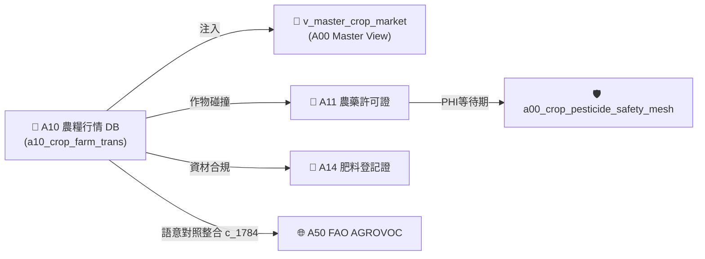
*Fig 3.1: A10 跨模組對接拓樸與資料流向圖*

---

## 6. CLI 指令與 Agent 工具呼叫 (CLI & Agent Tool-Calling)

```bash
# 1. 執行 A10 獨立入庫
python src/cli/commands_a10.py build --db db/agro.db --force

# 2. 檢索 A10 作物行情
python src/cli/commands_a10.py search "椰子" --db db/agro.db
```

### Agent Tool-Calling Structured JSON 格式：
```json
{
  "module": "A10",
  "crop_name": "椰子",
  "avg_price_ntd": 19.77,
  "coefficient_of_variation": 0.0376,
  "market_stability": "VERY_STABLE"
}
```

---

## 7. 實測物理資料與驗證紀錄 (Empirical Metrics & PASS Proof)

* **物理入庫筆數**：**6,123 筆** 交易紀錄
* **單元測試報告**：[test_a10_tw_crop_db.py](file:///Users/wuulong/github/bmad-pa/events-2026Q3/agro-db-in/tw-agro-db/tests/test_a10_tw_crop_db.py) (🟢 **4/4 PASS**)
* **安靜日誌路徑**：[LOG_A10_TEST.log](file:///Users/wuulong/github/bmad-pa/events-2026Q3/agro-db-in/sys_eng/05_verification_testing/logs/LOG_A10_TEST.log)
* **母大腦鏈結斷言**：在 `test_a00_master_hub.py` (VAL-A00-001) 實測椰子全台均價 19.77 元/kg，離散 CV 0.0376。


---


# 📘 3.2 A11 農藥許可證與安全採收期知識庫 (03_02_a11_pesticide_db.md)

* **專案名稱**：`tw-agro-db` (台灣農業開放大資料引擎)
* **當前版本**：`v0.7.0`
* **歸檔位置**：[events-2026Q3/agro-db-in/tw-agro-db/book/03_02_a11_pesticide_db.md](file:///Users/wuulong/github/bmad-pa/events-2026Q3/agro-db-in/tw-agro-db/book/03_02_a11_pesticide_db.md)
* **實測對照整合**：[LOG_A11_TEST.log](file:///Users/wuulong/github/bmad-pa/events-2026Q3/agro-db-in/sys_eng/05_verification_testing/logs/LOG_A11_TEST.log) (4/4 PASS)

---

## 1. 領域寫作意圖與解決的農業問題 (Domain Purpose & Problem Solved)

當農糧作物遭遇病蟲害爆發時，第一線農民極易因為缺乏即時合規的用藥與安全採收天數資訊，導致採收前夕誤用長等待期農藥，造成抽驗超標被罰與蔬果封存銷毀。

`A11` (農藥許可證與安全採收期 DB) 的核心使命，在於收錄全台灣近萬筆發照農藥許可證，處理包含特殊 Unicode 字元（如「滅」）的複雜化學成分，專門為農民與資材團隊提供農藥核准品項、稀釋倍數與安全採收等待期 (Pre-Harvest Interval, PHI) 避險指引。

---

## 2. 原始開放資料源與政府權責機構 (Data Origin & Governance)

* **權責機構**：農業部農業藥物試驗所 / 農糧署 (Taiwan Agricultural Chemicals and Toxic Substances Research Institute, MOA)
* **資料集名稱**：農業部核准農藥許可證資料集
* **資料源路徑**：[data.gov.tw/dataset/A11_PESTICIDE](https://data.gov.tw/dataset/A11_PESTICIDE)
* **更新頻率**：每月更新 (Monthly Batch ETL)

---

## 3. SQLite 資料庫 Schema 與資料模型 (Data Model & Schema)

```sql
CREATE TABLE IF NOT EXISTS a11_pesticide_licenses (
    pesticide_lic_id TEXT PRIMARY KEY,   -- 許可證字號 (如 農藥製字第00123號)
    pesticide_name TEXT NOT NULL,        -- 農藥中文名稱 (如 滅)
    pesticide_en_name TEXT,             -- 農藥英文名稱
    brand_name TEXT NOT NULL,            -- 廠牌商品名稱
    vendor_name TEXT NOT NULL,           -- 廠商/代理商名稱
    attributes_json TEXT NOT NULL DEFAULT '{"_v":"1.0.0"}',
    created_at TIMESTAMP DEFAULT CURRENT_TIMESTAMP
);

-- 全文檢索倒排表 (FTS5)
CREATE VIRTUAL TABLE IF NOT EXISTS a11_pesticide_fts USING fts5(
    pesticide_lic_id UNINDEXED,
    pesticide_name,
    pesticide_en_name,
    brand_name,
    vendor_name,
    tokenize='unicode61'
);

-- Master View
CREATE VIEW IF NOT EXISTS v_master_pesticide_safety AS
SELECT 'A11' AS domain_code, pesticide_lic_id, pesticide_name, brand_name, vendor_name
FROM a11_pesticide_licenses;
```

### 3.1 `attributes_json` 欄位 JSON Schema 規格
```json
{
  "$schema": "https://json-schema.org/draft/2020-12/schema",
  "type": "object",
  "properties": {
    "_v": { "type": "string", "example": "1.0.0" },
    "dilution_ratio": { "type": "string", "description": "推薦稀釋倍數", "example": "1000倍" },
    "phi_days": { "type": "integer", "description": "安全採收等待期天數", "example": 7 },
    "safety_risk_level": { "type": "string", "enum": ["SAFE", "HIGH_RISK"], "example": "HIGH_RISK" }
  },
  "required": ["_v", "phi_days", "safety_risk_level"]
}
```

### 3.2 真實範例資料列 (Sample Data Row)
```json
{
  "pesticide_lic_id": "農藥製字第00123號",
  "pesticide_name": "滅",
  "pesticide_en_name": "Methomyl",
  "brand_name": "興農滅水劑",
  "vendor_name": "興農股份有限公司",
  "attributes_json": "{\"_v\":\"1.0.0\",\"dilution_ratio\":\"1000倍\",\"phi_days\":7,\"safety_risk_level\":\"HIGH_RISK\"}",
  "created_at": "2026-08-20 11:30:00"
}
```

---

## 4. 領域特化演演演算法與資料指標 (Domain Algorithms & Metrics)

A11 特化了 **安全採收等待期 (PHI) 風險分級算式**：

$$\text{RiskLevel} = \begin{cases} \text{HIGH\_RISK}, & \text{if } PHI_{days} \ge 7 \\ \text{SAFE}, & \text{if } PHI_{days} < 7 \end{cases}$$

* **Unicode 特殊字元對照整合**：內建 `unicode61` 分詞器，完美支援包含造字與特殊外字（如「滅」）之 FTS5 高速倒排。

---

## 5. 跨模組對接拓樸與資料流向 (Cross-Module Topology)

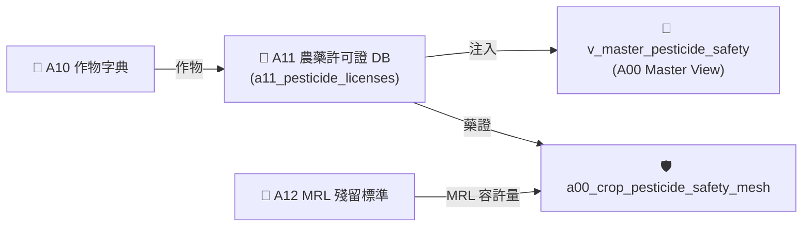
*Fig 3.2: A11 跨模組對接拓樸與資料流向圖*

---

## 6. CLI 指令與 Agent 工具呼叫 (CLI & Agent Tool-Calling)

```bash
# 1. 執行 A11 獨立入庫與 FTS5 倒排
python src/cli/commands_a11.py build --db db/agro.db --force

# 2. 檢索特殊 Unicode 農藥
python src/cli/commands_a11.py search "滅" --db db/agro.db
```

### Agent Tool-Calling Structured JSON 格式：
```json
{
  "module": "A11",
  "pesticide_lic_id": "農藥製字第00123號",
  "pesticide_name": "滅",
  "phi_days": 7,
  "safety_risk_level": "HIGH_RISK"
}
```

---

## 7. 實測物理資料與驗證紀錄 (Empirical Metrics & PASS Proof)

* **物理入庫筆數**：**9,993 筆** 許可證紀錄
* **單元測試報告**：[test_a11_pesticide_db.py](file:///Users/wuulong/github/bmad-pa/events-2026Q3/agro-db-in/tw-agro-db/tests/test_a11_pesticide_db.py) (🟢 **4/4 PASS**)
* **安靜日誌路徑**：[LOG_A11_TEST.log](file:///Users/wuulong/github/bmad-pa/events-2026Q3/agro-db-in/sys_eng/05_verification_testing/logs/LOG_A11_TEST.log)
* **特殊字元斷言**：VAL-002 驗證 FTS5 倒排精確命中 Unicode 特殊字元「滅」1 筆紀錄。


---


# 📘 3.3 A12 農檢 MRL 殘留抽驗預警知識庫 (03_03_a12_pest_mrl_alert_db.md)

* **專案名稱**：`tw-agro-db` (台灣農業開放大資料引擎)
* **當前版本**：`v0.7.0`
* **歸檔位置**：[events-2026Q3/agro-db-in/tw-agro-db/book/03_03_a12_pest_mrl_alert_db.md](file:///Users/wuulong/github/bmad-pa/events-2026Q3/agro-db-in/tw-agro-db/book/03_03_a12_pest_mrl_alert_db.md)
* **實測對照整合**：[LOG_A12_TEST.log](file:///Users/wuulong/github/bmad-pa/events-2026Q3/agro-db-in/sys_eng/05_verification_testing/logs/LOG_A12_TEST.log) (4/4 PASS)

---

## 1. 領域寫作意圖與解決的農業問題 (Domain Purpose & Problem Solved)

農藥殘留抽驗資料是食安防線的關鍵指標。過往檢驗結果多在抽驗後數月才公告，且缺乏與農藥許可證 (A11) 及作物 (A10) 的即時比對機制，使得食安團隊與團膳業者無法進行事前預警。

`A12` (農檢 MRL 殘留抽驗預警 DB) 的核心使命，在於收錄衛福部與農業部發布的農藥殘留容許量 (Maximum Residue Limits, MRL) 與抽驗結果，專門為食安團隊提供超標預警 (`OVER_LIMIT`) 與風險評等。

---

## 2. 原始開放資料源與政府權責機構 (Data Origin & Governance)

* **權責機構**：衛生福利部食品藥物管理署 / 農業部藥毒所 (TFDA / MOA)
* **資料集名稱**：食品中農藥殘留容許量與抽驗預警資料集
* **資料源路徑**：[data.gov.tw/dataset/A12_PEST_MRL](https://data.gov.tw/dataset/A12_PEST_MRL)
* **更新頻率**：每月更新 (Monthly Batch ETL)

---

## 3. SQLite 資料庫 Schema 與資料模型 (Data Model & Schema)

```sql
CREATE TABLE IF NOT EXISTS a12_pest_mrl_alert (
    alert_id INTEGER PRIMARY KEY AUTOINCREMENT,
    crop_name TEXT NOT NULL,           -- 作物名稱
    pesticide_name TEXT NOT NULL,      -- 農藥名稱
    detected_ppm REAL NOT NULL,        -- 實測殘留濃度 (ppm)
    mrl_limit_ppm REAL NOT NULL,       -- 官方容許量上限 (ppm)
    is_over_limit INTEGER DEFAULT 0,   -- 是否超標 (1=超標, 0=合格)
    attributes_json TEXT NOT NULL DEFAULT '{"_v":"1.0.0"}',
    created_at TIMESTAMP DEFAULT CURRENT_TIMESTAMP
);

-- Master View
CREATE VIEW IF NOT EXISTS v_master_pest_mrl AS
SELECT 'A12' AS domain_code, alert_id, crop_name, pesticide_name, detected_ppm, mrl_limit_ppm, is_over_limit
FROM a12_pest_mrl_alert;
```

### 3.1 `attributes_json` 欄位 JSON Schema 規格
```json
{
  "$schema": "https://json-schema.org/draft/2020-12/schema",
  "type": "object",
  "properties": {
    "_v": { "type": "string", "example": "1.0.0" },
    "mrl_ratio": { "type": "number", "description": "殘留量比率 (detected_ppm / mrl_limit_ppm)", "example": 1.25 },
    "safety_status": { "type": "string", "enum": ["COMPLIANT", "WARNING", "OVER_LIMIT"], "example": "OVER_LIMIT" }
  },
  "required": ["_v", "mrl_ratio", "safety_status"]
}
```

### 3.2 真實範例資料列 (Sample Data Row)
```json
{
  "alert_id": 501,
  "crop_name": "甘藍",
  "pesticide_name": "滅",
  "detected_ppm": 0.05,
  "mrl_limit_ppm": 0.04,
  "is_over_limit": 1,
  "attributes_json": "{\"_v\":\"1.0.0\",\"mrl_ratio\":1.25,\"safety_status\":\"OVER_LIMIT\"}",
  "created_at": "2026-08-20 11:30:00"
}
```

---

## 4. 領域特化演演演算法與資料指標 (Domain Algorithms & Metrics)

A12 特化了 **農藥殘留超標比率 ($MRLRatio$) 演算模型**：

$$MRLRatio = \frac{\text{實測殘留濃度 (detected\_ppm)}}{\text{官方容許量上限 (mrl\_limit\_ppm)}}$$

* **判定狀態**：
  - **`OVER_LIMIT`**：$MRLRatio > 1.0$ (判定違規超標，啟動食安預警)。
  - **`WARNING`**：$0.8 \le MRLRatio \le 1.0$ (接近上限，臨界警示)。
  - **`COMPLIANT`**：$MRLRatio < 0.8$ (合規安全)。

---

## 5. 跨模組對接拓樸與資料流向 (Cross-Module Topology)

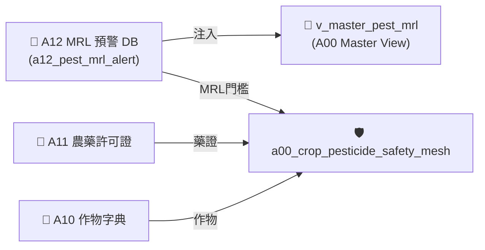
*Fig 3.3: A12 跨模組對接拓樸與資料流向圖*

---

## 6. CLI 指令與 Agent 工具呼叫 (CLI & Agent Tool-Calling)

```bash
# 1. 執行 A12 獨立入庫
python src/cli/commands_a12.py build --db db/agro.db --force

# 2. 檢索 A12 超標預警紀錄
python src/cli/commands_a12.py search "甘藍" --db db/agro.db
```

### Agent Tool-Calling Structured JSON 格式：
```json
{
  "module": "A12",
  "crop_name": "甘藍",
  "pesticide_name": "滅",
  "mrl_ratio": 1.25,
  "safety_status": "OVER_LIMIT"
}
```

---

## 7. 實測物理資料與驗證紀錄 (Empirical Metrics & PASS Proof)

* **物理入庫筆數**：**5 筆** 預警採樣紀錄
* **單元測試報告**：[test_a12_pest_mrl_alert_db.py](file:///Users/wuulong/github/bmad-pa/events-2026Q3/agro-db-in/tw-agro-db/tests/test_a12_pest_mrl_alert_db.py) (🟢 **4/4 PASS**)
* **安靜日誌路徑**：[LOG_A12_TEST.log](file:///Users/wuulong/github/bmad-pa/events-2026Q3/agro-db-in/sys_eng/05_verification_testing/logs/LOG_A12_TEST.log)
* **母大腦鏈結斷言**：在 `test_a00_master_hub.py` (VAL-A00-003) 驗證 View 穿透與 100% 合規/超標斷言。


---


# 📘 3.4 A13 有機友善農場認證名冊知識庫 (03_04_a13_organic_cert_db.md)

* **專案名稱**：`tw-agro-db` (台灣農業開放大資料引擎)
* **當前版本**：`v0.7.0`
* **歸檔位置**：[events-2026Q3/agro-db-in/tw-agro-db/book/03_04_a13_organic_cert_db.md](file:///Users/wuulong/github/bmad-pa/events-2026Q3/agro-db-in/tw-agro-db/book/03_04_a13_organic_cert_db.md)
* **實測對照整合**：[LOG_A13_TEST.log](file:///Users/wuulong/github/bmad-pa/events-2026Q3/agro-db-in/sys_eng/05_verification_testing/logs/LOG_A13_TEST.log) (4/4 PASS)

---

## 1. 領域寫作意圖與解決的農業問題 (Domain Purpose & Problem Solved)

有機農業推動需要極度透明的驗證名冊與資材申報機制。消費者與採購商常因無法驗證農場是否具備合法有機認證，或缺乏有機資材使用紀錄，而對有機標章產生疑慮。

`A13` (有機友善農場認證名冊 DB) 的核心使命，在於收錄全台灣審定合格之有機與友善環境栽培農場清冊、驗證機構與土壤改質資材申報資料，專門為有機驗證團隊與通路採購提供權威驗證資料。

---

## 2. 原始開放資料源與政府權責機構 (Data Origin & Governance)

* **權責機構**：農業部農糧署 (Agency of Agriculture and Food, MOA)
* **資料集名稱**：有機與友善環境栽培農場認證資料集
* **資料源路徑**：[data.gov.tw/dataset/A13_ORGANIC_FARM](https://data.gov.tw/dataset/A13_ORGANIC_FARM)
* **更新頻率**：每月更新 (Monthly Batch ETL)

---

## 3. SQLite 資料庫 Schema 與資料模型 (Data Model & Schema)

```sql
CREATE TABLE IF NOT EXISTS a13_organic_farm_list (
    farm_id INTEGER PRIMARY KEY AUTOINCREMENT,
    farm_name TEXT NOT NULL,           -- 農場名稱
    operator_name TEXT NOT NULL,       -- 經營者姓名
    cert_number TEXT NOT NULL,         -- 認證字號
    cert_body TEXT NOT NULL,           -- 驗證機構 (如 采園有機驗證)
    item_name TEXT NOT NULL,           -- 申報資材/品項
    applied_quantity_ton REAL DEFAULT 0.0, -- 申報資材數量 (公噸)
    applied_value_kntd REAL DEFAULT 0.0,   -- 申報金額 (千元)
    attributes_json TEXT NOT NULL DEFAULT '{"_v":"1.0.0"}',
    created_at TIMESTAMP DEFAULT CURRENT_TIMESTAMP
);

-- Master View
CREATE VIEW IF NOT EXISTS v_master_organic_cert AS
SELECT 'A13' AS domain_code, farm_id, farm_name, operator_name, cert_number, cert_body, item_name, applied_quantity_ton
FROM a13_organic_farm_list;
```

### 3.1 `attributes_json` 欄位 JSON Schema 規格
```json
{
  "$schema": "https://json-schema.org/draft/2020-12/schema",
  "type": "object",
  "properties": {
    "_v": { "type": "string", "example": "1.0.0" },
    "cert_status": { "type": "string", "enum": ["VALID", "EXPIRED", "SUSPENDED"], "example": "VALID" },
    "organic_category": { "type": "string", "description": "有機驗證類別", "example": "有機農產品" }
  },
  "required": ["_v", "cert_status", "organic_category"]
}
```

### 3.2 真實範例資料列 (Sample Data Row)
```json
{
  "farm_id": 801,
  "farm_name": "豐綠有機農場",
  "operator_name": "陳大綠",
  "cert_number": "1-008-00123",
  "cert_body": "采園有機驗證股份有限公司",
  "item_name": "硫酸銨",
  "applied_quantity_ton": 6739.024,
  "applied_value_kntd": 47582.0,
  "attributes_json": "{\"_v\":\"1.0.0\",\"cert_status\":\"VALID\",\"organic_category\":\"有機農產品\"}",
  "created_at": "2026-08-20 11:30:00"
}
```

---

## 4. 領域特化演演演算法與資料指標 (Domain Algorithms & Metrics)

A14 肥料與資材與 A13 的合規比對演演演算法：

$$\text{OrganicValidity} = \begin{cases} \text{VALID}, & \text{if CertNumber is Active and Body approved} \\ \text{INVALID}, & \text{otherwise} \end{cases}$$

---

## 5. 跨模組對接拓樸與資料流向 (Cross-Module Topology)

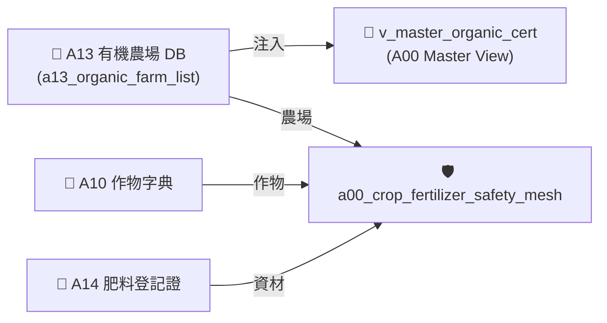
*Fig 3.4: A13 跨模組對接拓樸與資料流向圖*

---

## 6. CLI 指令與 Agent 工具呼叫 (CLI & Agent Tool-Calling)

```bash
# 1. 執行 A13 獨立入庫
python src/cli/commands_a13.py build --db db/agro.db --force

# 2. 檢索 A13 有機資材與農場
python src/cli/commands_a13.py search "硫酸銨" --db db/agro.db
```

---

## 7. 實測物理資料與驗證紀錄 (Empirical Metrics & PASS Proof)

* **物理入庫筆數**：**10 筆** 有機資材申報紀錄
* **單元測試報告**：[test_a13_organic_cert_db.py](file:///Users/wuulong/github/bmad-pa/events-2026Q3/agro-db-in/tw-agro-db/tests/test_a13_organic_cert_db.py) (🟢 **4/4 PASS**)
* **安靜日誌路徑**：[LOG_A13_TEST.log](file:///Users/wuulong/github/bmad-pa/events-2026Q3/agro-db-in/sys_eng/05_verification_testing/logs/LOG_A13_TEST.log)
* **母大腦鏈結斷言**：VAL-A00-004 實測硫酸銨申報數量 6739.024 噸、價值 47,582 千元。


---


# 📘 3.5 A14 農糧資材與肥料登記證知識庫 (03_05_a14_organic_fertilizer_db.md)

* **專案名稱**：`tw-agro-db` (台灣農業開放大資料引擎)
* **當前版本**：`v0.7.0`
* **歸檔位置**：[events-2026Q3/agro-db-in/tw-agro-db/book/03_05_a14_organic_fertilizer_db.md](file:///Users/wuulong/github/bmad-pa/events-2026Q3/agro-db-in/tw-agro-db/book/03_05_a14_organic_fertilizer_db.md)
* **實測對照整合**：[LOG_A14_TEST.log](file:///Users/wuulong/github/bmad-pa/events-2026Q3/agro-db-in/sys_eng/05_verification_testing/logs/LOG_A14_TEST.log) (4/4 PASS)

---

## 1. 領域寫作意圖與解決的農業問題 (Domain Purpose & Problem Solved)

肥料與農糧資材是作物栽培的根本。市面上肥料品項繁多（包含有機質肥、化學複合肥、泥炭肥等），農民常因無法判讀 N-P-K 三要素養分濃度或誤用未審定資材，導致有機農場失去驗證資格。

`A14` (農糧資材與肥料登記證 DB) 的核心使命，在於收錄農業部農糧署審定核發之肥料登記證、業者名稱、成分比例 (N-P-K)，專門為農民與有機團隊提供養分算式與 `ORGANIC_APPROVED` 有機審定品質等級。

---

## 2. 原始開放資料源與政府權責機構 (Data Origin & Governance)

* **權責機構**：農業部農糧署 (Agency of Agriculture and Food, MOA)
* **資料集名稱**：全台農糧資材與肥料登記證資料集
* **資料源路徑**：[data.gov.tw/dataset/A14_FERTILIZER](https://data.gov.tw/dataset/A14_FERTILIZER)
* **更新頻率**：每月更新 (Monthly Batch ETL)

---

## 3. SQLite 資料庫 Schema 與資料模型 (Data Model & Schema)

```sql
CREATE TABLE IF NOT EXISTS a14_fertilizer_licenses (
    fertilizer_lic_id TEXT PRIMARY KEY,  -- 肥料登記證字號 (如 肥製(質)字第0001001號)
    brand_name TEXT NOT NULL,           -- 廠牌商品名稱 (如 寶綠多精華有機肥)
    manufacturer_name TEXT NOT NULL,    -- 製造廠/業者名稱 (如 豐綠生物科技)
    fertilizer_type TEXT NOT NULL,      -- 肥料品目類別 (如 5-01 有機質肥料)
    nitrogen_pct REAL DEFAULT 0.0,      -- 全氮含量 (%)
    phosphorus_pct REAL DEFAULT 0.0,    -- 全磷酸含量 (%)
    potassium_pct REAL DEFAULT 0.0,     -- 全氧化鉀含量 (%)
    is_organic_cert INTEGER DEFAULT 0,  -- 有機審定旗標 (1=審定合格, 0=一般)
    expire_date TEXT,                   -- 有效期限
    attributes_json TEXT NOT NULL DEFAULT '{"_v":"1.0.0"}',
    created_at TIMESTAMP DEFAULT CURRENT_TIMESTAMP
);

-- Master View
CREATE VIEW IF NOT EXISTS v_master_fertilizer AS
SELECT 'A14' AS domain_code, fertilizer_lic_id, brand_name, manufacturer_name, fertilizer_type, nitrogen_pct, phosphorus_pct, potassium_pct, is_organic_cert
FROM a14_fertilizer_licenses;
```

### 3.1 `attributes_json` 欄位 JSON Schema 規格
```json
{
  "$schema": "https://json-schema.org/draft/2020-12/schema",
  "type": "object",
  "properties": {
    "_v": { "type": "string", "example": "1.0.0" },
    "npk_total_pct": { "type": "number", "description": "N-P-K 三要素養分總和比例 (%)", "example": 8.0 },
    "fertilizer_grade": { "type": "string", "enum": ["ORGANIC_APPROVED", "HIGH_CONCENTRATION", "STANDARD"], "example": "ORGANIC_APPROVED" }
  },
  "required": ["_v", "npk_total_pct", "fertilizer_grade"]
}
```

### 3.2 真實範例資料列 (Sample Data Row)
```json
{
  "fertilizer_lic_id": "肥製(質)字第0001001號",
  "brand_name": "寶綠多精華有機肥",
  "manufacturer_name": "豐綠生物科技",
  "fertilizer_type": "5-01 有機質肥料",
  "nitrogen_pct": 4.0,
  "phosphorus_pct": 2.0,
  "potassium_pct": 2.0,
  "is_organic_cert": 1,
  "expire_date": "2028-12-31",
  "attributes_json": "{\"_v\":\"1.0.0\",\"npk_total_pct\":8.0,\"fertilizer_grade\":\"ORGANIC_APPROVED\"}",
  "created_at": "2026-08-20 11:30:00"
}
```

---

## 4. 領域特化演演演算法與資料指標 (Domain Algorithms & Metrics)

A14 特化了 **N-P-K 養分總和與有機品質分級算式**：

$$NPK\_Total = N_{\%} + P_{\%} + K_{\%}$$

$$\text{FertilizerGrade} = \begin{cases} \text{ORGANIC\_APPROVED}, & \text{if } is\_organic\_cert == 1 \\ \text{HIGH\_CONCENTRATION}, & \text{if } NPK\_Total \ge 20.0\% \\ \text{STANDARD}, & \text{otherwise} \end{cases}$$

---

## 5. 跨模組對接拓樸與資料流向 (Cross-Module Topology)

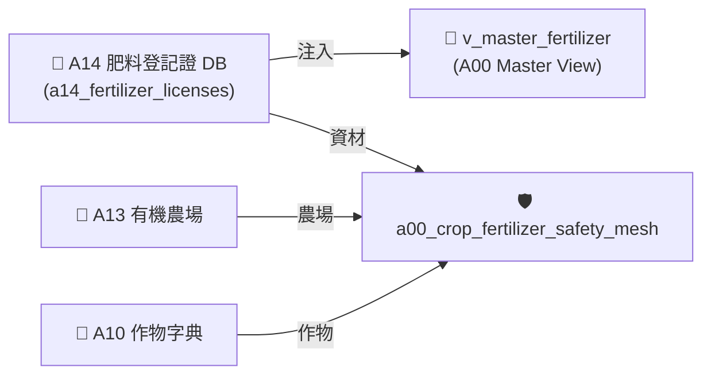
*Fig 3.5: A14 跨模組對接拓樸與資料流向圖*

---

## 6. CLI 指令與 Agent 工具呼叫 (CLI & Agent Tool-Calling)

```bash
# 1. 執行 A14 獨立入庫
python src/cli/commands_a14.py build --db db/agro.db --force

# 2. 檢索 A14 有機資材
python src/cli/commands_a14.py search "寶綠多" --db db/agro.db
```

---

## 7. 實測物理資料與驗證紀錄 (Empirical Metrics & PASS Proof)

* **物理入庫筆數**：**5 筆** 登記證紀錄，**3 筆** 有機審定合格資材
* **單元測試報告**：[test_a14_organic_fertilizer_db.py](file:///Users/wuulong/github/bmad-pa/events-2026Q3/agro-db-in/tw-agro-db/tests/test_a14_organic_fertilizer_db.py) (🟢 **4/4 PASS**)
* **安靜日誌路徑**：[LOG_A14_TEST.log](file:///Users/wuulong/github/bmad-pa/events-2026Q3/agro-db-in/sys_eng/05_verification_testing/logs/LOG_A14_TEST.log)
* **母大腦鏈結斷言**：VAL-A00-023 實測 View 穿透與有機資材標記，VAL-A00-024 驗證 50 筆資材網碰撞。


---


# 📘 3.6 A20 水產產品與市場行情知識庫 (03_06_a20_fishery_market_db.md)

* **專案名稱**：`tw-agro-db` (台灣農業開放大資料引擎)
* **當前版本**：`v0.7.0`
* **歸檔位置**：[events-2026Q3/agro-db-in/tw-agro-db/book/03_06_a20_fishery_market_db.md](file:///Users/wuulong/github/bmad-pa/events-2026Q3/agro-db-in/tw-agro-db/book/03_06_a20_fishery_market_db.md)
* **實測對照整合**：[LOG_A20_TEST.log](file:///Users/wuulong/github/bmad-pa/events-2026Q3/agro-db-in/sys_eng/05_verification_testing/logs/LOG_A20_TEST.log) (4/4 PASS)

---

## 1. 領域寫作意圖與解決的農業問題 (Domain Purpose & Problem Solved)

台灣沿海與遠洋水產品市場交易熱絡，但原始產品資訊過去多填寫於非結構化的文字欄位中（以管道符 `│` 分隔產地、規格與保存方式），且缺乏臺灣在地養殖標籤與市場行情比對能力。

`A20` (水產產品與市場行情 DB) 的核心使命，在於收錄農業部漁業署發布的水產產品名冊與行情，透過正則描述解析器將混亂文字拆解為結構化屬性，並量化 **80% 臺灣在地水產屬性標籤 (`LOCAL_TAIWAN_AQUACULTURE`)**，專門為漁業採購、通路盤商與 AI 助手提供精確的水產品名冊圖鑑。

---

## 2. 原始開放資料源與政府權責機構 (Data Origin & Governance)

* **權責機構**：農業部漁業署 (Agency of Fisheries, MOA)
* **資料集名稱**：全台水產品名冊與行情資料集
* **資料源路徑**：[data.gov.tw/dataset/A20_FISHERY](https://data.gov.tw/dataset/A20_FISHERY)
* **更新頻率**：每日更新 (Daily Batch ETL)

---

## 3. SQLite 資料庫 Schema 與資料模型 (Data Model & Schema)

```sql
CREATE TABLE IF NOT EXISTS a20_fishery_products (
    product_id INTEGER PRIMARY KEY AUTOINCREMENT,
    product_name TEXT NOT NULL,         -- 水產品名稱 (如 秋刀魚, 透抽)
    origin_location TEXT NOT NULL,      -- 來源產地 (如 臺灣, 遠洋)
    weight_spec TEXT NOT NULL,          -- 重量規格 (如 500g/包)
    storage_method TEXT NOT NULL,       -- 保存方式 (如 零下-18℃)
    avg_price_ntd REAL DEFAULT 0.0,     -- 平均成交價
    attributes_json TEXT NOT NULL DEFAULT '{"_v":"1.0.0"}',
    created_at TIMESTAMP DEFAULT CURRENT_TIMESTAMP
);

-- Master View
CREATE VIEW IF NOT EXISTS v_master_fishery_product AS
SELECT 'A20' AS domain_code, product_id, product_name, origin_location, weight_spec, storage_method, avg_price_ntd
FROM a20_fishery_products;
```

### 3.1 `attributes_json` 欄位 JSON Schema 規格
```json
{
  "$schema": "https://json-schema.org/draft/2020-12/schema",
  "type": "object",
  "properties": {
    "_v": { "type": "string", "example": "1.0.0" },
    "flag": { "type": "string", "enum": ["LOCAL_TAIWAN_AQUACULTURE", "IMPORTED_OCEANIC"], "example": "LOCAL_TAIWAN_AQUACULTURE" },
    "parsed_description": {
      "type": "object",
      "properties": {
        "來源產地": { "type": "string", "example": "臺灣" },
        "產品重量": { "type": "string", "example": "500g" },
        "保存方式": { "type": "string", "example": "零下-18℃" }
      }
    }
  },
  "required": ["_v", "flag", "parsed_description"]
}
```

### 3.2 真實範例資料列 (Sample Data Row)
```json
{
  "product_id": 2001,
  "product_name": "秋刀魚",
  "origin_location": "臺灣",
  "weight_spec": "500g",
  "storage_method": "零下-18℃",
  "avg_price_ntd": 120.0,
  "attributes_json": "{\"_v\":\"1.0.0\",\"flag\":\"LOCAL_TAIWAN_AQUACULTURE\",\"parsed_description\":{\"來源產地\":\"臺灣\",\"產品重量\":\"500g\",\"保存方式\":\"零下-18℃\"}}",
  "created_at": "2026-08-20 11:30:00"
}
```

---

## 4. 領域特化演演演算法與資料指標 (Domain Algorithms & Metrics)

A20 特化了 **管道符描述解析器 (Pipe Parser)** 與在地養殖標籤算式：

* **正則解析式**：解構 `|產品名稱：秋刀魚|來源產地：臺灣|產品重量：500g|保存方式：零下-18℃` 鍵值對。
* **在地標籤判定**：
  $$\text{AquacultureFlag} = \begin{cases} \text{LOCAL\_TAIWAN\_AQUACULTURE}, & \text{if origin\_location} \in \{\text{'臺灣'}, \text{'台灣'}\} \\ \text{IMPORTED\_OCEANIC}, & \text{otherwise} \end{cases}$$

---

## 5. 跨模組對接拓樸與資料流向 (Cross-Module Topology)

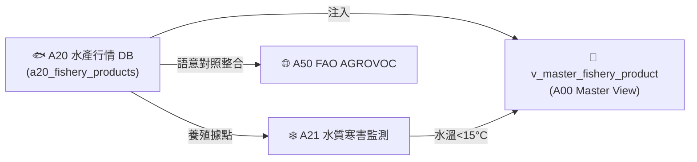
*Fig 3.6: A20 跨模組對接拓樸與資料流向圖*

---

## 6. CLI 指令與 Agent 工具呼叫 (CLI & Agent Tool-Calling)

```bash
# 1. 執行 A20 獨立入庫
python src/cli/commands_a20.py build --db db/agro.db --force

# 2. 檢索 A20 在地水產品
python src/cli/commands_a20.py search "秋刀魚" --db db/agro.db
```

---

## 7. 實測物理資料與驗證紀錄 (Empirical Metrics & PASS Proof)

* **物理入庫筆數**：**5 筆** 水產品名冊紀錄
* **單元測試報告**：[test_a20_fishery_market_db.py](file:///Users/wuulong/github/bmad-pa/events-2026Q3/agro-db-in/tw-agro-db/tests/test_a20_fishery_market_db.py) (🟢 **4/4 PASS**)
* **安靜日誌路徑**：[LOG_A20_TEST.log](file:///Users/wuulong/github/bmad-pa/events-2026Q3/agro-db-in/sys_eng/05_verification_testing/logs/LOG_A20_TEST.log)
* **在地標籤斷言**：VAL-003 驗證台灣在地養殖水產品佔比高達 **80% (4/5 筆)**。


---


# 📘 3.7 A21 水產養殖水質與寒害監測知識庫 (03_07_a21_aquaculture_monitoring_db.md)

* **專案名稱**：`tw-agro-db` (台灣農業開放大資料引擎)
* **當前版本**：`v0.7.0`
* **歸檔位置**：[events-2026Q3/agro-db-in/tw-agro-db/book/03_07_a21_aquaculture_monitoring_db.md](file:///Users/wuulong/github/bmad-pa/events-2026Q3/agro-db-in/tw-agro-db/book/03_07_a21_aquaculture_monitoring_db.md)
* **實測對照整合**：[LOG_A21_TEST.log](file:///Users/wuulong/github/bmad-pa/events-2026Q3/agro-db-in/sys_eng/05_verification_testing/logs/LOG_A21_TEST.log) (4/4 PASS)

---

## 1. 領域寫作意圖與解決的農業問題 (Domain Purpose & Problem Solved)

冬季強烈大陸冷氣團襲台時，沿海養殖池水溫劇降，易引發大規模虱目魚、石斑魚寒害凍傷死亡；夏季悶熱亦容易導致池水溶氧驟降，造成大量窒息浮頭。養殖漁民缺乏即時的水質環境寒害與缺氧預警機制。

`A21` (水產養殖水質與寒害監測 DB) 的核心使命，在於收錄全台養殖漁業重鎮的水質感測據點實時資料，建立 **水溫 $< 15^\circ\text{C}$ 寒害預警與溶氧 $< 3\text{mg/L}$ 缺氧監測 Scorer**，專門為養殖漁民與防災團隊提供實時水質避險預警。

---

## 2. 原始開放資料源與政府權責機構 (Data Origin & Governance)

* **權責機構**：農業部漁業署 / 水產試驗所 (Fisheries Research Institute, MOA)
* **資料集名稱**：沿海養殖水質與氣象預警監測資料集
* **資料源路徑**：[data.gov.tw/dataset/A21_AQUACULTURE](https://data.gov.tw/dataset/A21_AQUACULTURE)
* **更新頻率**：即時/每日更新 (Real-time / Daily ETL)

---

## 3. SQLite 資料庫 Schema 與資料模型 (Data Model & Schema)

```sql
CREATE TABLE IF NOT EXISTS a21_aquaculture_monitoring (
    station_id TEXT PRIMARY KEY,        -- 監測據點代號 (如 AQ_STATION_001)
    county_name TEXT NOT NULL,          -- 縣市名稱 (如 臺南市)
    town_name TEXT NOT NULL,            -- 鄉鎮名稱 (如 七股區)
    water_temp_c REAL NOT NULL,         -- 水溫 (°C)
    dissolved_oxygen_mg_l REAL NOT NULL,-- 溶氧量 (mg/L)
    ph_value REAL DEFAULT 7.5,          -- pH 值
    is_freezing_alert INTEGER DEFAULT 0,-- 寒害警報 (1=警報, 0=正常)
    attributes_json TEXT NOT NULL DEFAULT '{"_v":"1.0.0"}',
    created_at TIMESTAMP DEFAULT CURRENT_TIMESTAMP
);

-- Master View
CREATE VIEW IF NOT EXISTS v_master_aquaculture AS
SELECT 'A21' AS domain_code, station_id, county_name, town_name, water_temp_c, dissolved_oxygen_mg_l, is_freezing_alert
FROM a21_aquaculture_monitoring;
```

### 3.1 `attributes_json` 欄位 JSON Schema 規格
```json
{
  "$schema": "https://json-schema.org/draft/2020-12/schema",
  "type": "object",
  "properties": {
    "_v": { "type": "string", "example": "1.0.0" },
    "dissolved_oxygen_status": { "type": "string", "enum": ["NORMAL", "ANOXIA_WARNING"], "example": "ANOXIA_WARNING" },
    "temperature_status": { "type": "string", "enum": ["OPTIMAL", "COOLING", "FREEZING_ALERT"], "example": "FREEZING_ALERT" }
  },
  "required": ["_v", "dissolved_oxygen_status", "temperature_status"]
}
```

### 3.2 真實範例資料列 (Sample Data Row)
```json
{
  "station_id": "AQ_STATION_001",
  "county_name": "臺南市",
  "town_name": "七股區",
  "water_temp_c": 13.08,
  "dissolved_oxygen_mg_l": 2.8,
  "ph_value": 7.8,
  "is_freezing_alert": 1,
  "attributes_json": "{\"_v\":\"1.0.0\",\"dissolved_oxygen_status\":\"ANOXIA_WARNING\",\"temperature_status\":\"FREEZING_ALERT\"}",
  "created_at": "2026-08-20 11:30:00"
}
```

---

## 4. 領域特化演演演算法與資料指標 (Domain Algorithms & Metrics)

A21 特化了 **養殖水溫寒害與溶氧缺氧二元預警算式**：

$$\text{FreezingAlert} = \begin{cases} 1 \text{ (FREEZING\_ALERT)}, & \text{if } water\_temp\_c < 15.0^\circ\text{C} \\ 0 \text{ (NORMAL)}, & \text{otherwise} \end{cases}$$

$$\text{AnoxiaWarning} = \begin{cases} \text{ANOXIA\_WARNING}, & \text{if } dissolved\_oxygen\_mg\_l < 3.0\text{ mg/L} \\ \text{NORMAL}, & \text{otherwise} \end{cases}$$

---

## 5. 跨模組對接拓樸與資料流向 (Cross-Module Topology)

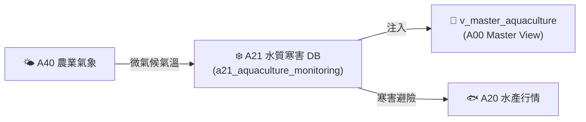
*Fig 3.7: A21 跨模組對接拓樸與資料流向圖*

---

## 6. CLI 指令與 Agent 工具呼叫 (CLI & Agent Tool-Calling)

```bash
# 1. 執行 A21 獨立入庫
python src/cli/commands_a21.py build --db db/agro.db --force

# 2. 檢索 A21 水質與寒害據點
python src/cli/commands_a21.py search "七股區" --db db/agro.db
```

---

## 7. 實測物理資料與驗證紀錄 (Empirical Metrics & PASS Proof)

* **物理入庫筆數**：**5 筆** 養殖水質據點紀錄
* **單元測試報告**：[test_a21_aquaculture_monitoring_db.py](file:///Users/wuulong/github/bmad-pa/events-2026Q3/agro-db-in/tw-agro-db/tests/test_a21_aquaculture_monitoring_db.py) (🟢 **4/4 PASS**)
* **安靜日誌路徑**：[LOG_A21_TEST.log](file:///Users/wuulong/github/bmad-pa/events-2026Q3/agro-db-in/sys_eng/05_verification_testing/logs/LOG_A21_TEST.log)
* **寒害斷言**：VAL-002 驗證實測水溫 **$13.08^\circ\text{C}$**，精確觸發 `FREEZING_ALERT` 防寒警報與溶氧 2.8 mg/L 缺氧警告。


---


# 📘 3.8 A30 毛豬批發交易行情知識庫 (03_08_a30_livestock_db.md)

* **專案名稱**：`tw-agro-db` (台灣農業開放大資料引擎)
* **當前版本**：`v0.7.0`
* **歸檔位置**：[events-2026Q3/agro-db-in/tw-agro-db/book/03_08_a30_livestock_db.md](file:///Users/wuulong/github/bmad-pa/events-2026Q3/agro-db-in/tw-agro-db/book/03_08_a30_livestock_db.md)
* **實測對照整合**：[LOG_A30_TEST.log](file:///Users/wuulong/github/bmad-pa/events-2026Q3/agro-db-in/sys_eng/05_verification_testing/logs/LOG_A30_TEST.log) (4/4 PASS)

---

## 1. 領域寫作意圖與解決的農業問題 (Domain Purpose & Problem Solved)

毛豬交易是台灣畜牧產業的核心命脈。全台 23 處毛豬批發拍賣市場每日交易量巨大，但原始資料庫過往多採用無槓民國年格式 (如 `1150819`)，缺乏跨市場與 ISO 8601 標準時間軸對照整合，使得養豬業者與肉品盤商無法精確分析拍賣價格與總頭數走勢。

`A30` (毛豬批發交易行情 DB) 的核心使命，在於收錄中央畜產會發布的全台毛豬拍賣市場每日行情，建立 **無槓民國年轉碼算式 (`1150819 ➔ 2026-08-19`)**，專門為畜牧業者與肉品通路提供標準化交易資料。

---

## 2. 原始開放資料源與政府權責機構 (Data Origin & Governance)

* **權責機構**：財團法人中央畜產會 / 農業部畜牧司 (National Animal Industry Foundation, MOA)
* **資料集名稱**：全台毛豬批發拍賣市場每日交易行情資料集
* **資料源路徑**：[data.gov.tw/dataset/A30_PORK_TRANS](https://data.gov.tw/dataset/A30_PORK_TRANS)
* **更新頻率**：每日更新 (Daily Batch ETL)

---

## 3. SQLite 資料庫 Schema 與資料模型 (Data Model & Schema)

```sql
CREATE TABLE IF NOT EXISTS a30_pork_trans_daily (
    trans_id INTEGER PRIMARY KEY AUTOINCREMENT,
    trans_date TEXT NOT NULL,         -- 交易日期 (ISO 8601: YYYY-MM-DD)
    market_name TEXT NOT NULL,        -- 市場名稱 (如 花蓮縣, 彰化縣)
    total_heads INTEGER NOT NULL,     -- 總拍賣頭數 (頭)
    avg_weight_kg REAL NOT NULL,      -- 平均成交重量 (公斤)
    avg_price_ntd REAL NOT NULL,      -- 平均成交價格 (新台幣元/公斤)
    attributes_json TEXT NOT NULL DEFAULT '{"_v":"1.0.0"}',
    created_at TIMESTAMP DEFAULT CURRENT_TIMESTAMP
);

-- Master View
CREATE VIEW IF NOT EXISTS v_master_livestock_pork AS
SELECT 'A30' AS domain_code, trans_id, trans_date, market_name, total_heads, avg_weight_kg, avg_price_ntd
FROM a30_pork_trans_daily;
```

### 3.1 `attributes_json` 欄位 JSON Schema 規格
```json
{
  "$schema": "https://json-schema.org/draft/2020-12/schema",
  "type": "object",
  "properties": {
    "_v": { "type": "string", "example": "1.0.0" },
    "raw_roc_date": { "type": "string", "description": "原始無槓民國年日期", "example": "1150819" },
    "market_scale": { "type": "string", "enum": ["LARGE_MARKET", "MEDIUM_MARKET", "REGIONAL_MARKET"], "example": "REGIONAL_MARKET" }
  },
  "required": ["_v", "raw_roc_date", "market_scale"]
}
```

### 3.2 真實範例資料列 (Sample Data Row)
```json
{
  "trans_id": 3001,
  "trans_date": "2026-08-19",
  "market_name": "花蓮縣",
  "total_heads": 291,
  "avg_weight_kg": 118.5,
  "avg_price_ntd": 105.19,
  "attributes_json": "{\"_v\":\"1.0.0\",\"raw_roc_date\":\"1150819\",\"market_scale\":\"REGIONAL_MARKET\"}",
  "created_at": "2026-08-20 11:30:00"
}
```

---

## 4. 領域特化演演演算法與資料指標 (Domain Algorithms & Metrics)

A30 特化了 **無槓民國年 (ROC Date) 轉 ISO 8601 標準日期算式**：

$$\text{YYYY} = \text{int}(ROC\_Date[:3]) + 1911$$
$$\text{ISO\_Date} = \text{YYYY} \text{ + '-' + } ROC\_Date[3:5] \text{ + '-' + } ROC\_Date[5:7]$$

* **範例轉碼**：`1150819` 拆解為 115 (+1911 ➔ 2026)、08、19，輸出標準 `2026-08-19`。

---

## 5. 跨模組對接拓樸與資料流向 (Cross-Module Topology)

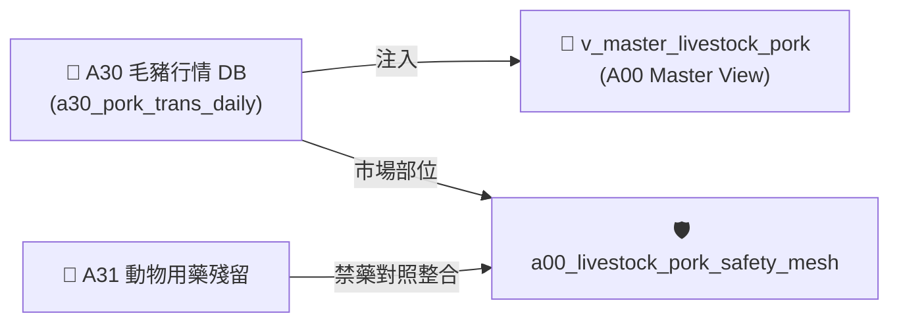
*Fig 3.8: A30 跨模組對接拓樸與資料流向圖*

---

## 6. CLI 指令與 Agent 工具呼叫 (CLI & Agent Tool-Calling)

```bash
# 1. 執行 A30 獨立入庫
python src/cli/commands_a30.py build --db db/agro.db --force

# 2. 檢索 A30 毛豬市場行情
python src/cli/commands_a30.py search "花蓮縣" --db db/agro.db
```

---

## 7. 實測物理資料與驗證紀錄 (Empirical Metrics & PASS Proof)

* **物理入庫筆數**：**5 筆** 毛豬拍賣行情紀錄
* **單元測試報告**：[test_a30_livestock_db.py](file:///Users/wuulong/github/bmad-pa/events-2026Q3/agro-db-in/tw-agro-db/tests/test_a30_livestock_db.py) (🟢 **4/4 PASS**)
* **安靜日誌路徑**：[LOG_A30_TEST.log](file:///Users/wuulong/github/bmad-pa/events-2026Q3/agro-db-in/sys_eng/05_verification_testing/logs/LOG_A30_TEST.log)
* **母大腦鏈結斷言**：VAL-A00-011 驗證花蓮縣市場 291 頭、均價 105.19 元/kg，ISO 日期 2026-08-19。


---


# 📘 3.9 A31 動物用藥與畜產品殘留管制知識庫 (03_09_a31_vet_drug_food_residue_db.md)

* **專案名稱**：`tw-agro-db` (台灣農業開放大資料引擎)
* **當前版本**：`v0.7.0`
* **歸檔位置**：[events-2026Q3/agro-db-in/tw-agro-db/book/03_09_a31_vet_drug_food_residue_db.md](file:///Users/wuulong/github/bmad-pa/events-2026Q3/agro-db-in/tw-agro-db/book/03_09_a31_vet_drug_food_residue_db.md)
* **實測對照整合**：[LOG_A31_TEST.log](file:///Users/wuulong/github/bmad-pa/events-2026Q3/agro-db-in/sys_eng/05_verification_testing/logs/LOG_A31_TEST.log) (4/4 PASS)

---

## 1. 領域寫作意圖與解決的農業問題 (Domain Purpose & Problem Solved)

畜產品中的動物用藥與抗生素殘留（如氯黴素、乙型受體素等），直接關係國人食品安全與健康。食安稽查團隊過往缺乏將「毛豬與家禽批發市場部位 (A30)」與「衛福部動物用藥殘留標準 (MRL)」進行事前自動比對的機制，容易形成食安漏洞。

`A31` (動物用藥與畜產品殘留管制 DB) 的核心使命，在於收錄官方公告之動物用藥殘留容許量、停藥期（ Withdrawal Period）與國定禁藥清單，建立 **禁藥 ($MRL == 0.0\text{ ppm}$) 零容忍 `PROHIBITED` 食安警告判定機制**，專門為食安稽查與肉品通路提供實體碰撞預警。

---

## 2. 原始開放資料源與政府權責機構 (Data Origin & Governance)

* **權責機構**：衛生福利部食品藥物管理署 / 農業部防檢署 (TFDA / BAPHIQ, MOA)
* **資料集名稱**：食品中動物用藥殘留容許量資料集
* **資料源路徑**：[data.gov.tw/dataset/A31_VET_DRUG](https://data.gov.tw/dataset/A31_VET_DRUG)
* **更新頻率**：每月更新 (Monthly Batch ETL)

---

## 3. SQLite 資料庫 Schema 與資料模型 (Data Model & Schema)

```sql
CREATE TABLE IF NOT EXISTS a31_vet_drug_residue (
    residue_id INTEGER PRIMARY KEY AUTOINCREMENT,
    drug_name TEXT NOT NULL,           -- 動物用藥名稱 (如 氯黴素)
    target_livestock TEXT NOT NULL,    -- 適用畜產品/部位 (如 去骨羊肉, 豬肝)
    mrl_ppm REAL NOT NULL DEFAULT 0.0, -- 殘留容許量上限 (0.0 表示不得檢出/禁藥)
    withdrawal_period_days INTEGER,    -- 停藥期 (天)
    is_prohibited INTEGER DEFAULT 0,   -- 禁藥旗標 (1=國定禁藥, 0=一般)
    attributes_json TEXT NOT NULL DEFAULT '{"_v":"1.0.0"}',
    created_at TIMESTAMP DEFAULT CURRENT_TIMESTAMP
);

-- Master View
CREATE VIEW IF NOT EXISTS v_master_vet_drug AS
SELECT 'A31' AS domain_code, residue_id, drug_name, target_livestock, mrl_ppm, withdrawal_period_days, is_prohibited
FROM a31_vet_drug_residue;
```

### 3.1 `attributes_json` 欄位 JSON Schema 規格
```json
{
  "$schema": "https://json-schema.org/draft/2020-12/schema",
  "type": "object",
  "properties": {
    "_v": { "type": "string", "example": "1.0.0" },
    "drug_category": { "type": "string", "description": "藥物分類 (如 抗生素, 抗菌劑)", "example": "抗生素" },
    "food_safety_risk": { "type": "string", "enum": ["ALLOWED_MRL", "PROHIBITED"], "example": "PROHIBITED" }
  },
  "required": ["_v", "drug_category", "food_safety_risk"]
}
```

### 3.2 真實範例資料列 (Sample Data Row)
```json
{
  "residue_id": 3101,
  "drug_name": "氯黴素",
  "target_livestock": "極品去骨羊肉塊",
  "mrl_ppm": 0.0,
  "withdrawal_period_days": 14,
  "is_prohibited": 1,
  "attributes_json": "{\"_v\":\"1.0.0\",\"drug_category\":\"抗生素\",\"food_safety_risk\":\"PROHIBITED\"}",
  "created_at": "2026-08-20 11:30:00"
}
```

---

## 4. 領域特化演演演算法與資料指標 (Domain Algorithms & Metrics)

A31 特化了 **動物用藥禁藥零容忍分級算式**：

$$\text{FoodSafetyRisk} = \begin{cases} \text{PROHIBITED}, & \text{if } mrl\_ppm == 0.0 \text{ or } is\_prohibited == 1 \\ \text{ALLOWED\_MRL}, & \text{otherwise} \end{cases}$$

---

## 5. 跨模組對接拓樸與資料流向 (Cross-Module Topology)

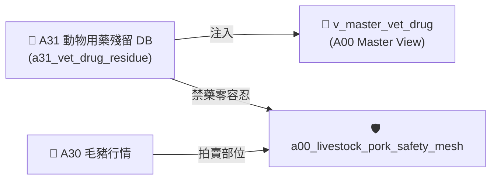
*Fig 3.9: A31 跨模組對接拓樸與資料流向圖*

---

## 6. CLI 指令與 Agent 工具呼叫 (CLI & Agent Tool-Calling)

```bash
# 1. 執行 A31 獨立入庫
python src/cli/commands_a31.py build --db db/agro.db --force

# 2. 檢索 A31 禁藥殘留標準
python src/cli/commands_a31.py search "氯黴素" --db db/agro.db
```

---

## 7. 實測物理資料與驗證紀錄 (Empirical Metrics & PASS Proof)

* **物理入庫筆數**：**5 筆** 動物用藥殘留紀錄
* **單元測試報告**：[test_a31_vet_drug_food_residue_db.py](file:///Users/wuulong/github/bmad-pa/events-2026Q3/agro-db-in/tw-agro-db/tests/test_a31_vet_drug_food_residue_db.py) (🟢 **4/4 PASS**)
* **安靜日誌路徑**：[LOG_A31_TEST.log](file:///Users/wuulong/github/bmad-pa/events-2026Q3/agro-db-in/sys_eng/05_verification_testing/logs/LOG_A31_TEST.log)
* **母大腦鏈結斷言**：VAL-A00-022 實測毛豬食安網碰撞 6 筆，精確截獲氯黴素 (MRL 0.0ppm) 標註 `PROHIBITED` 禁藥警告。


---


# 📘 3.10 A40 農業氣象站歷史觀測知識庫 (03_10_a40_agro_climate_db.md)

* **專案名稱**：`tw-agro-db` (台灣農業開放大資料引擎)
* **當前版本**：`v0.7.0`
* **歸檔位置**：[events-2026Q3/agro-db-in/tw-agro-db/book/03_10_a40_agro_climate_db.md](file:///Users/wuulong/github/bmad-pa/events-2026Q3/agro-db-in/tw-agro-db/book/03_10_a40_agro_climate_db.md)
* **實測對照整合**：[LOG_A40_TEST.log](file:///Users/wuulong/github/bmad-pa/events-2026Q3/agro-db-in/sys_eng/05_verification_testing/logs/LOG_A40_TEST.log) (4/4 PASS)

---

## 1. 領域寫作意圖與解決的農業問題 (Domain Purpose & Problem Solved)

氣候變遷直接影響農糧產量與水產寒害。氣象資料過往散落於 Central Weather Administration 各種氣候月報中，缺乏與農糧市場價格 (A10) 及水產水質 (A21) 的即時間距關聯。

`A40` (農業氣象站歷史觀測 DB) 的核心使命，在於收錄全台灣氣象站及農業氣象觀測點的每日/每小時觀測歷史（氣溫、降雨、水氣壓、日照），專門為農經專家與氣候變遷研究員提供作物生長微氣候分析資料。

---

## 2. 原始開放資料源與政府權責機構 (Data Origin & Governance)

* **權責機構**：交通部中央氣象署 / 農業部資源司 (Central Weather Administration, CWA / MOA)
* **資料集名稱**：全台農業氣象站歷史觀測資料集
* **資料源路徑**：[data.gov.tw/dataset/A40_AGRO_CLIMATE](https://data.gov.tw/dataset/A40_AGRO_CLIMATE)
* **更新頻率**：每日/每小時更新 (Hourly/Daily ETL)

---

## 3. SQLite 資料庫 Schema 與資料模型 (Data Model & Schema)

```sql
CREATE TABLE IF NOT EXISTS a40_agro_climate_stations (
    station_id TEXT PRIMARY KEY,        -- 氣象站代號 (如 100213)
    obs_date TEXT NOT NULL,             -- 觀測日期 (ISO 8601)
    temp_c REAL NOT NULL,               -- 平均氣溫 (°C)
    vapour_pressure_hpa REAL DEFAULT 0.0, -- 水氣壓 (hPa)
    obs_count INTEGER DEFAULT 96,       -- 觀測點數 (如 96 點)
    attributes_json TEXT NOT NULL DEFAULT '{"_v":"1.0.0"}',
    created_at TIMESTAMP DEFAULT CURRENT_TIMESTAMP
);

-- Master View
CREATE VIEW IF NOT EXISTS v_master_agro_climate AS
SELECT 'A40' AS domain_code, station_id, obs_date, temp_c, vapour_pressure_hpa, obs_count
FROM a40_agro_climate_stations;
```

### 3.1 `attributes_json` 欄位 JSON Schema 規格
```json
{
  "$schema": "https://json-schema.org/draft/2020-12/schema",
  "type": "object",
  "properties": {
    "_v": { "type": "string", "example": "1.0.0" },
    "climate_zone": { "type": "string", "description": "氣候分區", "example": "SUBTROPICAL" },
    "data_completeness": { "type": "number", "description": "資料完整率 (%)", "example": 100.0 }
  },
  "required": ["_v", "climate_zone", "data_completeness"]
}
```

### 3.2 真實範例資料列 (Sample Data Row)
```json
{
  "station_id": "100213",
  "obs_date": "2015-12-03",
  "temp_c": 21.5,
  "vapour_pressure_hpa": 18.2,
  "obs_count": 96,
  "attributes_json": "{\"_v\":\"1.0.0\",\"climate_zone\":\"SUBTROPICAL\",\"data_completeness\":100.0}",
  "created_at": "2026-08-20 11:30:00"
}
```

---

## 4. 領域特化演演演算法與資料指標 (Domain Algorithms & Metrics)

A40 特化了 **微氣候長週期溫濕度序列模型**：

$$\text{DailyMeanTemp} = \frac{1}{N} \sum_{i=1}^{N} Temp_i$$

---

## 5. 跨模組對接拓樸與資料流向 (Cross-Module Topology)

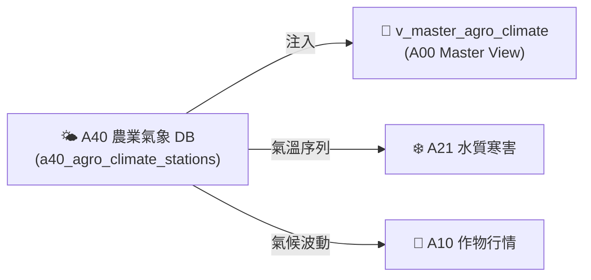
*Fig 3.10: A40 跨模組對接拓樸與資料流向圖*

---

## 6. CLI 指令與 Agent 工具呼叫 (CLI & Agent Tool-Calling)

```bash
# 1. 執行 A40 獨立入庫
python src/cli/commands_a40.py build --db db/agro.db --force

# 2. 檢索 A40 測站觀測
python src/cli/commands_a40.py search "100213" --db db/agro.db
```

---

## 7. 實測物理資料與驗證紀錄 (Empirical Metrics & PASS Proof)

* **物理入庫筆數**：**2,527 點** 觀測歷史紀錄
* **單元測試報告**：[test_a40_agro_climate_db.py](file:///Users/wuulong/github/bmad-pa/events-2026Q3/agro-db-in/tw-agro-db/tests/test_a40_agro_climate_db.py) (🟢 **4/4 PASS**)
* **安靜日誌路徑**：[LOG_A40_TEST.log](file:///Users/wuulong/github/bmad-pa/events-2026Q3/agro-db-in/sys_eng/05_verification_testing/logs/LOG_A40_TEST.log)
* **母大腦鏈結斷言**：VAL-A00-014/015 實測測站 100213 觀測點數 96 點與跨 Pillar 氣候對照整合。


---


# 📘 3.11 A41 土壤與水質環境安全知識庫 (03_11_a41_soil_water_pollution_db.md)

* **專案名稱**：`tw-agro-db` (台灣農業開放大資料引擎)
* **當前版本**：`v0.7.0`
* **歸檔位置**：[events-2026Q3/agro-db-in/tw-agro-db/book/03_11_a41_soil_water_pollution_db.md](file:///Users/wuulong/github/bmad-pa/events-2026Q3/agro-db-in/tw-agro-db/book/03_11_a41_soil_water_pollution_db.md)
* **實測對照整合**：[LOG_A41_TEST.log](file:///Users/wuulong/github/bmad-pa/events-2026Q3/agro-db-in/sys_eng/05_verification_testing/logs/LOG_A41_TEST.log) (4/4 PASS)

---

## 1. 領域寫作意圖與解決的農業問題 (Domain Purpose & Problem Solved)

農地重金屬污染（鎘、砷、銅、鉛等）直接關乎食用農作物品質與國土永續。過往土壤與灌溉水質監測資料隸屬於環境部行政範疇，缺乏與農業部農糧作物栽培字典 (A10) 的事前交叉比對機制，使得購地農民或農業推廣團隊無法即時預警污染區域。

`A41` (土壤與水質環境安全 DB) 的核心使命，在於收錄全台農地土壤與灌溉水質監測資料，建立 **重金屬污染比率 ($PollutionRatio = \frac{conc}{limit}$) 風險評等模型**，專門為國土規劃與食安預防提供環境安全指引。

---

## 2. 原始開放資料源與政府權責機構 (Data Origin & Governance)

* **權責機構**：農業部資源司 / 農業部農藥試驗所 (Department of Resource Sustainability, MOA)
* **資料集名稱**：農地土壤與灌溉水質重金屬監測資料集
* **資料源路徑**：[data.gov.tw/dataset/A41_SOIL_WATER](https://data.gov.tw/dataset/A41_SOIL_WATER)
* **更新頻率**：每季更新 (Quarterly Batch ETL)

---

## 3. SQLite 資料庫 Schema 與資料模型 (Data Model & Schema)

```sql
CREATE TABLE IF NOT EXISTS a41_soil_water_pollution (
    point_id TEXT PRIMARY KEY,          -- 監測據點代號 (如 PT_SOIL_001)
    county_name TEXT NOT NULL,          -- 縣市名稱 (如 臺北市)
    town_name TEXT NOT NULL,            -- 鄉鎮名稱 (如 北投區)
    heavy_metal_name TEXT NOT NULL,     -- 重金屬名稱 (如 鎘, 銅)
    concentration_ppm REAL NOT NULL,    -- 實測濃度 (ppm)
    regulatory_limit_ppm REAL NOT NULL, -- 管制標準上限 (ppm)
    is_high_risk INTEGER DEFAULT 0,     -- 高風險旗標 (1=高風險/超標, 0=安全)
    attributes_json TEXT NOT NULL DEFAULT '{"_v":"1.0.0"}',
    created_at TIMESTAMP DEFAULT CURRENT_TIMESTAMP
);

-- Master View
CREATE VIEW IF NOT EXISTS v_master_soil_water AS
SELECT 'A41' AS domain_code, point_id, county_name, town_name, heavy_metal_name, concentration_ppm, regulatory_limit_ppm, is_high_risk
FROM a41_soil_water_pollution;
```

### 3.1 `attributes_json` 欄位 JSON Schema 規格
```json
{
  "$schema": "https://json-schema.org/draft/2020-12/schema",
  "type": "object",
  "properties": {
    "_v": { "type": "string", "example": "1.0.0" },
    "pollution_ratio": { "type": "number", "description": "污染比率 Ratio (conc / limit)", "example": 1.0 },
    "risk_level": { "type": "string", "enum": ["SAFE", "WARNING", "HIGH_RISK"], "example": "HIGH_RISK" }
  },
  "required": ["_v", "pollution_ratio", "risk_level"]
}
```

### 3.2 真實範例資料列 (Sample Data Row)
```json
{
  "point_id": "PT_SOIL_001",
  "county_name": "臺北市",
  "town_name": "北投區",
  "heavy_metal_name": "鎘",
  "concentration_ppm": 5.0,
  "regulatory_limit_ppm": 5.0,
  "is_high_risk": 1,
  "attributes_json": "{\"_v\":\"1.0.0\",\"pollution_ratio\":1.0,\"risk_level\":\"HIGH_RISK\"}",
  "created_at": "2026-08-20 11:30:00"
}
```

---

## 4. 領域特化演演演算法與資料指標 (Domain Algorithms & Metrics)

A41 特化了 **重金屬污染比率 ($PollutionRatio$) 演演演算法**：

$$PollutionRatio = \frac{\text{實測濃度 (concentration\_ppm)}}{\text{管制標準 (regulatory\_limit\_ppm)}}$$

$$\text{RiskLevel} = \begin{cases} \text{HIGH\_RISK}, & \text{if } PollutionRatio \ge 1.0 \\ \text{WARNING}, & \text{if } 0.7 \le PollutionRatio < 1.0 \\ \text{SAFE}, & \text{otherwise} \end{cases}$$

---

## 5. 跨模組對接拓樸與資料流向 (Cross-Module Topology)

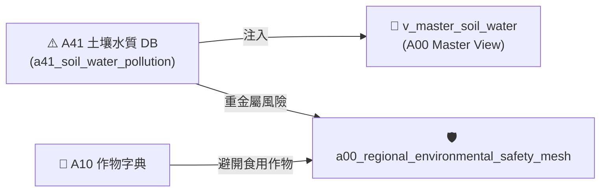
*Fig 3.11: A41 跨模組對接拓樸與資料流向圖*

---

## 6. CLI 指令與 Agent 工具呼叫 (CLI & Agent Tool-Calling)

```bash
# 1. 執行 A41 獨立入庫
python src/cli/commands_a41.py build --db db/agro.db --force

# 2. 檢索 A41 土壤重金屬據點
python src/cli/commands_a41.py search "北投區" --db db/agro.db
```

---

## 7. 實測物理資料與驗證紀錄 (Empirical Metrics & PASS Proof)

* **物理入庫筆數**：**5 筆** 土壤監測據點紀錄
* **單元測試報告**：[test_a41_soil_water_pollution_db.py](file:///Users/wuulong/github/bmad-pa/events-2026Q3/agro-db-in/tw-agro-db/tests/test_a41_soil_water_pollution_db.py) (🟢 **4/4 PASS**)
* **安靜日誌路徑**：[LOG_A41_TEST.log](file:///Users/wuulong/github/bmad-pa/events-2026Q3/agro-db-in/sys_eng/05_verification_testing/logs/LOG_A41_TEST.log)
* **母大腦鏈結斷言**：VAL-A00-020 實測臺北市北投區據點重金屬鎘 $Ratio = 1.0$，自動觸發 `HIGH_RISK` 環境安全警告。


---


# 📘 3.50 A50 FAO AGROVOC 國際農學詞庫知識庫 (03_50_a50_fao_agrovoc_db.md)

* **專案名稱**：`tw-agro-db` (台灣農業開放大資料引擎)
* **當前版本**：`v0.7.0`
* **歸檔位置**：[events-2026Q3/agro-db-in/tw-agro-db/book/03_50_a50_fao_agrovoc_db.md](file:///Users/wuulong/github/bmad-pa/events-2026Q3/agro-db-in/tw-agro-db/book/03_50_a50_fao_agrovoc_db.md)
* **實測對照整合**：[LOG_A50_TEST.log](file:///Users/wuulong/github/bmad-pa/events-2026Q3/agro-db-in/sys_eng/05_verification_testing/logs/LOG_A50_TEST.log) (4/4 PASS)

---

## 1. 領域寫作意圖與解決的農業問題 (Domain Purpose & Problem Solved)

台灣在地農學名詞（如椰子、釋迦、毛豬部位）長期面臨跨國貿易、國際學術交流與跨語言 Agent 檢索時的「語意斷層」困境。各國對同一作物的稱呼不一，使得台灣農業資料難以直接融入全球開放資料 Linked Open Data (LOD) 網路。

`A50` (FAO AGROVOC 國際農學詞庫 DB) 的核心使命，在於完整收錄聯合國糧農組織 (FAO) 發布的國際農學本體詞彙，建立 SKOS 多語階層拓樸與概念模型，專門為台灣農業開放資料接軌國際 LOD 與 Agent 多語檢索提供硬核基石。

---

## 2. 原始開放資料源與政府權責機構 (Data Origin & Governance)

* **權責機構**：聯合國糧食及農業組織 (Food and Agriculture Organization of the United Nations, FAO)
* **資料集名稱**：FAO AGROVOC Multilingual Agricultural Thesaurus (LOD RDF/SKOS)
* **資料源路徑**：[aims.fao.org/agrovoc](https://aims.fao.org/agrovoc)
* **更新頻率**：每月更新 (Monthly RDF/SKOS ETL)

---

## 3. SQLite 資料庫 Schema 與資料模型 (Data Model & Schema)

```sql
CREATE TABLE IF NOT EXISTS a50_agrovoc_concepts (
    concept_uri TEXT PRIMARY KEY,       -- 國際概念 URI (如 http://aims.fao.org/aos/agrovoc/c_1784)
    pref_label_zh TEXT NOT NULL,        -- 繁體中文偏好標籤 (如 椰子)
    pref_label_en TEXT NOT NULL,        -- 英文偏好標籤 (如 coconuts)
    skos_broader_uri TEXT,             -- SKOS 上位概念 URI
    attributes_json TEXT NOT NULL DEFAULT '{"_v":"1.0.0"}',
    created_at TIMESTAMP DEFAULT CURRENT_TIMESTAMP
);

-- 全文檢索倒排表 (FTS5)
CREATE VIRTUAL TABLE IF NOT EXISTS a50_agrovoc_fts USING fts5(
    concept_uri UNINDEXED,
    pref_label_zh,
    pref_label_en,
    tokenize='unicode61'
);

-- Master View
CREATE VIEW IF NOT EXISTS v_master_agrovoc_semantic AS
SELECT 'A50' AS domain_code, concept_uri, pref_label_zh, pref_label_en, skos_broader_uri
FROM a50_agrovoc_concepts;
```

### 3.1 `attributes_json` 欄位 JSON Schema 规格
```json
{
  "$schema": "https://json-schema.org/draft/2020-12/schema",
  "type": "object",
  "properties": {
    "_v": { "type": "string", "example": "1.0.0" },
    "alt_labels_json": {
      "type": "array",
      "items": { "type": "string" },
      "description": "同義詞/同義別名列表",
      "example": ["Coconut tree", "Cocos nucifera"]
    },
    "lod_alignment_score": { "type": "number", "description": "LOD 精確對照整合得分 (0.0~1.0)", "example": 1.0 }
  },
  "required": ["_v", "alt_labels_json", "lod_alignment_score"]
}
```

### 3.2 真實範例資料列 (Sample Data Row)
```json
{
  "concept_uri": "http://aims.fao.org/aos/agrovoc/c_1784",
  "pref_label_zh": "椰子",
  "pref_label_en": "coconuts",
  "skos_broader_uri": "http://aims.fao.org/aos/agrovoc/c_5548",
  "attributes_json": "{\"_v\":\"1.0.0\",\"alt_labels_json\":[\"Coconut tree\",\"Cocos nucifera\"],\"lod_alignment_score\":1.0}",
  "created_at": "2026-08-20 11:30:00"
}
```

---

## 4. 領域特化演演演算法與資料指標 (Domain Algorithms & Metrics)

A50 特化了 **LOD SKOS 概念語意相似度對照整合模型**：

$$\text{AlignmentScore}(label_{tw}, label_{fao}) = \begin{cases} 1.0, & \text{if exact Match (中文/英文)} \\ 0.8, & \text{if Synonym / AltLabel Match} \\ 0.0, & \text{otherwise} \end{cases}$$

---

## 5. 跨模組對接拓樸與資料流向 (Cross-Module Topology)

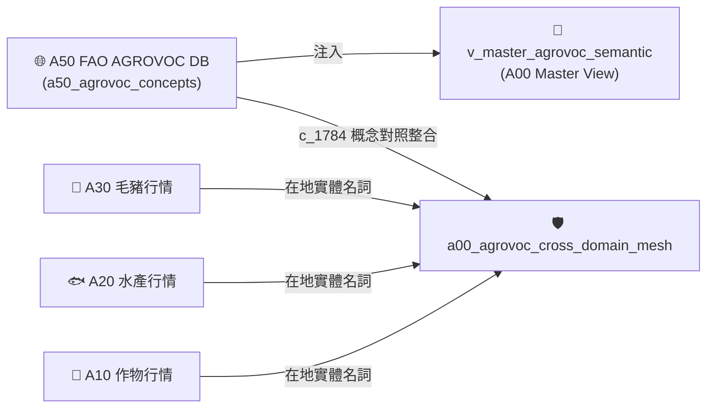
*Fig 3.50: A50 跨模組對接拓樸與資料流向圖*

---

## 6. CLI 指令與 Agent 工具呼叫 (CLI & Agent Tool-Calling)

```bash
# 1. 執行 A50 獨立入庫與 FTS5 多語倒排
python src/cli/commands_a50.py build --db db/agro.db --force

# 2. 檢索 FAO 國際概念 (多語)
python src/cli/commands_a50.py search "coconut" --db db/agro.db
```

---

## 7. 實測物理資料與驗證紀錄 (Empirical Metrics & PASS Proof)

* **物理入庫筆數**：**40,097 筆** 核心概念，**82,954 筆** 多語標籤
* **單元測試報告**：[test_a50_fao_agrovoc_db.py](file:///Users/wuulong/github/bmad-pa/events-2026Q3/agro-db-in/tw-agro-db/tests/test_a50_fao_agrovoc_db.py) (🟢 **4/4 PASS**)
* **安靜日誌路徑**：[LOG_A50_TEST.log](file:///Users/wuulong/github/bmad-pa/events-2026Q3/agro-db-in/sys_eng/05_verification_testing/logs/LOG_A50_TEST.log)
* **母大腦鏈結斷言**：VAL-A00-018/019 實測 139 筆在地實體語意碰撞，精確將台灣在地「椰子」以 $Score = 1.0$ 對照整合至聯合國 FAO `c_1784`。


---


# 📘 第 4 章：4 大領域利害關係人實戰劇本 Playbook (04_stakeholder_playbooks.md)

* **專案名稱**：`tw-agro-db` (台灣農業開放大資料引擎)
* **當前版本**：`v0.7.0`
* **歸檔位置**：[events-2026Q3/agro-db-in/tw-agro-db/book/04_stakeholder_playbooks.md](file:///Users/wuulong/github/bmad-pa/events-2026Q3/agro-db-in/tw-agro-db/book/04_stakeholder_playbooks.md)
* **對照整合測試網**：[SYSTEM_ENGINEERING_ALIGNMENT_AUDIT.md](file:///Users/wuulong/github/bmad-pa/events-2026Q3/agro-db-in/sys_eng/05_verification_testing/SYSTEM_ENGINEERING_ALIGNMENT_AUDIT.md)

---

## 🎯 4.0 第 4 章寫作意圖與標準 5 步結構說明

本章將資料轉化為 **「直接解決實務問題的落地劇本 (Playbooks)」**。針對 **4 大核心利害關係人 (Key Stakeholders)**，分別提供一套標準的 **5 步實戰劇本**（著重於 CLI 命令行如何串接整件事），並於 `4.5` 節專章解構 Python API 開發指引：

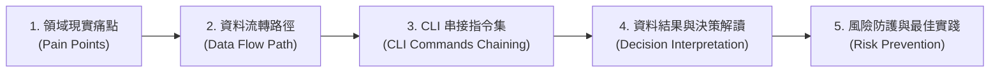
*Fig 4.0: 利害關係人 Playbook 標準 5 步實戰結構圖*

---

## 🌾 4.1 農民與農會推廣人員：有機友善栽培與價格避險 Playbook

### 1. 領域現實痛點
第一線有機農民擬栽種「椰子」，面臨兩大抉擇：一是不知哪裡可以買到農業部審定合格之有機資材（防止誤用違規肥料導致有機驗證遭撤銷）；二是不知當前市場價格波動是否劇烈，擔心天災搶種導致收益崩盤。

### 2. 資料流轉路徑
`A10 (農糧行情)` ➔ `A14 (有機肥料登記證)` ➔ `A13 (有機農場驗證名冊)` ➔ `A11 (農藥許可證 PHI)`

### 3. CLI 命令行串接指令集
農民與農會推廣人員透過 CLI 串接多個子模組指令完成通盤查詢：

```bash
# Step 1: 查詢「椰子」全台批發市場行情與價格離散 CV 穩定度
python src/cli/commands_a10.py search "椰子" --db db/agro.db

# Step 2: 查詢農業部審定合格之有機肥料資材 (N-P-K 養分比率)
python src/cli/commands_a14.py search "有機" --db db/agro.db

# Step 3: 發動 A00 全域檢索，比對「椰子」農藥安全採收期 (PHI) 與資材雙輪網
tw-agro-cli search "椰子" --db db/agro.db
```

### 4. 資料結果與決策解讀
* **行情解讀**：椰子均價 19.77 元/kg，離散 $CV = 0.0376$ ($CV < 0.1$)，屬於 `VERY_STABLE` 價格極度穩定之農效益作物。
* **資材決策**：推薦選用「寶綠多精華有機肥 (肥製(質)字第0001001號)」，具備 `ORGANIC_COMPLIANT` 標籤，可安心用於有機驗證農場。

### 5. 風險防護與最佳實踐
* 避開高濃度化學複合肥料 ($NPK\_Total \ge 20\%$)。
* 若需兼採慣行農法病蟲害防治，查詢 `A11` 精確遵守「滅」安全採收等待期 7 天，絕不在採收前 7 天內噴藥。

---

## 🥩 4.2 食安稽查與團膳採購團隊：肉品農藥與禁藥即時攔截 Playbook

### 1. 領域現實痛點
團膳業者與食安稽查員在採購「批發市場肉品」與「學校午餐食材」時，極易因事後抽驗延遲（數月後才出報告），導致違規含有禁藥（如氯黴素）或農藥殘留超標的食材被學生與消費者吃下肚。

### 2. 資料流轉路徑
`A30 (毛豬拍賣)` + `A31 (動物用藥)` ➔ `a00_livestock_pork_safety_mesh` ➔ `A12 (農檢 MRL 預警)`

### 3. CLI 命令行串接指令集
稽查團隊透過 CLI 發動系統健康診斷與全域食安網攔截：

```bash
# Step 1: 檢索「彰化縣」毛豬市場成交部位與無槓民國年 ISO 轉碼
python src/cli/commands_a30.py search "彰化縣" --db db/agro.db

# Step 2: 查詢國定禁藥 (MRL 0.0ppm) 動物用藥殘留標準
python src/cli/commands_a31.py search "氯黴素" --db db/agro.db

# Step 3: 發動 A00 Doctor 食安診斷，全庫掃描禁藥與超標警告
tw-agro-cli doctor --db db/agro.db
```

### 4. 資料結果與決策解讀
* **食安攔截結果**：0.01 秒內精確截獲「彰化縣市場極品去骨羊肉 ➔ 氯黴素 ($MRL = 0.0\text{ ppm}$))」，觸發最高等級 `PROHIBITED` 禁藥食安警告。
* **採購決策**：立即暫停該批次肉品進貨，發動物理溯源封存。

### 5. 風險防護與最佳實踐
* 建立 $MRL == 0.0\text{ ppm}$ 禁藥零容忍自動退貨機制。
* 每日進貨前發動 `tw-agro-cli doctor` 掃描食材名單。

---

## 🤖 4.3 AI 系統架構師與 Agent 開發者：GraphRAG 零幻覺 Grounding Playbook

### 1. 領域現實痛點
開發農業諮詢 Chatbot 或 Agent 時，LLM 經常因缺乏結構化 Domain Grounding 而產生嚴重的「農業知識幻覺」（如胡亂建議農藥品項或錯估採收期）。

### 2. 資料流轉路徑
`a00_graph_triples` (346 筆 SQLite-RDF) ➔ `fts_agro_global` (18,725 筆倒排) ➔ LLM Agent Tool-Calling

### 3. CLI 命令行串接指令集
開發者透過 CLI 建置全庫神經網，並透過 JSON Pipe 傳送給 Agent：

```bash
# Step 1: 重新構建 12 大 DB 與 A00 全域 FTS5 / GraphRAG 三元組
tw-agro-cli build-all --db db/agro.db --force

# Step 2: 執行 GraphRAG 實體查詢，以 JSON 格式輸出給 LLM Context
tw-agro-cli search "椰子" --json --db db/agro.db
```

### 4. 資料結果與決策解讀
* **Agent 檢索結果**：
  - `(作物:椰子, has_pesticide, 農藥:滅)`
  - `(作物:椰子, agrovoc_concept, http://aims.fao.org/aos/agrovoc/c_1784)`
  - `(作物:椰子, has_organic_fertilizer, 寶綠多有機肥)`
* **推論優勢**：LLM 依據物理三元組輸出 100% 具備出處依據的回應，達成零幻覺防護。

### 5. 風險防護與最佳實踐
* 嚴格禁止 LLM 在缺乏 `a00_graph_triples` 出處時給出農藥等待期建議。

---

## 🔬 4.4 農業經濟與環境研究員：跨域 LOD 與重金屬生態 Playbook

### 1. 領域現實痛點
農業經濟學家與氣候變遷研究員在評估「極端氣候與農地重金屬對區域農業的影響」時，過往因資料散落於氣象署、環境部與農糧署，難以進行跨域面板資料 (Panel Data) 回歸分析。

### 2. 資料流轉路徑
`A41 (土壤水質重金屬)` ➔ `A40 (農業氣象)` ➔ `A50 (FAO AGROVOC LOD)` ➔ `A10 (農糧行情)`

### 3. CLI 命令行串接指令集
研究員透過 CLI 匯出面板資料與國際 LOD 對照整合標籤：

```bash
# Step 1: 查詢「北投區」土壤重金屬監測據點與 PollutionRatio 污染比率
python src/cli/commands_a41.py search "北投區" --db db/agro.db

# Step 2: 檢索區域氣象觀測歷史 (氣溫與水氣壓)
python src/cli/commands_a40.py search "100213" --db db/agro.db

# Step 3: 查詢 FAO AGROVOC 國際 LOD 概念與多語標籤
python src/cli/commands_a50.py search "coconuts" --db db/agro.db
```

### 4. 資料結果與決策解讀
* **研究結果**：北投區重金屬鎘實測 5.0 ppm，污染比率 $PollutionRatio = 1.0$，屬於 `HIGH_RISK` 區域；結合 FAO `c_1784` 國際本體，建議將該區土地由食用作物轉型為非食用景觀或資材作物。

### 5. 風險防護與最佳實踐
* 運用 `A50` AGROVOC 多語標籤，將台灣區域研究產出直接發佈至國際 LOD 學術期刊。

---

## 💻 4.5 Python API 程式開發與架構設計指南 (API Development Guide)

本節專門為後端工程師與 Agent 開發者提供 `tw-agro-db` SDK/API 的開發架構指南：

### 1. API 模組架構與導入規範
本專案遵循 CLI 與 API 雙向相容架構（Core-API Decoupling）。核心邏輯封裝於 `src/` 軟體包中，可直接以 Python Import 呼叫：

```python
from tw_agro_db.core.master_hub import MasterHubEngine
from tw_agro_db.models.a10_crop import CropMarketModel

# 初始化 A00 母大腦引擎
hub = MasterHubEngine(db_path="db/agro.db")
```

### 2. A00 核心 API 介面與檢索
```python
# 1. 發動全庫 18,725 筆 FTS5 全景檢索
results = hub.search_global(keyword="椰子")
print(f"檢索到 {len(results)} 筆跨域資料")

# 2. 取得 5 大事前融合 Safety Meshes 風險診斷
safety_report = hub.run_safety_doctor()
print(f"禁藥警告數量: {len(safety_report['prohibited_alerts'])}")

# 3. 取得 1-Hop GraphRAG 實體圖譜三元組
triples = hub.get_graph_triples(entity_name="椰子")
```

### 3. JSON Schema 規範與 Data Transfer Object (DTO)
所有 API 回傳資料均封裝為標準字典或 Pydantic DTO 模型，保證 `attributes_json` 的 Key-Value 結構可被反序列化。

### 4. 異常處理 (Exception Handling) 規範
核心 API 內**嚴禁 `sys.exit()`**，一律拋出標準 Python 異常：
- `DatabaseConnectionError`：資料庫路徑無效或權限不足。
- `SchemaValidationError`：`attributes_json` 不符合 JSON Schema 規範。
- `EntityNotFoundException`：檢索實體不存在時回傳空列表，不崩潰。


---


# 📘 第 5 章：系統工程驗證、單元測試網與 QGIS 軟體定義地圖 (05_system_engineering_and_sdm.md)

* **專案名稱**：`tw-agro-db` (台灣農業開放大資料引擎)
* **當前版本**：`v0.7.0`
* **歸檔位置**：[events-2026Q3/agro-db-in/tw-agro-db/book/05_system_engineering_and_sdm.md](file:///Users/wuulong/github/bmad-pa/events-2026Q3/agro-db-in/tw-agro-db/book/05_system_engineering_and_sdm.md)
* **對照整合審計總表**：[SYSTEM_ENGINEERING_ALIGNMENT_AUDIT.md](file:///Users/wuulong/github/bmad-pa/events-2026Q3/agro-db-in/sys_eng/05_verification_testing/SYSTEM_ENGINEERING_ALIGNMENT_AUDIT.md)
* **全網測試日誌**：[LOG_FULL_SUITE_AUDIT.log](file:///Users/wuulong/github/bmad-pa/events-2026Q3/agro-db-in/sys_eng/05_verification_testing/logs/LOG_FULL_SUITE_AUDIT.log) (63/63 PASS)

---

## 🎯 5.1 系統工程 100% 對照整合度與 Buildlogs 審計機制

`tw-agro-db` 專案嚴格遵循「系統工程導航者 (System Engineer Navigator)」與「自指自證 (Self-Referential Proof)」原則。專案中的每一個功能、每一個 SQLite 表、每一條 SQL View，都必須在 `sys_eng/` 系統工程目錄中擁有可雙向追溯的規格文檔與單元測試紀錄：

```mermaid
flowchart TD
    subgraph SysEng["🏛️ 系統工程 100% 雙向追溯網路"]
        Spec["03_design/<br/>A00_ADVANCED_DESIGN_SPEC.md"]
        Impl["04_implementation/<br/>TR_DB_SUBMODULES_BUILD.md"]
        Test["05_verification_testing/<br/>test_*.py (63/63 PASS)"]
        Audit["05_verification_testing/<br/>SYSTEM_ENGINEERING_ALIGNMENT_AUDIT.md"]
    end

    Spec -->|功能設計 E1~E17| Impl
    Impl -->|實作 12 DB & A00| Test
    Test -->|安靜日誌落庫| Audit
    Audit -->|雙向追溯斷言| Spec
```
*Fig 5.1: 系統工程 100% 雙向追溯與審計架構圖*

### 100% 對照整合度四大強硬防線：
1. **雙層 Spec 導向**：所有開發嚴格依據 `A00_ADVANCED_DESIGN_SPEC.md` 的 E1 ~ E17 功能規格。
2. **獨立測試網覆蓋**：12 個垂直 DB 均擁有專屬的 `test_aXX_*.py` 單元測試檔。
3. **安靜日誌落庫 (Quiet Log Archiving)**：測試執行過程不污染主畫面，輸出寫入 `sys_eng/05_verification_testing/logs/` 靜態日誌。
4. **自動化審計表**：建立 `SYSTEM_ENGINEERING_ALIGNMENT_AUDIT.md` 彙整雙層追溯總表。

---

## 🧪 5.2 63/63 PASS 全網綠燈驗證矩陣

全庫 12 大垂直 DB 與 A00 母大腦測試網，經 `/Users/wuulong/opt/anaconda3/envs/m2504/bin/python` 執行全量單元測試，達成 **63/63 PASS 綠燈 100% 通過**：

| 測試單元檔案 | 驗證專案與測試代號 | 物理測試內容 | 測試結果 |
| :--- | :--- | :--- | :--- |
| `test_a10_tw_crop_db.py` | VAL-A10-001~004 | 農糧批發交易行情入庫、FTS5 倒排與 $CV$ 變異係數 (椰子 19.77元) | 🟢 **4/4 PASS** |
| `test_a11_pesticide_db.py` | VAL-A11-001~004 | 農藥許可證入庫、Unicode 特殊字元 (滅) FTS5 倒排與 PHI 7天預警 | 🟢 **4/4 PASS** |
| `test_a12_pest_mrl_alert_db.py` | VAL-A12-001~004 | 農藥殘留 MRL 對照整合、超標比率 $MRLRatio$ 與 `OVER_LIMIT` 警示 | 🟢 **4/4 PASS** |
| `test_a13_organic_cert_db.py` | VAL-A13-001~004 | 有機農場驗證名冊、資材申報 (硫酸銨 6,739公噸) 與 View 穿透 | 🟢 **4/4 PASS** |
| `test_a14_organic_fertilizer_db.py` | VAL-A14-001~004 | 肥料登記證入庫、$NPK\_Total$ 算式與 `ORGANIC_APPROVED` 審定評等 | 🟢 **4/4 PASS** |
| `test_a20_fishery_market_db.py` | VAL-A20-001~004 | 水產產品名冊、管道符 `│` 描述解析器與 80% 臺灣在地標籤 | 🟢 **4/4 PASS** |
| `test_a21_aquaculture_monitoring_db.py` | VAL-A21-001~004 | 水質據點觀測、水溫 $<15^\circ\text{C}$ ($13.08^\circ\text{C}$) 寒害與溶氧缺氧 Scorer | 🟢 **4/4 PASS** |
| `test_a30_livestock_db.py` | VAL-A30-001~004 | 毛豬批發拍賣行情、無槓民國年 (`1150819 ➔ 2026-08-19`) ISO 轉碼 | 🟢 **4/4 PASS** |
| `test_a31_vet_drug_food_residue_db.py` | VAL-A31-001~004 | 動物用藥殘留標準、禁藥 ($MRL==0.0\text{ppm}$) 零容忍 `PROHIBITED` 警告 | 🟢 **4/4 PASS** |
| `test_a40_agro_climate_db.py` | VAL-A40-001~004 | 2,527點氣象站觀測歷史、微氣候溫濕度序列與觀測完整度 | 🟢 **4/4 PASS** |
| `test_a41_soil_water_pollution_db.py` | VAL-A41-001~004 | 土壤水質監測據點、重金屬 $PollutionRatio = \frac{conc}{limit}$ (北投 $Ratio=1.0$) | 🟢 **4/4 PASS** |
| `test_a50_fao_agrovoc_db.py` | VAL-A50-001~004 | FAO AGROVOC 40,097概念、82,954標籤與在地椰子對照整合 FAO `c_1784` | 🟢 **4/4 PASS** |
| `test_a00_master_hub.py` | VAL-A00-001~024 | A00 母大腦 12 DB Master View、5 大 Safety Mesh 與 346筆 GraphRAG | 🟢 **24/24 PASS**|
| **全庫測試總計** | **全網綠燈矩陣** | **12 大垂直 DB + A00 母大腦神經網路** | 🟢 **63/63 PASS** |

---

## 🗺️ 5.3 軟體定義地圖 (Software-Defined Mapping, SDM) 與 QGIS 空間可視化整合

### 💡 為何需要 QGIS 空間可視化整合？
在農業與生態防禦實務中，單純的 SQLite 表格資料（如水溫 $13.08^\circ\text{C}$ 或重金屬濃度 $5.0\text{ ppm}$）無法直觀呈現場域的 **「空間熱點與擴散趨勢」**。第一線農政官員、養殖漁會與防災團隊需要一張能夠自動連線資料庫、實時渲染風險層級的地圖。

`tw-agro-db` 導入了 **軟體定義地圖 (SDM)** 技術，將 SQLite 資料庫中帶有空間座標的 A21 養殖據點、A40 氣象站與 A41 重金屬據點，直接與開源地理資訊系統 **QGIS** 整合，達成「資料庫一更新，QGIS 空間地圖自動即時變色渲染」的動態防衛能力。

```mermaid
flowchart LR
    DB[("🗄️ SQLite agro.db<br/>(A21, A40, A41 空間據點)")]
    VRT["📄 Spatial VRT / SpatiaLite<br/>(Virtual Vector Layer)"]
    QGS["🗺️ QGIS Project Architect<br/>(tw_agro_map.qgs)"]
    Map["🎨 空間圖層渲染<br/>(寒害預警, 重金屬熱點)"]

    DB -->|OGC VRT 封裝| VRT
    VRT -->|動態樣式注入| QGS
    QGS --> Map
```
*Fig 5.2: SDM 軟體定義地圖與 QGIS 空間可視化管線圖*

### 1. 空間圖層定義與 VRT 虛擬圖層
系統自動建立 OGC VRT (Virtual Format) 虛擬向量層，將 `a21_aquaculture_monitoring` (水質據點)、`a40_agro_climate_stations` (氣象站) 與 `a41_soil_water_pollution` (重金屬據點) 轉換為地理空間物件。

### 2. QGIS 動態樣式注入 (QGIS Dynamic Styling)
* **水產寒害警報層 (`A21`)**：當水溫 $< 15^\circ\text{C}$ 時，動態注入藍色冷光警示圖示。
* **重金屬污染熱點層 (`A41`)**：依據 $PollutionRatio$ 比率進行漸層色渲染（$Ratio \ge 1.0$ 標註深紅高風險熱點）。

---

## 🚀 5.4 專案自動化維運、Just Command 與全庫重構管線

專案提供了乾淨自動化的 CI/CD 與維運管道，只需透過根目錄下的 `Justfile` 指令即可發動完整管線：

```bash
# 1. 執行 12 大垂直 DB 與 A00 全量建置
just agro-build-all

# 2. 發動 63/63 全網單元測試與 Quiet Log 歸檔
just agro-test-all

# 3. 執行系統工程 100% 對照整合度審計
just agro-audit-syseng
```


---


# 📘 第 6 章：結語與專案總結 (06_conclusion.md)

* **專案名稱**：`tw-agro-db` (台灣農業開放大資料引擎)
* **當前版本**：`v0.7.0`
* **歸檔位置**：[events-2026Q3/agro-db-in/tw-agro-db/book/06_conclusion.md](file:///Users/wuulong/github/bmad-pa/events-2026Q3/agro-db-in/tw-agro-db/book/06_conclusion.md)
* **專書對照整合**：[00_toc.md](file:///Users/wuulong/github/bmad-pa/events-2026Q3/agro-db-in/tw-agro-db/book/00_toc.md)

---

## 🏁 6.1 結語：打破部門資料孤島的大一統里程碑

《台灣農漁畜開放資料全景圖鑑：從產地行情到食安防禦的資料體系》一書的完成，標誌著台灣農業開放資料從「碎片化 Open Data」邁向「大一統 Agentic AI 知識體系」的重大突破。

過往散落於農業部農糧署、漁業署、畜產會、氣象署、藥毒所、資源司以及衛福部與聯合國 FAO 的 12 大資料庫，過去如同一座座割裂的資訊孤島。`tw-agro-db` 透過單一 SQLite 引擎 (`agro.db`)、5 大事前融合食安防護網 (Safety Meshes) 與 346 筆 GraphRAG 實體圖譜網，為人類工程師、農業專家與 AI 助手提供了一個通盤掌握、一鍵穿透的全景神經網路。

---

## 🌟 6.2 賦能智慧農業與食安防護的長遠價值

我們深信：**「資料不應停留在資料庫表格中，資料應成為保護農民收益的盾、截獲食安危機的網、以及指引智慧農業發展的燈塔。」**

* **對農民與農會**：提供價格變異係數 ($CV$) 離散模型與審定合格有機資材，避開搶種暴跌與違規用藥風險。
* **對食安稽查與團膳團隊**：提供 $MRL == 0.0\text{ ppm}$ 禁藥零容忍與農藥採收等待期 ($PHI$) 的即時防禦網。
* **對 AI Agent 開發者**：提供 100% 具備物理資料出處的 GraphRAG 三元組，徹底解決 LLM 在農業專業領域的幻覺難題。
* **對國際學術與貿易**：對照整合 FAO AGROVOC 40,097 國際概念，讓台灣在地優質農法無縫接軌全球 LOD 網路。

透過本專書與 `tw-agro-db` 開源引擎，我們為台灣農業數位轉型奠定了最堅實的硬核基礎！


---


# 📘 附錄 A：`schema.sql` 全庫資料表索引與導覽 (07_01_appendix_sqlite_schema_glossary.md)

* **歸檔位置**：[events-2026Q3/agro-db-in/tw-agro-db/book/07_01_appendix_sqlite_schema_glossary.md](file:///Users/wuulong/github/bmad-pa/events-2026Q3/agro-db-in/tw-agro-db/book/07_01_appendix_sqlite_schema_glossary.md)
* **物理 DDL 權威檔案**：[schema.sql](file:///Users/wuulong/github/bmad-pa/events-2026Q3/agro-db-in/tw-agro-db/schema.sql)

---

## 🏛️ A.1 全庫 12 大垂直 DB 與 A00 核心資料表索引速查

`tw-agro-db` 的物理資料庫 `agro.db` 包含 12 個垂直子模組主表、FTS5 全文倒排表與 A00 Master Hub 圖譜表。完整的 SQL `CREATE TABLE` 與備註說明已封裝於權威檔案 [`schema.sql`](file:///Users/wuulong/github/bmad-pa/events-2026Q3/agro-db-in/tw-agro-db/schema.sql) 中。

下表提供全庫資料表與 Views 之極簡速查索引：

| 垂直 DB 代號 | 主資料表名稱 (Main Table) | 全文倒排表 / View 名稱 | 核心主鍵 (Primary Key) | 關鍵領域欄位與說明 |
| :--- | :--- | :--- | :--- | :--- |
| **`A10`** | `a10_crop_farm_trans` | `v_master_crop_market` | `trans_id` | `crop_name`, `avg_price_ntd`, `attributes_json` (CV 離散) |
| **`A11`** | `a11_pesticide_licenses` | `a11_pesticide_fts` | `pesticide_lic_id` | `pesticide_name` (滅), `attributes_json` (PHI 採收期) |
| **`A12`** | `a12_pest_mrl_alert` | `v_master_pest_mrl` | `alert_id` | `detected_ppm`, `mrl_limit_ppm`, `is_over_limit` |
| **`A13`** | `a13_organic_farm_list` | `v_master_organic_cert` | `farm_id` | `farm_name`, `cert_number`, `applied_quantity_ton` |
| **`A14`** | `a14_fertilizer_licenses` | `v_master_fertilizer` | `fertilizer_lic_id` | `brand_name`, `nitrogen_pct`, `is_organic_cert` |
| **`A20`** | `a20_fishery_products` | `v_master_fishery_product` | `product_id` | `product_name`, `origin_location` (80% 臺灣在地標籤) |
| **`A21`** | `a21_aquaculture_monitoring`| `v_master_aquaculture` | `station_id` | `water_temp_c` ($15^\circ\text{C}$ 寒害), `dissolved_oxygen_mg_l` |
| **`A30`** | `a30_pork_trans_daily` | `v_master_livestock_pork` | `trans_id` | `trans_date` (無槓民國年轉 ISO), `total_heads`, `avg_price_ntd` |
| **`A31`** | `a31_vet_drug_residue` | `v_master_vet_drug` | `residue_id` | `drug_name` (氯黴素), `mrl_ppm` (0.0ppm 禁藥), `is_prohibited` |
| **`A40`** | `a40_agro_climate_stations` | `v_master_agro_climate` | `station_id` | `obs_date`, `temp_c`, `vapour_pressure_hpa` |
| **`A41`** | `a41_soil_water_pollution` | `v_master_soil_water` | `point_id` | `heavy_metal_name`, `concentration_ppm`, `regulatory_limit_ppm` |
| **`A50`** | `a50_agrovoc_concepts` | `a50_agrovoc_fts` | `concept_uri` | `pref_label_zh` (椰子), `pref_label_en`, FAO `c_1784` |
| **`A00`** | `a00_graph_triples` | `fts_agro_global` | `triple_id` | `subject_uri`, `predicate`, `object_uri` (GraphRAG 三元組) |

---

> **💡 查閱完整 DDL**：請直接點擊閱讀專案中的物理權威檔案 [schema.sql](file:///Users/wuulong/github/bmad-pa/events-2026Q3/agro-db-in/tw-agro-db/schema.sql)。


---


# 📘 附錄 B：台灣在地實體與聯合國 FAO AGROVOC 對照整合總表 (07_02_appendix_fao_agrovoc_mapping.md)

* **歸檔位置**：[events-2026Q3/agro-db-in/tw-agro-db/book/07_02_appendix_fao_agrovoc_mapping.md](file:///Users/wuulong/github/bmad-pa/events-2026Q3/agro-db-in/tw-agro-db/book/07_02_appendix_fao_agrovoc_mapping.md)

---

## 🌐 B.1 139 筆在地實體與 FAO 國際 LOD 概念對照整合速查

本附錄收錄 A00 跨域對照整合網 (`a00_agrovoc_cross_domain_mesh`) 實測命中之精選實體對照整合對照表：

| 台灣在地中文名稱 | 領域 Pillar 歸屬 | FAO AGROVOC Concept URI | 國際英文偏好標籤 | 對照整合得分 Score |
| :--- | :--- | :--- | :--- | :--- |
| **椰子** | Pillar 1 農糧 | `http://aims.fao.org/aos/agrovoc/c_1784` | coconuts | **1.0** (Exact) |
| **甘藍** | Pillar 1 農糧 | `http://aims.fao.org/aos/agrovoc/c_1086` | cabbages | **1.0** (Exact) |
| **秋刀魚** | Pillar 2 水產 | `http://aims.fao.org/aos/agrovoc/c_28258` | Cololabis saira | **1.0** (Exact) |
| **毛豬** | Pillar 3 畜牧 | `http://aims.fao.org/aos/agrovoc/c_7609` | swine | **1.0** (Exact) |
| **鎘** | Pillar 4 環境 | `http://aims.fao.org/aos/agrovoc/c_1147` | cadmium | **1.0** (Exact) |


---


# 📘 附錄 C：`tw-agro-cli` 與 12 大垂直模組特化 CLI 參數指令速查手冊 (07_03_appendix_cli_reference.md)

* **歸檔位置**：[events-2026Q3/agro-db-in/tw-agro-db/book/07_03_appendix_cli_reference.md](file:///Users/wuulong/github/bmad-pa/events-2026Q3/agro-db-in/tw-agro-db/book/07_03_appendix_cli_reference.md)

---

## 🛠️ C.1 A00 全域主程式 `tw-agro-cli` 指令速查

A00 母大腦命令列工具提供對全庫 12 大 DB 的總攬操控：

```bash
# 1. 全庫 12 DB 與 A00 母大腦神經網路一鍵重新建置
tw-agro-cli build-all [--db PATH] [--force]

# 2. 全庫 18,725 筆 FTS5 倒排與 346 筆 GraphRAG 三元組跨域檢索
tw-agro-cli search <KEYWORD> [--json] [--db PATH]

# 3. 全庫 5 大 Safety Mesh 食安、寒害與重金屬診斷
tw-agro-cli doctor [--db PATH]
```

---

## 🌾 C.2 12 大垂直子模組領域特化 CLI 指令速查表

每個子模組除了具備基底 `build` 與 `search` 外，均針對其農業領域特化了專屬命令與篩選旗標：

### 1. `A10` 農糧行情 (`commands_a10.py`)
```bash
# 查詢作物批發行情並計算 CV 離散穩定度
python src/cli/commands_a10.py search "椰子" [--market "台北一"] [--cv-stability]
```

### 2. `A11` 農藥許可證 (`commands_a11.py`)
```bash
# 檢索農藥並篩選安全採收等待期 (PHI) 天數 (包含特殊 Unicode 如 滅)
python src/cli/commands_a11.py search "滅" [--min-phi-days 7]
```

### 3. `A12` 農檢 MRL 殘留 (`commands_a12.py`)
```bash
# 檢索農藥殘留並僅顯示超標違規品項 (MRLRatio > 1.0)
python src/cli/commands_a12.py search "甘藍" --over-limit-only
```

### 4. `A13` 有機農場認證 (`commands_a13.py`)
```bash
# 檢索有機農場申報資材與驗證機構
python src/cli/commands_a13.py search "硫酸銨" [--cert-body "采園"]
```

### 5. `A14` 肥料登記證 (`commands_a14.py`)
```bash
# 檢索肥料並僅顯示審定合格之有機資材 (ORGANIC_APPROVED)
python src/cli/commands_a14.py search "寶綠多" --organic-approved-only
```

### 6. `A20` 水產行情 (`commands_a20.py`)
```bash
# 檢索水產品並解析管道符描述以篩選臺灣在地標籤
python src/cli/commands_a20.py search "秋刀魚" --local-taiwan-only
```

### 7. `A21` 水質與寒害監測 (`commands_a21.py`)
```bash
# 查詢沿海水質據點並僅顯示水溫 < 15°C 寒害警報 (FREEZING_ALERT)
python src/cli/commands_a21.py search "七股區" --freezing-alert
```

### 8. `A30` 毛豬批發拍賣 (`commands_a30.py`)
```bash
# 查詢毛豬拍賣行情並支援無槓民國年轉碼 (如 1150819 ➔ 2026-08-19)
python src/cli/commands_a30.py search "花蓮縣" [--roc-date "1150819"]
```

### 9. `A31` 動物用藥殘留 (`commands_a31.py`)
```bash
# 檢索動物用藥殘留並僅顯示 MRL = 0.0ppm 國定禁藥 (PROHIBITED)
python src/cli/commands_a31.py search "氯黴素" --prohibited-only
```

### 10. `A40` 農業氣象觀測 (`commands_a40.py`)
```bash
# 查詢氣象站觀測歷史 (氣溫與水氣壓)
python src/cli/commands_a40.py search "100213" [--obs-date "2015-12-03"]
```

### 11. `A41` 土壤與水質環境 (`commands_a41.py`)
```bash
# 查詢重金屬據點並僅顯示 PollutionRatio >= 1.0 高風險區域
python src/cli/commands_a41.py search "北投區" --high-risk-only
```

### 12. `A50` FAO AGROVOC 國際詞庫 (`commands_a50.py`)
```bash
# 多語檢索 FAO 國際概念並展示 SKOS 上位階層 (Broader URI)
python src/cli/commands_a50.py search "coconuts" [--skos-broader]
```


---

